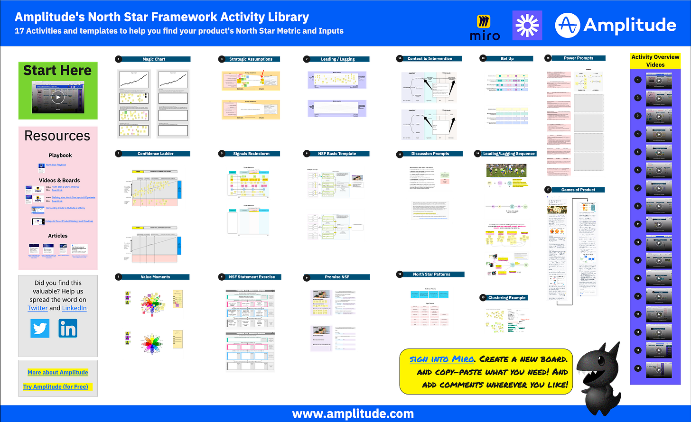

Hello!

I finally got around to organizing the templates and resources we use in our North Star Workshops at Amplitude. I apologize for how long this took.

[Here is the board.](https://miro.com/app/board/uXjVPf0HwEA=/?share_link_id=112905984658) Check it out!

The Miro board contains:

1. 17 Miro templates/activities you can copy and use[1](https://cutlefish.substack.com/p/north-star-framework-template-and#footnote-1-68539815)

2. Loom videos explaining each activity

3. Links to free articles, long-form videos, and the original playbook

Feel free to share it far and wide.

The board is open for commenting if anything catches your eye.

Thanks!

[1](https://cutlefish.substack.com/p/north-star-framework-template-and#footnote-anchor-1-68539815)

To use the Miro templates, you’ll need a Miro account. They have a free version.