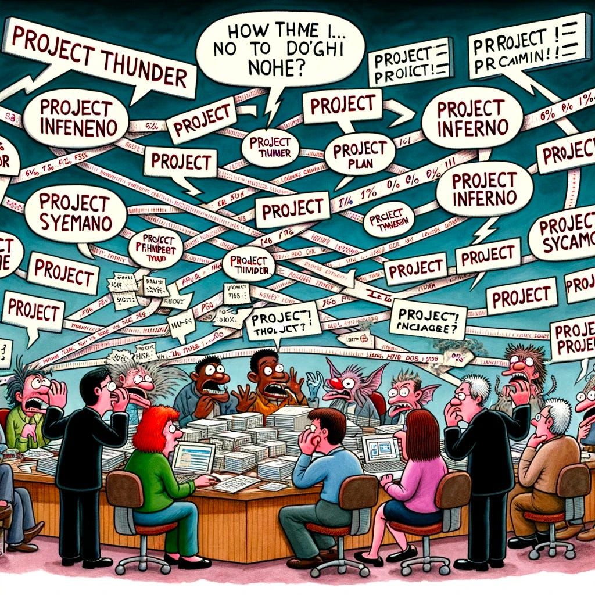

In addition to my newsletter, sometimes I write short playbooks/mini-books. I write mini-books while I procrastinate writing a real book. They include:

* [How to think about Bets, Success Metrics, and Roadmapping](https://docs.google.com/document/d/1XRx4p8cvA7r8RujYQhqFyTBSFAY7L9XJw_sifivRIaY/edit?usp=sharing)

* [Measurement / Metrics Foundations](https://docs.google.com/document/d/1205M-IyZayiCIGDh9YgEjuT-RsbLOvQ9dWWfuW0Pu6Y/edit?usp=sharing)

* [North Star Playbook](https://amplitude.com/books/north-star) (with Jason Scherschligt)

Here is a link to a new mini-book [Scoping and Shaping For Success.](https://docs.google.com/document/d/10OKde2-NodQRpTnOqmHRfdjKyEXBmFHJUcA3o0L3Eqo/edit?usp=sharing)

**The mini-book is a deep-dive into drivers, limiting constraints, floats, and enabling constraints**. It is structured as a collection of thought experiments, mental models, reflection questions, and actionable activities. It's designed to be skimmable and flexible—feel free to jump around and explore sections in any order. Throughout, you’ll find specific activities that I recommend trying out in your work or with your teams.

I originally created this as a companion piece for my Scoping and Shaping for Success workshop, which I’ve since discontinued as I explore how to integrate these ideas into other learning experiences.

Let me know how you like the format and whether it sparks new insights for you!

---

*Like the newsletter? Support TBM by upgrading your subscription. Get an invite to a Slack group where I answer questions.*

[Support the newsletter](https://cutlefish.substack.com/subscribe)

---

