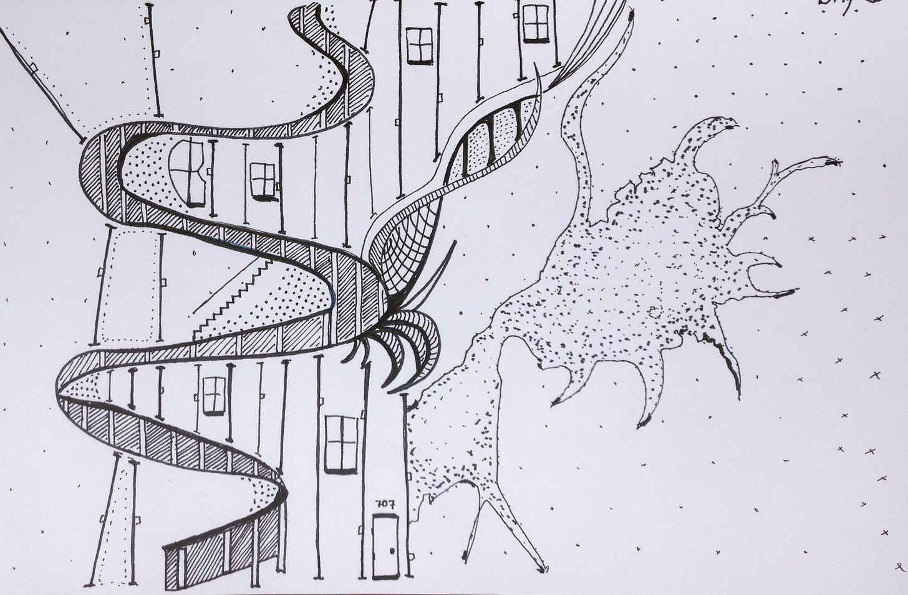

*If you have time this morning—or want to get the recording—I’m chatting with Emily Campbell, VP of Product, BookClub. We re going to go deep on community, systems thinking, and data and design. Sign up [here](https://info.amplitude.com/product_led_in_practice_march11).*

How does feel when you...

* Make something, even something tiny, *work*

* Get enlightening feedback from a fresh set of eyes

* All the tests passing for the first time

* Watch a customer use your product in a new way

* Something *clicks*...a new way forward emerges

* Turn the corner on a puzzle

* The story plot reveals itself. Or a plot twist

These moments have a unique quality—visceral and chemical. Our faces light up. We smile and nod. Stress drops, even if for a moment. Our brain connects in new ways. Dopamine! We experience a sense of joy, relief, clarity, gratification, and momentum.

It isn't *progress*, exactly. Or productivity. We can spend a whole day "making progress" (and experience a state of flow) without sparks of novelty, hill-cresting, and corner-turning. It isn't automatic. There's beneficial friction.

Why is is this important?

Product development is about stringing together these moments, big and small. It's a signal that learning and integration is really happening. A team is struggling when days and weeks pass without a *spark, even if they are productive and "making commitments".* We rationalize it. We explain it away. But that is what we are looking for.

Trust your sense of what this feels like!!

If you aren't experiencing these sparks often—big and small—it is a good signal that you need to tweak your approach. Something is off. You may need to step back and change direction. Support your team. Try working smaller. Of course, sometimes it is necessary to down a rabbit hole, but don’t get stuck there.  

This weeks question…how can you support a steady stream of these celebratory moments? And if you’re in a rut, what can you do to break the cycle?

