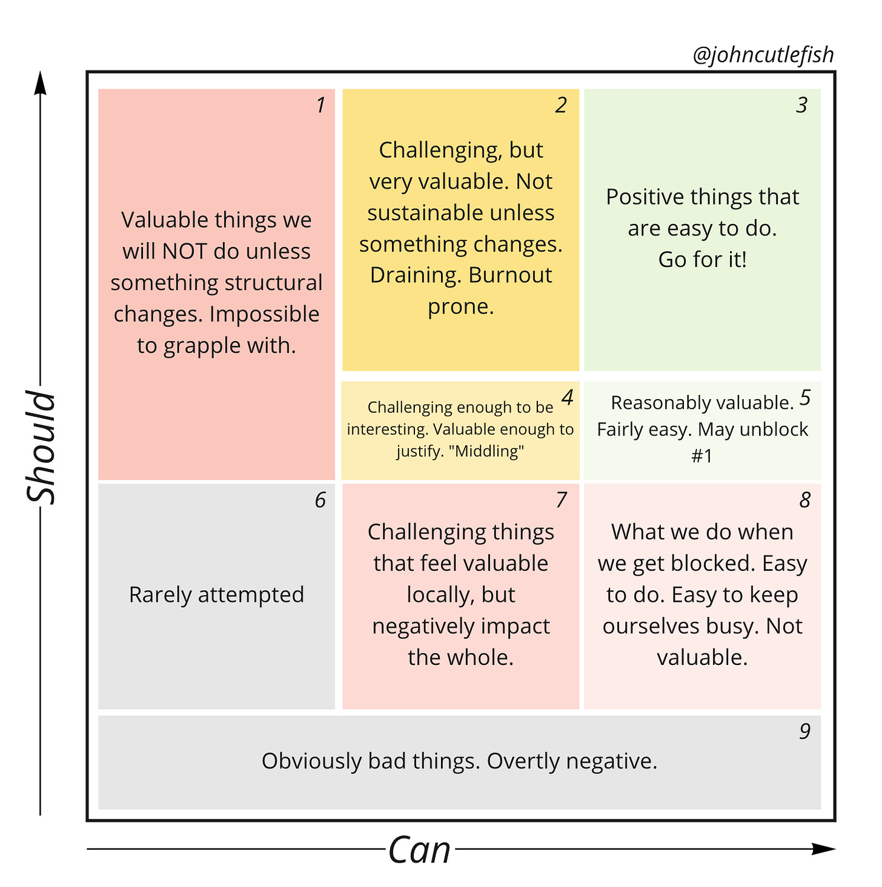
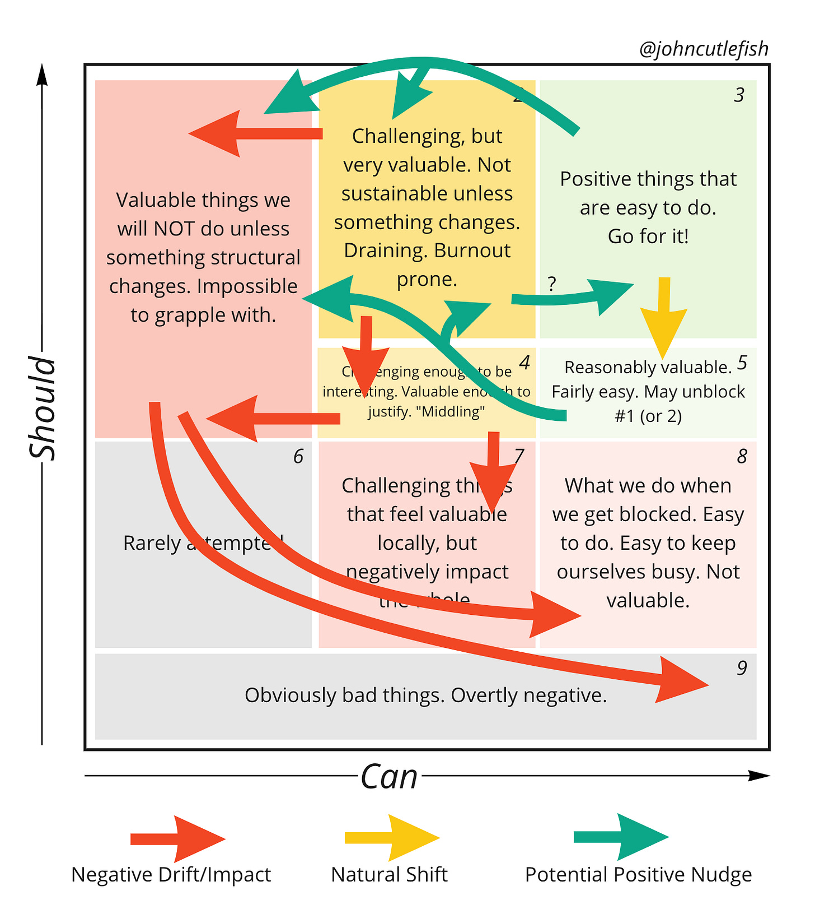

*Before we jump into this week’s post.*

📣**As loyal TBM readers, do you want[ a free ticket to Amplify in Vegas](https://forms.gle/TLx4D5iiVtd3CSaR7)**?📣

My day-job Amplitude is having [a hybrid in-person/virtual conference](https://amplitude.com/amplify) in Las Vegas. May 24 – 26, 2022. Speakers include Crystal Widjaja, Justin Bauer, Elena Verna, Melissa Perri, Varun Parmar, Stephanie Halamek, and more. They are even letting me speak 🤷…and maybe do an activity with Varun (Miro’s CPO).   

[It would be great to see you there](https://forms.gle/7J3fuqyeBh4Gn5nJ7). I say this also with full respect for anyone uncomfortable attending. We will do our absolute best to make the virtual experience worthwhile.

---

Is your team focusing on what it *should* do? Or what it *can* do?

Many teams struggle with this deceptively simple question.

Here's a diagram to aid the discussion.

**The Boxes**

==========

**1️⃣  
Box 1** represents the valuable things that we *can't* work on right now. Why? I’m not going to give away the whole post, so for now imagine *something* is blocking this work.

**2️⃣  
Box 2** work is valuable AND possible, but only with a lot of unsustainable sacrifice. It's right on the border of *can* and *can’t*. In short doses, **Box 2** work can be very rewarding (challenging work is like that). As you practice, you can move it to **Box 3**. But when it is the norm—or when the challenges make your head hurt—**Box 2** becomes the realm of heroics and burnout.

Some people have spent their career doing **Box 2** work, and working in organizations that reward **Box 2** work. It's all they know. They identify as being *good* at it. But you pay the price. Something has to give. Over time, it causes **Box 1** issues. It can also easily slip into **Box 4** of **Box 7** (see below).

**3️⃣  
Box 3** work is valuable, possible, and within a comfortable "can" range. You can keep up **Box 3** work forever, but its rare to only do **Box 3** work in a dynamic environment. You can try, but you're likely ignoring unblocking **Box 1,** **Box 8**, **Box 4**, and **Box 7**. Plus, nothing stays valuable forever. **Box 3** work becomes **Box 5** work. It degrades over time.

4️⃣ and 7️⃣  
**Boxes 4 and 7** are a little weird, I admit. They have the same challenge as **Box 2**, but produce less value. Why would people expose themselves to that kind of challenge, for anything less than the most valuable work? Aha! That's the $20,000,000 question. A couple reasons. **Box 7** might reflect work that feels valuable locally, but is not valuable in the big picture. **Box 4** might be work on the cusp. The takeaway here is that we do crazy challenging work, even when value is low.

5️⃣  
**Box 5** is interesting. Some might call this the "low hanging fruit" box. It is reasonably valuable. It might not be the MOST valuable thing we can do, but depending on how easy it is, it could be a good idea. **Box 5** (and **Box 3**) might also represent the things we CAN do to dislodge **Box 1** blockers, or make **Box 2** work less straining**.**

My friend Jade Rubick noticed this in an earlier revision of the diagram. He [writes](https://www.linkedin.com/feed/update/urn:li:activity:6916626087305232385?commentUrn=urn%3Ali%3Acomment%3A%28activity%3A6916626087305232385%2C6916750201953153024%29):

>
>
> *One thing I learned (I believe from Diana Larsen) was the difference between Direct Actions - appropriate when you can directly change something, and Influence Actions - appropriate when you can’t directly change something.Often when you can’t do something, you can still take action, as an “influence action”. Do it aware that you may or may not be able to change things. Influence actions require a different skill set, but you can succeed at them, and most leaders ignore an important sphere of activity and change because they ignore them.*
>
>

8️⃣  
**Box 8** work is the easy stuff we do because we're blocked. You're going through the motions. Why would teams operate here? Well..**Box 1**, **Box 2/4/7** burnout, etc.

6️⃣ and 9️⃣  
Box 6 and Box 9 are rarely attempted. Hopefully. Never. Lol.

**Discussion**

==========

In a reply to an earlier version of the diagram, Jordan Lamborn [noted](https://www.linkedin.com/feed/update/urn:li:activity:6916626087305232385?commentUrn=urn%3Ali%3Acomment%3A%28activity%3A6916626087305232385%2C6916685847085944832%29):

>
>
> *Seems effectively the same as Impact (Should) vs Effort/Complexity (Can) but I do like the 9 boxes layout and notes.*
>
>
>
> *These more personal labels (implied "We" Should/Can) seem to promote team introspection in terms of technical readiness to attack a problem and alignment to a team vision and strategy.*
>
>

I agree, but I do think there is a difference.

Effort and complexity can take many forms. What if the org structure isn't conducive to doing the work? What if there’s a web of insane dependencies? What if psychological safety levels are too low to undertake the work?

The standard impact / effort matrix is helpful, but it often hides deeper issues. Work can be *technically* easy, but in the current context may be impossible. Impact / effort overweights our effort estimates (and does so with without the advantage of something like [Cost of Delay](https://www.infoq.com/news/2015/02/cost-of-delay/#:~:text=Arnold%3A%20Cost%20of%20Delay%20is,we%20had%20it%20right%20now%3F)). It also ignores the probabilistic nature of product work. If a team is chasing down an impactful opportunity, it has the leeway to "fail" many times in that journey. How do you think about "can" in that case? Or effort even?

Is Can about skills? About the environment? Worth a conversation with your team.

Here's the big lesson (and trap).

Many teams are so focused on what they CAN do, that they forget what they SHOULD do. Sure, at the offsite everyone has amazing ideas (it's almost never a case of not knowing the SHOULD). But then they go back to work on CAN work.

We're programmed as humans to be super pragmatic. I don't really know any lazy product people. If anything I know too many over-worked (Box 2, 4, 7, and 8) product people. Conditions are never perfect. So there will always be a little CAN blocking some SHOULD. But for some teams there's only CAN, and no SHOULD.

Finally, to Jade Rubick's point, teams let opportunities languish in **Boxes 1 and 2**. Sometimes the most valuable thing we CAN do, is unblock the things we SHOULD do.

Here’s a clumsy attempt to represent this on the diagram:

Hope you found this post helpful.

And if for some reason an in-person conference sounds good to you (see the top of the post), let me know:  

📣**As loyal TBM readers, do you want[ a free ticket to Amplify in Vegas](https://forms.gle/TLx4D5iiVtd3CSaR7)**?📣