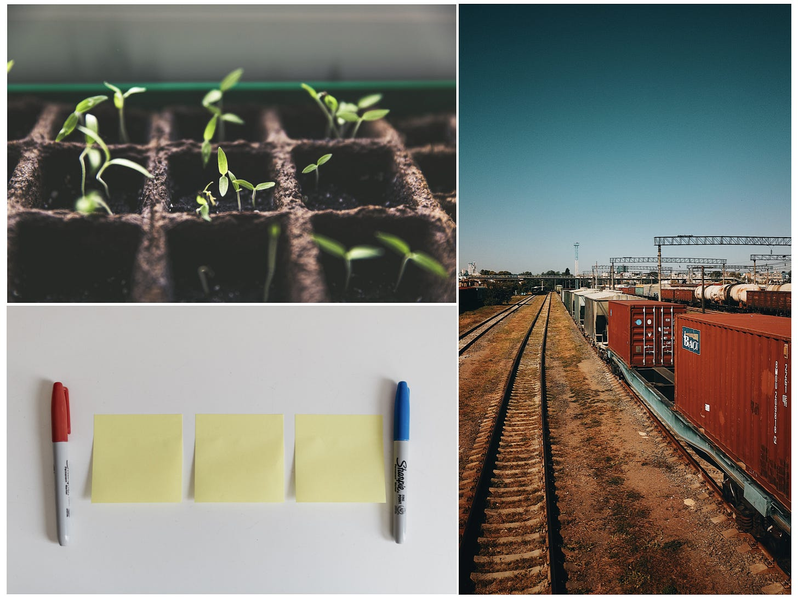

Here is a simple activity you can do with your team. I’ve tried it about a dozen times now with good results.

The basic idea is to use common (but salient) objects, activities, and ideas to spark a conversation. I have given a couple examples below, but you could easily come up with your own. **Importantly, don’t pick things that are** ***only*** **positive, or** ***only*** **negative.**

For each item, I have provided some example tensions and alternative explanations. I have also given some question examples. Over time you can evolve your own. If you are feeling adventurous, bring pictures and/or draw the objects.

**Blank Slates**

----------

*Starting over. The blank page.*

* A chance to "start over knowing what we know now"

* Feel exhilarating and fun, and intimidating and disconcerting

* Involve loss. Involve leaving behind the "old thing"

* Sometimes involve leaving people and places behind

* An opportunity to work in new, unconstrained ways

* Could involve discounting prior work. Not honoring the past

* Easier than working with the good in the status quo

**Where do we feel the urge to start over? Why?**

**Where have we started over recently? Why?**

**What did it feel like to start over?**

---

**Walls**

----------

Support and divide.

* Space to focus. Prevent distractions

* Contribute to structural integrity. Safety

* Some feel naturally placed. Some feel awkward, artificial

* Can emerge through repeat passage and erosion

* Restrict flow of information, access

* Might need "doors and windows"

**Where do walls divide us, but are necessary?**

**Where have walls just appeared?**

**Which walls should we strengthen? Bring down?**

**What keeps certain walls in place?**

**Examples of things that are walls to some, and doors to others?**

---

**Seedlings**

----------

*Protect and nurture.*

* Need protection. Fragile. Need water

* Will hopefully grow into something bigger and stronger

* Not all will thrive. Need to pick and chose

* Doesn't "pay off" immediately. Is not fruit/flower-bearing yet

**What efforts must we protect?**

**Are we doing a good job of protecting those things? Do they get a chance?**

**Do we have enough seedlings planted?**

**How do we balance caring, and moving on?**

**When does a seedling** ***graduate*****?**

---

**Freight Trains**

----------

*Not if, but when. But why?*

* Have lots of inertia. Heavy. Lots of momentum

* Capable of scale and “moving stuff”

* Run "on rails". Travel predetermined routes

* Repetitive, known approaches, efficient, transactional

* We may not question why the exist. Run "just because"

**What are our freight trains?**

**Where do they serve us?**

**Where do they run without us questioning their value?**

---

**Gardening**

----------

*Weeding and pruning.*

* Required for sustainable growth and health

* Easy to overlook and get reprioritized

* Easy to get obsessed with gardening. Don't want to "over-garden"

* Less flashy. Improvements are less visible

* Makes other things possible

**Where must we do more gardening?**

**How can we do the right amount of gardening?**

**What does gardening make possible?**