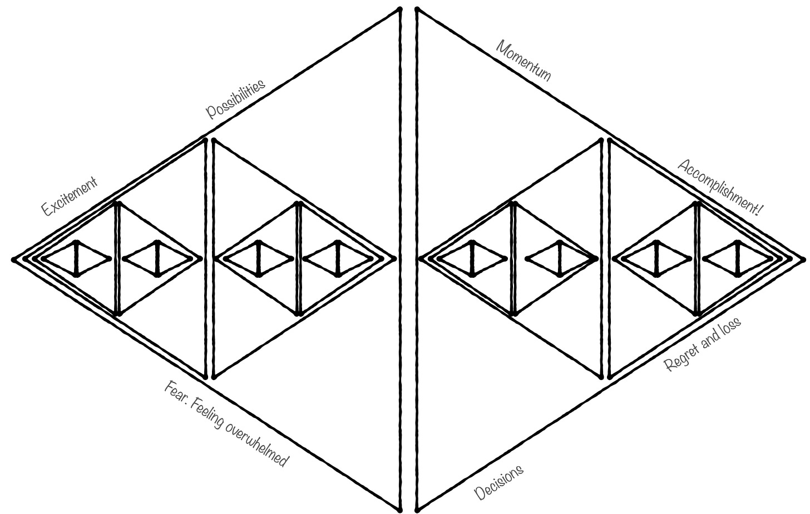

I recently posed the following question on Twitter:

>
>
> What is more common in your org?
>
>
>
> A. **Premature convergence?** Pushing for solutions and agreement too early, in ways that hurt outcomes.
>
>
>
> B. **Delayed convergence?** Taking too long to settle on a direction/decide, in ways that hurt outcomes.
>
>

Many people replied "Both", and this points to some common problems in product work.

It *might* go something like this:

The organization waits too long to—*or rushes and fails to*—converge on a coherent high level strategy. To reduce uncertainty to a tolerable level, they converge early on plans/solutions. With plans in place, there's no pressure to make the strategy more coherent. It's a non-strategy—*there* but *not there.* Outcomes suffer due to premature convergence. The organization gets more reactive. Trust levels drop. Prescriptive plans more necessary (to proxy trust). And the cycle continues.

Another version also starts with a strategy that fails to focus the team. But instead of rushing to plans, the team never finds its groove. They go in circles.

Or this pattern [offered by Michael McCliment:](https://twitter.com/cornazano/status/1395214659456806916?s=20)

>
>
> Put general steps on a timeline that we need to commit to (premature convergence to plan) without establishing strong constraints on options or running experiments to reduce uncertainty (delayed convergence to understanding).
>
>

Another one from [Josh Arnold:](https://twitter.com/joshuajames/status/1395305114869506052?s=20)

>
>
> Seen some orgs suffer from both.  
> 1. Premature Convergence on anything coming from HiPPOs.  
> 2. Everything else has to follow a massively drawn out, bureaucratic process even for basic, obvious decisions.  
> In other words, a shit show.
>
>

**In each of these examples you have both A and B happening at the same time, at many levels.** Rushing in one place, causes delays (and likely) rushing somewhere else. And delays past a certain point will cause rushing. On and on.

Even in the healthiest orgs, this dance is the beautiful balancing act of product work. You can never escape. My coworker Jack McCloy describes the tension wonderfully:

>
>
> Any convergence that has already happened feels premature because you’re always learning new things. The environment is always changing. And any convergence that hasn’t happened yet is feels delayed because it’s a drag on execution.
>
>

I love this because it exposes a core reality with our work. Divergence is both exhilarating and nerve-wracking. The possibilities are endless. But endless possibilities are overwhelming. Narrowing focus is equal parts relief and regret/loss. We also sense our success might be random and the problem is likely shifting underneath us.

So are we destined to struggle? Perhaps. But some things can help.

1. Most non-product makers don't understand the negative impacts of premature convergence. Why wouldn't we want a clear plan and a clear deliverable? It is on you to educate them. And once trust/confidence has dropped, you’ll need to set your pride aside and rebuild it.

2. Nothing is worse than a *there-but-not-there* strategy that doesn't help guide decision making. It kicks off a wicked loop. Focus on a strategy. The goal is coherence and clarity...not faux certainty.

3. Uncertainty is easier to face when you have a plan to learn. Fire up a learning backlog and treat learning like you do "real work". Structure and constraints here can help.

4. How many options are you grappling with? Only one? Time to explore more options. Fifty? Time to converge a bit. Or diverge to explore your guiding opportunity/problem statement.

5. In general, you need to flex the other muscle. If your organization is effective at convergence…then learn to be more comfortable with divergence. The opposite? Exercise the other muscle.

6. Notice how the layers are related. A solid strategy, inspires more creative problem solving. Improved outcomes inspires the breathing room to embark on less clear strategies.

7. If agreeing on anything is hard (even small decisions), you shoot yourself in the foot when you want to delay agreement for positive effect. The answer? Work to increase the flow of decisions…made at the appropriate time given context. Similarly, if shipping anything is hard, the focus will be on delivering *anything* (let alone the right thing).

Hopefully this little exploration was somewhat helpful.