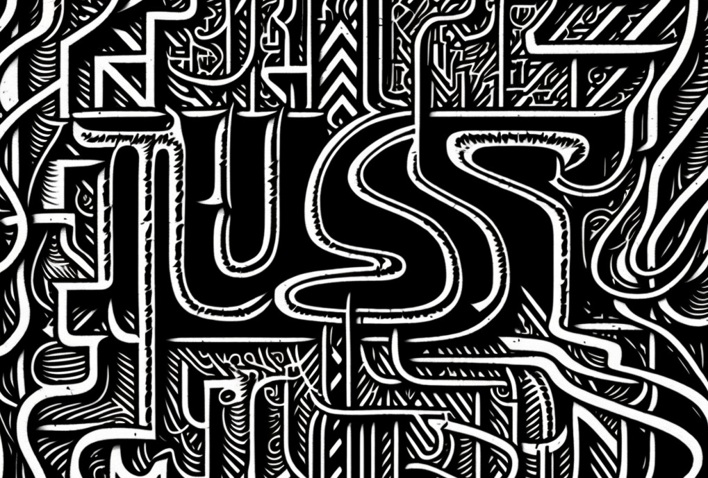

Midjourney: intricate line drawing of the word "JUST" against a maze background

"Just" is a seductive word. 

>
>
> We *just* need to hire a new leader.
>
>
>
> We *just* need a solid strategy.
>
>
>
> We *just* need a consistent process.
>
>

Imagine you are a CEO. You face a seemingly intractable problem, and the board keeps harassing you for updates. Pressure mounts. "What's the problem? How will you fix it? When will you fix it?" Meanwhile, the executive team is caught in a cycle of finger-pointing and alliance-building—all trying to fill the void caused by The Problem.

What do you do? In my experience, humans in this situation fall for the just-ing trap. We desperately want something to fix, someone to blame, and a problem (a root cause) to rally behind. Assuming the pain is acute, many CEOs in this situation end up firing someone and hiring a new leader or pressuring a leader to reorg their department. 

>
>
> We *just* need the right people in the right roles!
>
>

In less acute situations, we pin (or maybe shroud?) The Problem on the process.

>
>
> We *just* need to dial in our annual planning process so this doesn't happen next year!
>
>
>
> We *just* need to do an offsite to align!
>
>
>
> We *just* need to hire my old friend from McKinsey!
>
>

It's easy to criticize this from the side, but consider that humans:

* Simplify things to make progress.

* Crave control. We want *things* we can control.

* Are drawn to easily recalled (and salient) solutions.

* Get a solution in their mind, and find it hard to let go of that solution.

* Can be easily swayed by groupthink.

* Want to preserve their reputation.

This last point is critical. I remember a manager telling me that "It is better to fail at solving a specific, agreed upon problem with a lot of confidence—than to fail at trying to solve a more systemic issue where you can't be as confident OR to succeed, but not in a way that is less obvious and measurable." 

The feedback stung, but it made sense. What is the first advice we are given when creating a pitch deck, plan, or proposal? "Define the problem!" How about when setting goals? Make your goals specific, measurable, achievable, etc. Bonuses and promotions? Base those on clear, quantifiable accomplishments. Metrics? Establish inputs that you know you can "action" and where causation is easily understood. Projects? Define done! Communicating strategy? Describe your strategy as simple as possible! 

Most modern business practices encourage an elaborate game of whack-a-mole. When combined with "human nature" (a big topic and a vast oversimplification, but let's go with it), justing seems inevitable.

But is it?

Let me start with an observation that *most* people seem capable—when threat levels are low, and they are in a thinking mood—of accepting that situations can be complex, with many contributing and interlocking factors. So when you remove the *implications* (e.g., "ok, we're going to need to work together to solve this" or "that group of people in the company is blocking our ability to address this"), people can grapple with complexity. 

I've seen this over and over again in my workshops. When we're diverging and considering all the factors, making maps, and "letting things be messy," you can see people's eyes light up, and they get it. 

However, when we try to converge (to decide how to act), you can sense people get more guarded. They start saying things like, "but I don't trust that metric 100%," or "that map will be too intimidating for the team," or "this is making my head hurt!" As the reality of dealing with a messy situation becomes increasingly concrete, they shut down. This is when you're liable to hear someone say, "we just need to hire more people," "we just need someone to own the strategy!" or "we just need someone who has done it before!"

Justing kicks in when the tension between the conceptual understanding of a problem's intricacies and the practical need to make decisions and take action reaches a breaking point. For some people, this happens earlier than others. People "wired for action" and prone to very linear thinking break sooner and sometimes instantaneously. People "who go too deep" may never transition to action and necessary simplification. 

It's about navigating the polarity between understanding and action.

To summarize:

* When we just too early, we fail to embrace the complexity of the problem. We fail to acknowledge the problem's complexity, pick the wrong justs, and kick off a cycle of disappointment and reactivity ("we've put four people in that role over the last five years!").

* When we just too late (or never), we fail to act. We get overwhelmed by the complexity of the problem; we make no progress (and don't learn, the ultimate measure of progress).

The challenging news is that we appear wired to just too early and believe our justs. The good news, as I mentioned, is that we can control these things (somewhat).

### **Explore the Mess**

 ###

Create a space where people feel comfortable mapping out the situation in all its interesting glory. Resist labeling things as "problems," asking for "proof," and pushing people to identify the root cause. Focus on stories, observations, different perspectives, relationships, and dynamics. Encourage metaphors, analogies, or symbolism. Pick facilitation methods that actively resist convergence. Leverage the fact that people can explore messy things when the threat level is low.

Specific examples help, but [as we discussed last week](https://cutlefish.substack.com/p/tbm-208-do-you-have-specific-examples), you need to be very careful to make it safe to discuss specifics. You'll feel pressured to just when these become a point of debate or trigger a threat response. Resist labeling and the rush to judgment.

### **Capture the Mess**

 ###

When you've spent long enough exploring the mess—remember this will be longer than you're comfortable with—you'll need to find a way to ritualistically preserve this version of the mess.

Why? If you lose sight of the original mess in the push to act, you risk slipping into perpetual justing. Don't throw this away. Name it to tame it. Consider creating a physical or digital artifact representing the story and its central themes. This could be a piece of artwork, a written document, or even a video or podcast.

### **Shift to Action**

 ###

At this point, you'll need to foster a gradual shift to deciding on how to act. Discuss "leverage points" and places where a small change might help. Discuss how to make experiments "safe" and less likely to cause unintended 2nd and 3rd-order effects. 

Try those things!

The critical advice here is to clarify that it is unlikely that any one experiment will solve the problem but that if the team keeps second-guessing themselves, you'll never learn and have a shot. Most challenges require focus across multiple fronts.

At this point, it is just fine to just (lol). But hold a light touch—thinking back to the mess.

### **Close The Period of Action and Return to the Mess**

 ###

Close the loop by "ending" the experiments. This ritualistic step is vital because it allows people to shift their mindset to exploration, mess wrangling, and open-ended thinking. If you jump immediately from the summative evaluation of your experiments to the "next steps," you'll be more likely to stay in the justing mindset.

Then return to the mess.

What have you learned about the mess? Is it the same mess (unlikely because you actively changed it by trying things)? How might you capture what you learned? What new perspectives might be helpful?

To summarize:

1. Actively explore the mess

2. Capture the mess

3. Invite appropriate action—not seen as a cure-all, but also not throwing up our hands in dismay

4. Intentionally "close" the period of action and return to the mess 

**Concluding…**

----------

When we view justing as something natural and potentially helpful, we can harness that urge at the right time to make progress. It’s not the desire to act that is the problem, rather the rush to act, and the belief that there is a single cause we can “just” address. As leaders, our key job is to support environments where that can happen.

The pressure to just is strong, but we can take steps to resist the urge while being decisive when it counts. It’s not one or the other.

(Apologies, I hit my time-box for this weeks post. I will write more of this topic if people are interested)