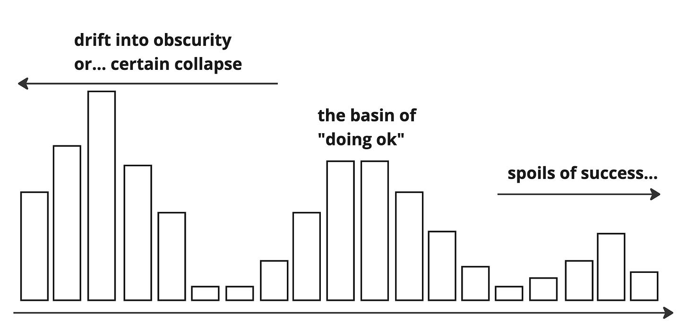
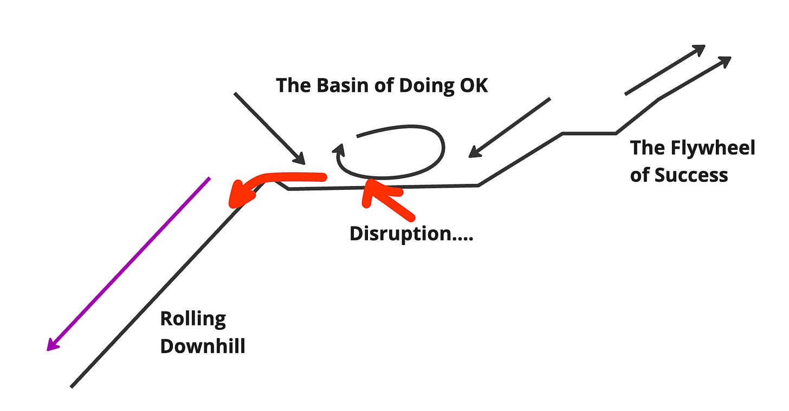

I have a theory:

The most dangerous place for a company is somewhere between obviously healthy and obviously dysfunctional.

"But isn't that most companies?" you might ask.

An extension of the theory (completely unsupported):

No, it isn't *most companies*. What if—again, an unsubstantiated theory—the distribution of company performance levels looks more like this:

Some % of companies are either collapsed or are on their way down. Meanwhile, a smaller % of companies are enjoying the "flywheel of success". They are getting better and improving. This leaves some companies in the "doing OK" basin. They aren't improving, but they also aren't failing. Stay long enough in the "doing OK" basin, and you will start your drift into obscurity, but it can take a while.

You can think of this theory as consistent with the idea of basins of attraction in dynamic systems. Imagine companies as points in a landscape with hills and valleys representing different levels of success. Collapsing companies gravitate "downhill" to the valleys. The thriving companies are climbing uphill. The "basin of doing OK" companies are stuck on a flat plateau or shallow basin where companies neither decline nor thrive until circumstances knock them over the edge.

In an obviously broken situation, change—any change—is more likely. It may not be the change we want (e.g., go bankrupt, sell the company, completely re-org), but change will happen.

In "sort of working, kind of successful, a little dysfunctional but not too bad" situations, meaningful change is *much* harder. Problems are more likely to fester for a long time and become systemic. More people have a vested interest in keeping the status quo. There's a lot to lose, and the upside feels abstract.

**But…**

It is easy to cherry-pick an example of something "going well" and use that to rationalize why more drastic change is unnecessary. The argument/question is, "If team X can make it work in this environment, then why can't YOUR team make it in this environment?" You can easily rationalize how moving the deck chairs around—a new process, a new manager, a new X, a bit more accountability—might do the trick. 

**Maybe it's me**

Even trickier, these types of environments have a way of making people question their competence. The "I must not be up for the challenge" feelings bubble up. "How can *some* people figure it out? What's wrong with me?" asks the thoughtful team member.

**Problems are "on the radar."**

Related, there's almost certainly *something* being done to address whatever problems get raised. So the answer probably isn't, "Yep, you have to live with the suck." It is more like, "We hear you, we heard you last year, and we've tasked Team X to take a look at that, be patient!" It's not like things are falling apart before your eyes, which would require immediate and decisive action. Team X is probably making *some* progress. 

**The devil we know**

There's a real argument to be made that "staying the course" will produce predictable results, whereas shaking things up might put everything at risk. While doing the same thing repeatedly and expecting different results may be "the definition of insanity", you can flip that to say, "If we do this over and over and get the same results, at least we will get the same results." When things are going *reasonably* well, a ton of money is at stake—for the company, investors, individuals, etc. Achieving the *same results* are not trivial. 

**Boiled frog**

It is difficult for anyone to be accountable for anything—work languishes, goals slip, and misalignment lingers—but teams aren't at an obvious or intractable standstill. While not ideal, there's *a way* to move forward, even if that way forward makes the situation worse in the long run. Instead of overt burnout, individuals experience a slow but steady "boiled frog" situation. They stop speaking up, focus on local things that are reasonably challenging and fun, and generally mind their business until their stock vests, they get the promotion, etc.

**Warranted skepticism (but can backfire)**

Lastly, teams *should* be concerned that improvement efforts will sap the company's core strengths. Efforts to "transform" organizations are fraught with challenges. In many cases, the new version of the company has 1) lost what made the company great and 2) is not any better positioned to tackle future challenges. Skepticism is warranted! But the skepticism can also backfire and prevent necessary shifts.

The mix of status quo bias, organizational inertia, satisficing, risk aversion, and incrementalism is a recipe for change aversion. And everything is OK until it isn’t (at which point you have zero adaptive capabilities and can’t weather the storm).

So if you work in a company like this, what can you do?

The answer depends on WHO you are—a senior leader has more formal influence than an individual front-line contributor. Your personal risk profile may also vary. A newcomer *may* have much less to lose (and more to gain) than someone who has put in their time and is cautiously optimistic that *something* will happen. 

But I think, at a high level, the answer is the same. You *have* to disrupt the situation...safely.

We know what doesn't work: 

**Antipattern #**1: telling people they are complacent, slacking, lack drive, are risk averse, etc. Not only are these things likely *wrong* (even if people seem this way on the surface), but they are also terribly demotivating. There's a good chance the team has been dealing with challenges for a long time. If you fail to acknowledge that and jump to judgment, you will lose a lot of trust and support. This antipattern is a big cause of moving the deckchairs around without tangible effect.

**Antipattern #2**: short-changing the fact that predictable ("good") success can be much more attractive than taking a big risk to try to be "best". No one wants to admit this publicly—everyone wants to say they are doing their "best work"—but people harbor assumptions about their team, their company's leadership, etc. They believe certain things are possible *only* at [insert famous company here]. Assuming everyone wants to risk it all to make the leap is naive.

**Antipattern #3**: talking about how much better things were at [other company] and how everything would be better if people *just* did X, Y, or Z. Teams tire easily of this *justing*. 

None of these work. Instead, you might consider trying the following:

1. **Seeding new behaviors**. Sometimes a system can be 'flipped' by seeding new behaviors or patterns. It probably starts with you taking the lead. Often we need to go through the motions to feel how things could be different.

2. **Increasing connectivity** among different parts of a system can facilitate the spread of new ideas, possibly creating new attractors.

3. **Introducing a disturbance** in the system is enough to push it out of its current basin of attraction. But it has to be safe. Otherwise, you'll trigger a threat response.

4. Re-evaluate and gently nudge the **incentive structures** in the system. A subtle realignment of incentives can slowly shift the motivations and actions within the system, guiding it toward new attractors without causing a shock.

5. **Removing a key constraint**. By changing certain system parameters, the shape of the basins of attraction themselves can change. 

6. **Broadcasting signals**. Send out signals (promoting a change or an interest in being part of a change) and keenly observe who responds. You may be pleasantly surprised to find latent pools of enthusiasm.

7. **Be ready**. Like a surfer who knows when to catch the wave, understand that there will be an inflection point when the system is ripe for change. When that moment happens, it is critical to have established trust, a network, and the confidence of others. You need to be prepared to make decisive moves. People vastly underestimate this patient strategy. Focus on strong relationships and wait for the catalyzing event.

8. **Localized Actions**. Harness the potential within your immediate surroundings by acting locally. Often, individuals underestimate their impact within their own teams or groups and overestimate what can be achieved on a larger scale. Your team can gradually become a beacon of change through local actions, creating a new attractor within the broader system.

What has worked for you?