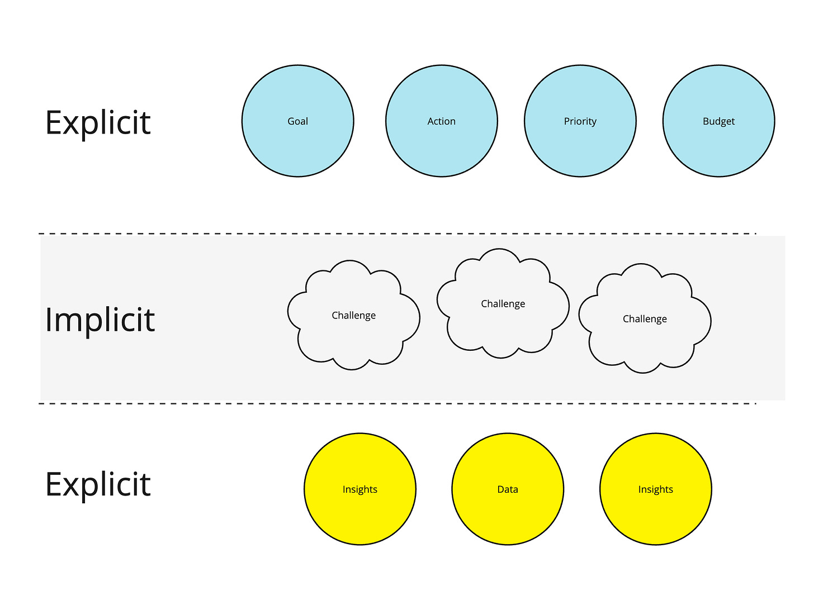

I've been (slowly) reading Richard Rumelt's new book, [The Crux: How Leaders Become Strategists](https://www.amazon.com/Crux-How-Leaders-Become-Strategists-ebook/dp/B09G2QXXWX). One of the themes of the book—extending on his previous book [Good Strategy Bad Strategy: The Difference and Why It Matters](https://www.amazon.com/Good-Strategy-Bad-Difference-Matters/dp/0307886239)— is that a coherent strategy is:

1. An insightful and clear-eyed description of the challenges facing a team, company, etc.

2. A decision about which challenges are both 1) critical to address and 2) addressable

3. A set of a) guiding policies and b) coherent actions designed to impact those critical challenges

It got me thinking.

A couple of years ago, an executive shared this observation:

>
>
> It doesn't matter what the strategy is. What matters are the goals we commit to, our budgets, our forecasts, our promise, and our commitments. We will be held accountable for these things, and they will set the constraints of how we work.
>
>

They pointed out that while the quality of a strategy matters, it is the *translation* of the strategy into tangible things like goals and budgets that matters to most people in the organization.

But let's consider how this plays out in most organizations.

Talking about challenges is difficult, especially when they are internal challenges. Making the call on the most important *addressable* challenges is also challenging. First, you need to prioritize. Second, you need to make the call on what's feasible and within reach of the team—both difficult, likely threatening, and sensitive. Even guiding policies can be tough. If they are powerful, they will be, by definition, opinionated. They will drive focus and a bit of healthy tension, not platitudinous head nodding. 

No leader wants to say, "Oh hey, [department] you aren't as important this year," or "We can play it safe and get acquired or go for broke and try to make this happen ." It's easier to discuss a BHAG (big hairy audacious goal), a watered-down growth narrative, or a model/framework. 

Leaving us with:

Let's combine these ideas:

1. The most important thing for most people is how the company deploys the strategy and its impact on their day-to-day lives. "It is all talk until it becomes my OKR!"

2. Converging on a strategy is hard.

Imagine a savvy product leader. They know 1) strategy is hard, and 2) it all boils down to tangible byproducts. You have a choice: keep asking questions about the high-level strategy, or form your personal view of what has to be done and make sure your OWN goals, budgets, forecasts, and roadmaps are generally coherent. Get those things "approved" (knowing this makes it real). 

As the product leader, which option do you chose? Most choose the latter. It is natural and tempting. The net result: either 1) less good strategies, or 2) good strategies that no one really understand outside of the manifestations of those strategies. Neither is good. Granted, you might not want to expose a full-on existential crisis to your whole org, but at least some group of people need to understand what is happening.

What can you do about this problem?

There's no silver bullet. You need:

1. To create a space that is safe to have hard discussions. You will likely need a smaller group at first. 

2. Carve out TIME to have the hard discussions—no strategy emerges fully formed. It can take a team of experienced people dozens of hours to converge. 

3. And then focus on deployment because the leader I mentioned earlier had a point: for most people, a strategy isn't real until it manifests in all the practices, incentives, and constraints surrounding your team.