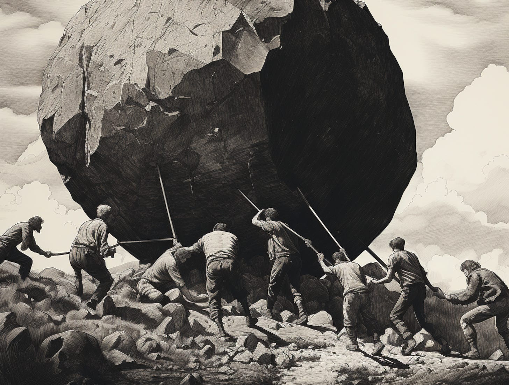

When times are good, companies develop a mix of good habits and bad habits. When times get tough, they can no longer get by with bad habits. And in many cases, the habits that were a good fit for boom times are no longer a good fit for leaner times. 

At a macro level, what I am seeing in the industry currently, is a battle for the narrative around those good and bad habits. Here's an example by way of an observation. I recently posted on LinkedIn about productivity. Adam Yuret posted [a very interesting reply](https://www.linkedin.com/feed/update/urn:li:activity:7086235352914399232?commentUrn=urn%3Ali%3Acomment%3A%28activity%3A7086235352914399232%2C7086409904973873153%29):

>
>
> A major issue is American individualism in leadership culture. Systems thinking, effective operational tooling, org design, and dependency mitigation are all things most enterprise executives I've encountered reject as "excuses" for individuals not being accountable.
>
>
>
> I've literally had a VP tell me that dependencies were an excuse because they could just build to mocks. When I pointed out how that ends up with heaps of interdependent refactoring when production doesn't match the mocks he conceded but he still felt the same way and probably I just did damage to my reputation with that client.
>
>

What I found fascinating about Adam's reply is that it speaks to, on some level, a struggle (a clash, even) for meaning-making within the organization. Adam and the executive operate within different cultural frameworks and paradigms. While clashes are a constant, my guess is that "under threat"—the threat of layoffs, pressure from investors, increased blame-placing—that these differences get amplified. 

This is how I interpreted the recent statements from ​​Brian Chesky regarding product management at AirBnb. I didn't pay too much attention to the details because I sensed this wasn't about the details. It was about reactivity under threat. [Itamar Gilad noticed the same thing](https://www.linkedin.com/posts/itamargilad_why-did-airbnb-kill-product-management-activity-7084088739005632512-ENTf):

>
>
> Chesky was apparently not happy with how democratic, distributed, and data-driven AirBnB has become. He felt that made the development process slow, expensive, and lacking in cohesion. 
>
>

Consider this quote from a product manager (large, enterprise-focused B2B SaaS):

>
>
> When things were booming, our executives were spending like crazy. They had no strategy. They bought companies like they were buying coffee. And now they have the gall to come in here and talk about productivity? They want the same output; meanwhile, we're digging out from the debt of all their crappy decisions for the last couple of years. They say we're now in 'war-time', but that assumes we were in 'peace-time'. We weren't: we were in crazy-time. And we were raising these flags the whole time!
>
>

Or a founder at a very fast growing startup:

>
>
> I get the empowerment thing, but there is a level of hubris here on the part of our product managers. The second we ask for any kind of visibility they push back. The second we ask for a timeline they push back. I understand! I was like that. But this is non-trivial. This is literally our survival as a company on the line.
>
>

In each of these examples there are is a clash.

Imagine two companies. 

One company positions productivity as a collectivist effort at doing more with less but doing so by focusing more, working more sustainably, making the hard decisions, having more open conversations, and empowering front-line employees to call out inefficiencies and opportunities. Another company positions productivity as a game of metrics, measurement, accountability, commitment, ownership, "managing performance," agency, managing up, and top-down calls to eliminate meetings. These are two drastically different approaches to the task at hand. 

Which do you find yourself drawn to? Why?

If your company is currently mired in discussions about productivity, realize that this is a proxy discussion for something else. Like many things, it is about power, narrative, and worldviews. It is probably about a clash—paradigm, professional, cultural, or otherwise.

Keep that in mind when you try to address this "rationally".

It probably will not work.

Instead, you probably need to start with listening and seeking to bridge the divide (as abhorrent and opposite to your way of thinking it feels). Realize that the current state of the world—business and otherwise—is probably making this harder. You are threatened. They are threatened. You’ll have to work through it.

*Or don’t—discussions about productivity are extremely tiring for all the reasons mentioned above, and you might save your brain and heart for something else.*