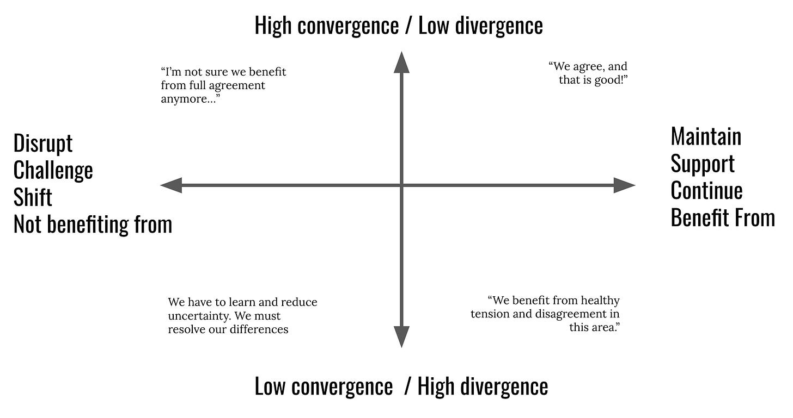
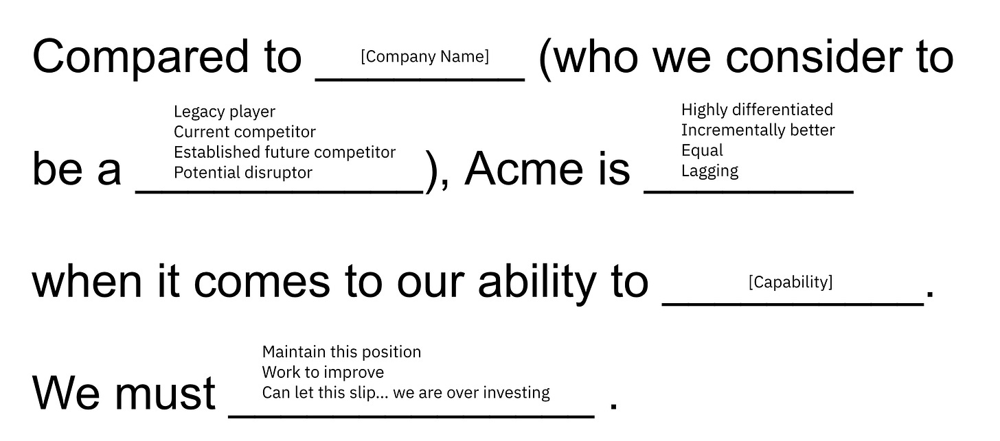
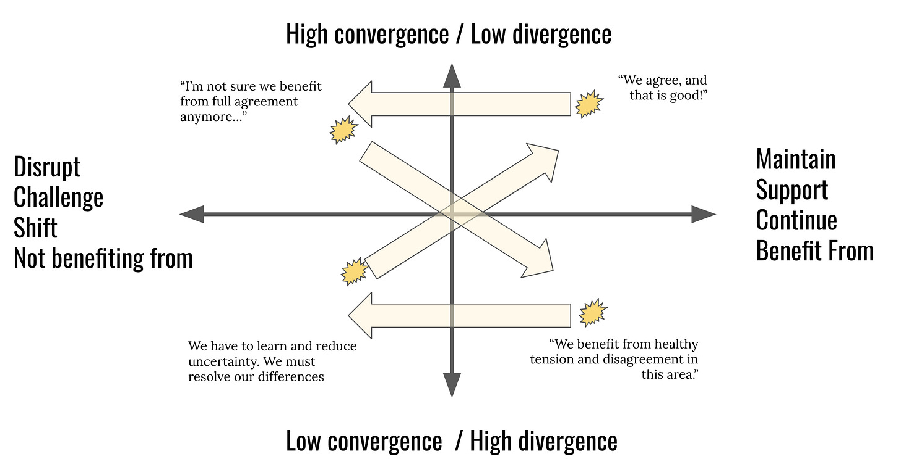

*Update: Again, thank you to all who pre-ordered [the book](https://gum.co/MTAVD). I’ve almost hit my goal of 1,000 pre-orders, which is both incredibly humbling and pretty scary! On to the post…*

I've been using this simple idea to inspire helpful conversations.

What is going on?

The **y-axis** describes the level of convergence around the belief. The **x-axis** describes whether that convergence is beneficial (right) or detrimental (left). Placing beliefs on the matrix is very subjective and that is the point.

Example beliefs (and placement). A team...

* Has diverse perspectives on how to evolve the product strategy. The tension is beneficial. Trying to converge now will silence important ideas. **Lower Right**

* Believes in the importance of diversity and inclusion, and must nurture and support that convergence. **Upper Right**

* Has a track record of careful estimation and planning (believes it is helpful). Leadership rewards "hitting your dates". But now the team -- or at least part of the team -- is wondering whether this might be hurting outcomes. **Upper Left**

* Has been struggling to settle a debate between two key executives for months. It is time to agree (shift to **Upper Right**) or agree to disagree (shift to **Lower Right**).

If you are having trouble eliciting believes, you might consider starting with this simple prompt:

Try silent brainstorming. You’ll be surprised by the variety of responses. And you’ll be surprised that many of the areas of divergence don’t actually matter at the moment…thought they may in the future.

What I like about this model is that we tend to talk about agreement as if it is generally a good thing. Same with alignment. But often we need to agree to disagree. Or agree that our agreement is no longer valuable. Or disagree about the degree to which we are supporting areas of agreement.

There’s also an interesting dynamic at play:

Areas of agreement, over time, may become stale. Once you agree to challenge that convergence, the team is thrust into a period of uncertainty. But the uncertainty/divergence is valuable. At a certain point, you realize that convergence is necessary. Which ushers in the move to convergence and supporting an area of agreement. A company tends to have just a handful of ideas/beliefs that remain in the upper right.

Give this a try. To bootstrap the activity, make some notes about frequently communicated beliefs. Ask the team to place those beliefs on the matrix.