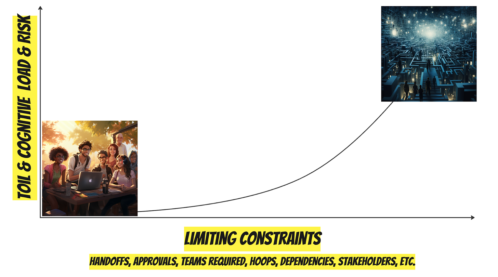
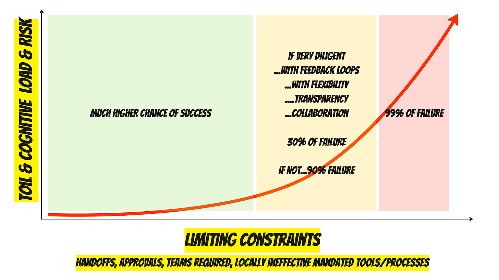
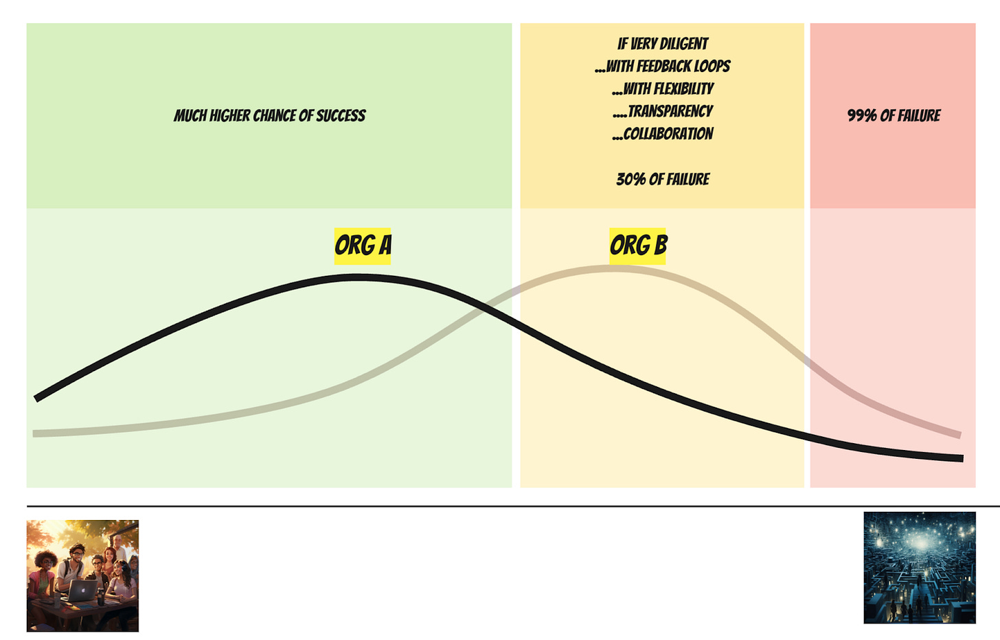

Imagine a spectrum.

On one side, you have a team basking in the warm glow of a sunny afternoon, free from constraints, shipping high-quality products at will, with instant access to customers and the best tools, and not a care in the world.

On the other side, you have a team thrown into a Sisyphean quagmire—an endless dark maze filled with setbacks, RACI charts, and soul-draining meetings-about-meetings-about-meetings. No one has stayed long enough at the company to see anything ship.

OK. Now consider these states plotted on a chart. On the x-axis, we have limiting constraints, things like handoffs, balls to juggle, approvals, hoops, dependencies, people-to-please, goals-to-achieve, etc. On the y-axis, we have toil, cognitive load, and risk.

Team Utopia occupies the lower left with the unicorns. The Unsolvable Maze is in the upper right. As limiting constraints increase, so do toil, cognitive load, and risk. 

When we operate with fewer limiting constraints, we enjoy a much higher chance of success. Meanwhile, failure is almost guaranteed once you exceed a certain number of limiting constraints. Somewhere in the middle, you have risky work, but with great diligence, flexibility, transparency, and close collaboration, you may be able to pull things off.

Different companies have different “spreads” (distributions) of work across the spectrum, but no company is Team Utopia 24-7. No company is Unsolvable Maze either (because they wouldn’t stay in business).

Which brings me to present a word that will stick in your brain longer than you like:

Project-ish

Our whole life is filled with projects. Presented with a challenge, we naturally break it down, strategize, allocate “resources,” and act. Humans are goal and reward-seeking machines. But some projects are more project-ish than other projects. With few constraints—not so project-ish—it might not even be worth mentioning the project. As limiting constraints increase, our labor becomes more project-ish. Our brain hurts a bit more. 

At a certain point of project-ish-ness, we start calling the thing A Project. At work, we have a name for Big Project-ish Projects: Big Messy Projects (BMPs). That’s our signal we need to pay attention—name it to tame it. Otherwise, there’s a good chance things will deteriorate. 

>
>
> *A Big Messy Project is a complex, interdependent initiative that involves extensive collaboration between multiple teams within and across lines of business or departments, including R&D and go-to-market. The complexity and interdependence of tasks often result in a high degree of coordination overhead.*
>
>
>
> *Such projects are characterized by high risk, with a propensity for schedule slippage without rigorous oversight. Complications can arise from conflicting team priorities and unanticipated dependencies that may not be fully apparent at the onset of the project.*
>
>
>
> *A Big Messy Project necessitates the assembly of a dedicated project team adhering to the principle of "starting together, working together, and finishing together." This collective approach helps to mitigate risks and ensure the project's success.*
>
>

BMPs are very project-ish. Add even more constraints, and we have no other choice than to find an alternative way to make progress. Failure is guaranteed. 

And that’s the thought for this week.

Project-ish is an adjective, not a noun :).