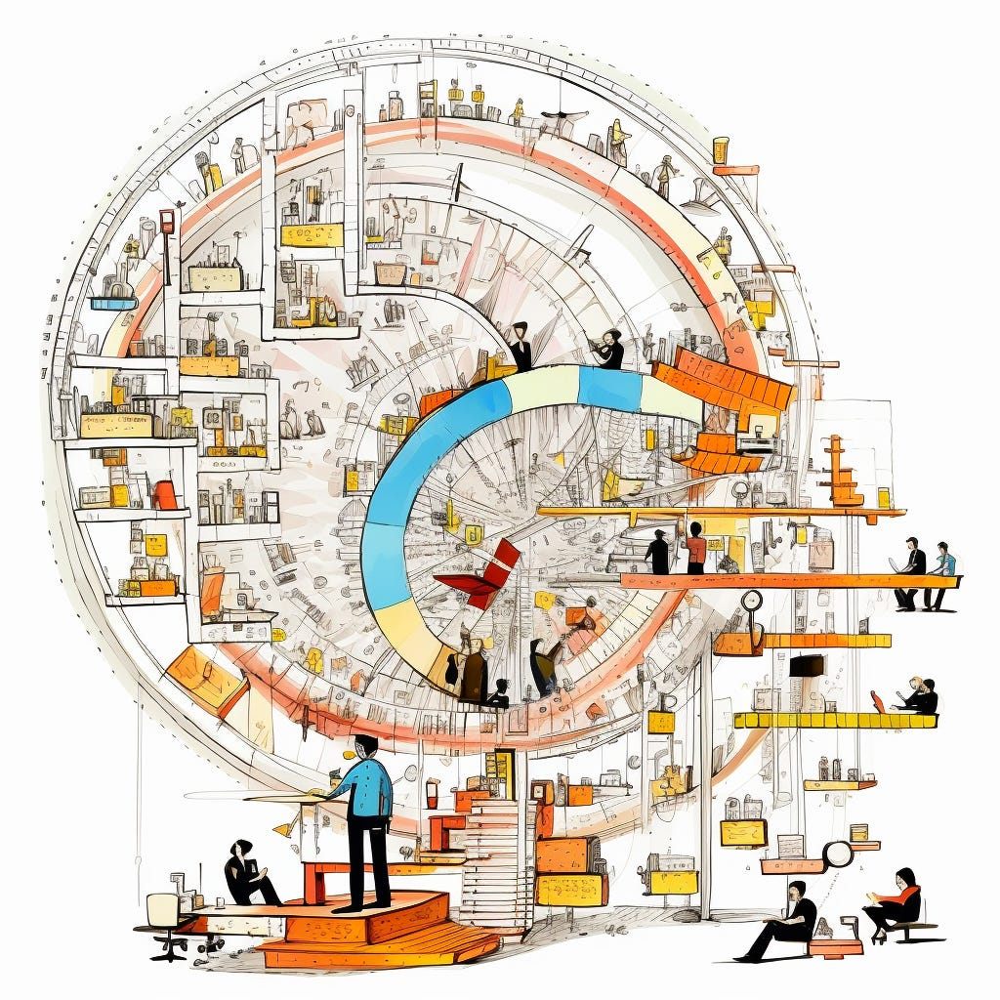

How do we answer…

>
>
> Where are we investing our money?
>
>
>
> Where is the money going?
>
>
>
> What are we getting for our money?
>
>

Let’s start with what not to do.

Product Maker Skepticism:

----------

Sadly, many methods teams use to understand the return on investment for product development activities inject bad things into the system. Many people throw up their hands and settle for a crappy method that "does the trick."

This sacrifice is not a good idea! Just because something looks good or adds up in a spreadsheet does not mean it is somehow good. 

Meanwhile, many product makers dismiss the questions of return on investment and resource allocations altogether. They discount the need to understand where the money is going, which creates a downward spiral. Or they buy into crappy methods because they assume there's nothing better out there. 

Again, this sacrifice is not good! 

When the product makers don't offer a somewhat reasonable approach to the problem, someone else will come up with an approach, and I can almost guarantee that that approach will not be friendly to good product making. Product maker skepticism and fear of malpractice are justified. The response—dismissing the challenge altogether or "playing the game"—makes things worse.

Allocation of Time and Money in R&D:

----------

Since a lot of the money in R&D and product development goes towards salaries, the most obvious way to answer the ROI question is to ask 1) who we are paying and 2) what those people are working on. Where are THEY spending their TIME? The conversation typically shifts to what projects they are working on and what they are delivering. 

Before you know it, you're allocating people's time to projects, and you end up with intricate spreadsheets linking people's energy or time to specific projects. If you are adventurous, you might start asking about the business results associated with those projects (see “Challenges with Revenue” below).

There are some obvious issues with this. 

Time tracking and accounting for every minute of the day is futile and stupid. Whenever I have done time-tracking exercises, it has been an exercise in wild-ass guessing and optics. I don't know of any team with 100% of their time to play around with, either. It's typical for a team to spend 20% of their time in meetings and administrative things and then 20 to 40% of their time doing some sort of reactive work. And then, if you factor in context switching, you don't have a lot left over. Yet, when people track their time, it's suddenly 40%, 40%, and 20% to three projects.

Someone dutifully tracking their time and incentivized to "make it count" will have extremely high utilization rates. Nothing gets done when you ramp up utilization rates to 100%. You're extremely busy but not very productive. Asking people to account for 100% of their time and scrutinizing their time allocation pushes them to do bad things!

In a similar vein, there's a tendency to think about time allocation on an individual basis. However, product development is a collaborative activity, and collaborative activities are hard to allocate from a time perspective. If five people collaborate in a meeting, that might have a different effect from those working individually. Theoretically, time is time, and time is money, but the quality of the interactions and collaboration makes a huge difference. A challenging nature of collaboration is that it can often be hard for people to pinpoint how much time they spend on it. A company that emphasizes where individuals spend their time (e.g., Mary spent 32% of her time on Project Foo in the last two weeks) may disincentivize more fluid collaboration.

As a general rule, I've noticed an inverse relationship between the rigor a company takes to determine where time is going and the actual outcomes they are achieving. This observation (if correct) is probably because companies that obsess about where time is going tend to over-index on the cost side of the equation, not the outcomes and opportunity cost.

I look for more systemic issues when someone reports 23% of their time to something.

Productivity and Efficacy:

----------

Time spent doesn't factor in efficacy. You can spend five hours trying to get something done and experience 80% drag due to debt, interruptions, etc. Only one of those hours is truly productive. Does that count as one hour, or does it count as 5 hours?

Hours are not created equal.

Example: say you're spending $100 million on collective R&D salaries. $50 million goes to teams experiencing a 50% drag in their work. And 50% of that money ($50m) goes to teams experiencing no drag in their work. This breakdown means that you are funding $25 million in drag. You are paying for this. You're essentially paying a $25 million tax for whatever productivity or efficiency hit those teams are experiencing. There's no place to put this in a ledger, but it's real. Anyone who has built products knows this; organizations use terms like "productivity" and "operational efficiency" to explain it. Still, we don't call out the tax using $ terms. We don’t answer the “Where is the money going?” with “Oh, 25% of it is going to pay the tax of past product decisions!”

Teams experiencing this systemic drag get thrown into a wicked loop. Because the team is going slower and slower, there are more questions about where the money is going. The influx of questions about where the money is going causes people to dream up even more unrealistic stories about where the money is going, further clouding the problem, making things go slower, and keeping the facade and optics ramping up until no one trusts each other. Before you know it, teams are "reporting" an equivalent of 10% of the available capacity, which will never add up to feeling very productive.

Ironically, environments where it is most important to address underlying issues are subject to the most deceiving "math" around return on investment. Opacity and spreadsheet-tomfoolery rule the day.

There's also a big danger in feeling like you need to break things into well-defined projects to begin with (just to make figuring out where your time and energy are going easier). Imagine a team shipping a lot of small tweaks across the surface area of the product every week. These are not distinct multi-month or multi-quarter projects but extremely valuable work streams. It is problematic to ask a team to simultaneously juggle and track their time on all these work streams.

Breaking things down into large projects to "make it easy to track time" is an anti-pattern because big projects are risky and often fail. It's better to work smaller, but it's much more time-consuming to figure out how you allocate your time and energy.

Investment In…

----------

A quick diversion: when you hear the term "return on investment," it's often assumed that the "investment" refers to salaries. However, there's more to consider. Companies invest in human capital. They invest in high-performance teams. They bolster specific capabilities and expand their capacity. They're making strategic bets in products and directing their focus purposefully. While this might seem like semantics, the distinction is very important. A company that views its investments as salary payments exchanged for project delivery might miss the mark.

While spending is about today, investing is a bet on tomorrow.

Let's keep going…

Output

----------

I had a recent debate with an engineering leader who claimed that the only thing that was controllable, and therefore the only thing that was fair to think about when it comes to return on investment, is the predictable delivery of projects. From their perspective, because outcomes were largely out of the control of a particular team, it was better to think specifically about what we shipped for the money. 

>
>
> What did they ship for the $N we spent on them?
>
>

Focusing on controllable inputs is not a bad idea—we're going to discuss this below—however, incentivizing pure output has all sorts of associated problems. First, our goal should be to generate the greatest outcomes with the least added complexity to our products. We want to deliver less for more. Or, put another way, We want the greatest ROI for the complexity we add to our products. 

There's no funnier place this plays out than with story points. Story points, for many teams, indicate complexity. And for many teams, more story points equals more credit. Yet that's essentially saying that you should add as much complexity as possible to your product. Any team using story points as a proxy for productivity is committing malpractice.

It also plays out in job ladders and promotion-driven development.

It's true; you can't score if you don't take shots on goal. So, output in terms of experiments delivered, features delivered, or projects delivered is a factor. But we are looking for something that indicates the team is closing the learning loop. Is the team pulling features that don't work? Is the team learning from these experiments? Are they de-risking large projects before those large projects add a ton of complexity to manage? You can’t learn if you take shots on goal blindfolded.

My general observation is that engineering organizations pivot to delivery as a proxy for success when they don't trust what their product and design counterparts are doing. They stick to what they can control: delivery.

Challenges with Revenue:

----------

OK, so output is problematic.

Enter: Revenue

Revenue itself is problematic. There are many ways to increase revenue in the short term but not in the long term. There are low-leverage methods for increasing revenue and high-leverage methods for increasing revenue—there's expensive revenue and cheaper revenue. We want cheaper revenue! A team incentivized to launch many things and "get credit" for the investment in their team quickly will find themselves incentivized to do things that may not scale in the long term.

The revenue a company earns today is the sum of many actions taken throughout the years. This leveraging of past successes also applies to new products and launches. Suppose a company has built up brand equity, built up its marketing channels, built up its sales operations, and has the benefit of launching a new product into a market. In that case, it's a mistake to attribute all of the revenue for that launch to a team that benefited from all of those advantages. 

The desire to attach revenue to specific products, product modules, or features also pushes companies to attempt to monetize individual additions. On the one hand, this helps the ROI calculation because you can say that team X built this feature, and we charge Y for this feature (and Z customers bought the feature). However, this may not be how customers want to purchase or experience the product. I'm always surprised by how many companies organize business units for "clean accounting" vs. delivering customer value.

What about revenue per FTE?

Revenue per full-time engineer suffers from many of the overall challenges with revenue. I read an article recently that claimed that "productivity was skyrocketing" because revenue per FTE was surging (in the companies they analyzed). But let's consider an alternative explanation. There have been layoffs, and now you have the remaining engineers supporting the existing revenue. Their revenue now is the output of a decade's worth of revenue-contributing actions (while interest rates were much more favorable). So, while the ratios look good, that does not indicate they can hold those ratios in the future. Again, a team can do many things in the short term that boost these types of metrics, which ultimately don't lead to good outcomes in the future.

You Can't Solve Dysfunction With Better Math

----------

Imagine three situations:

1. A company is in an extremely low-margin business. Spending on R&D doesn't make or break the company, but it's important. The company isn't truly a product company; they're trying to eke as much as possible from their modest tech spend.

2. A company aspires to be a technology and product leader. It has a large team and many questions about what people are working on. Questions arise regarding whether investments yield the right results. Teams are infighting and finger-pointing.

3. A company that's generally on solid footing. The team operates both efficiently and effectively. They're experiencing steady growth and, as part of their due diligence, want to ensure they're allocating their resources wisely.

Notice how the question, "What are we spending our money on, and what are we getting for our money?" has very different implications in these scenarios.

In the first example, the environment is resource-constrained, and the goal is to maximize small outcomes. In the second example, there's an atmosphere of low trust coupled with doubt and diminished confidence. The third company is generally trying to maintain its trajectory and ensure it's making smart choices.

We touched on this earlier, but if a company is grappling with systemic issues, any attempt to understand where time and energy through "traditional methods" will be inherently flawed. The answers become intractable. For the third scenario, assuming you have relatively healthy and autonomous teams aligned with a value chain or something similar, you'll find it much easier to figure out what is happening. With this third company, there's already a solid belief in the business model. There's confidence that the immediate and actionable inputs the teams focus on yield sustainable outcomes. In the second scenario, you have none of that.

Why is this important?

**You cannot solve company #2's problems with math. You just can't.** If anything the ROI question is an instance of political maneuvering and trying to navigate the blame landscape. The dynamics in a company like that are two intertwined. To even pretend to put those things in a spreadsheet is a disgrace to spreadsheets. You must attack that problem with curious inquiry, systems thinking, enabling constraints to stabilize the situation, and skepticism around any normal metrics.

I'll be even more forceful with this perspective. 

You make matters worse with math, weird proxy metrics, guesstimates, etc.

Solutions/Guidance

----------

With that out of the way, I wanted to focus on solutions. How do you answer questions like where are we investing our money and what are we getting from our money?

1. Due to the collaborative nature of product development, I believe the foundational element, or unit, for understanding return on investment is a team. Not specific individual allocations, not projects, but the team itself. If a team does more than one, two, or three things at a high level, then you probably don't have an independent team.

2. If you have some high-level company objectives or focus areas, it's reasonable for a team to provide a rough allocation figure for their capacity across those focus areas. But if you have more than three or four lanes in your roadmap, chances are you're paying a significant tax for multitasking. Focusing on leading indicators/inputs that roll up to those high-level focus areas is much more productive.

3. That said, in situations with many dependencies, you must embrace the mental model of throughput accounting. Essentially, you are funding a "pipe." Because your teams have many dependencies, that pipeline is narrower than you'd like—you're paying a tax for context switching and process overhead. If you have 150 people working on that pipeline, you can total their salaries, and that's the cost of that pipeline. However, dissecting things on a project-by-project or person-by-person basis is futile. Your goal should be to optimize the value throughput of that pipeline and use that as the basis for your ROI calculations. If, in the future, you can reduce dependencies and cultivate more independent teams, then you can refine how you consider return on investment. This accounting method is crucial because it pushes you to prioritize actions that reduce dependencies and focus on value flow.

4. Ultimately, teams should concentrate on actionable inputs they can control. Gauge the ROI for any particular team based on their ability to improve the inputs within their control. These inputs should correlate with sustainable outcomes like revenue and growth, but we must recognize that sustainable revenue growth is a lagging indicator. When considering return on investment, our foundation should be the actionable inputs that teams can influence. 

5. Always differentiate between time allocation and capacity allocation, even at the team level. Often, teams find that where they invested their time doesn't correlate with where they effectively applied their capacity and achieved outcomes.

6. Recognize the full value chain. Some teams may be customer-facing, with deliverables directly linked to customer outcomes. That's great. But you'll likely have many other teams supporting those primary teams. These support teams can perform valuable tasks, but if you default to a project-based ROI model, you'll significantly undervalue their impact. It's crucial that these teams ALSO identify actionable inputs to drive. Link those inputs to outputs, and then connect those outputs as inputs into subsequent outputs until everything ties back to what truly matters.

7. Pay attention to the overall health of delivery. If it's challenging for teams to deliver, or if there's a significant amount of debt and tooling issues, you undoubtedly need indicators highlighting these issues. Think of it as ensuring a healthy circulatory system. Remember, there's a hefty tax in this part of the process, and you're investing significantly in that tax. It's vital to sort this out before trying to understand ROI.

8. When teams genuinely own a business line or manage an isolated product, you can begin to consider indicators that treat it as a distinct business. Are they achieving sustainable growth? Be careful, though. Is this a standalone unit?

9. I touched on this with the second company example, but if your company faces challenges, that's not the time to ask about the ROI of specific efforts or where the money is going. While those questions are crucial, and you'll want to improve if investments are misaligned, expending effort to understand ROI only to realize you're struggling is a waste. If no one within the company is willing to admit a problem, then bring in an external consultant.

10. Above all, remember: if you don't provide a logical framework for understanding where you're investing time and money, someone in your company will—and it's unlikely to be product-friendly.

Parting Wisdom

----------

The most important thing here is to stay grounded in the Why. Yes, being smart about where you allocate money, capacity, risk, and focus is important. Yes, it can be helpful to hypothesize how actionable inputs link to long-term sustainable results. Yes, it's important to deliver. 

But don't get seduced by false precision and models and frameworks designed for project work.

Take care of the basics. Understand how your team's work links to company results. Carve out an area of independence where you can operate fairly independently. and govern yourself. Every day you come to work, ask yourself, "How is my team contributing to sustainable results?"

You're never going to have a perfect answer, and if you did, you probably wouldn't be involved in doing product work, but just asking that question and trying to fill in the blanks can go a long way.