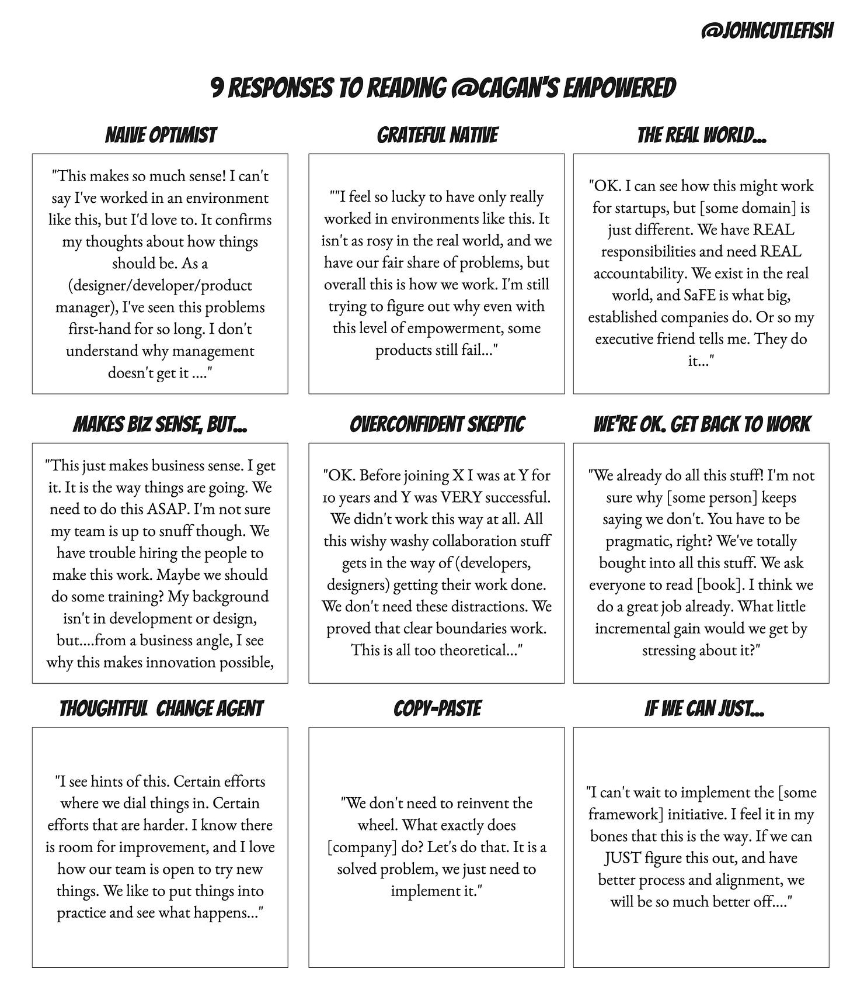

Here's something I've observed about how people (and companies) give and receive product advice.

The "higher performers" *underestimate* the impact of their context. They prefer to imagine the good things are due to their individual influence. The "low performers" *overestimate* the impact of their context. They prefer to imagine the bad things are outside of their control. Classic [self-serving bias](https://en.wikipedia.org/wiki/Self-serving_bias).

**Summary: Good things happen because of** ***Me (or Us)*****. Bad things happen (or are necessary) because of** ***The Context*** **or** ***Bad Other People*****. No one is immune to this type of thinking.**

Two sides of the same context coin. Why is this important?

There is a ton of product advice coming out of Silicon Valley. Some of it is original. Much of it repackaged, or innocently reinvented. Much of it is helpful. Most lacks context, but is compelling nonetheless. Oh and viral.

Many of the people giving the advice only have experience at digital product-first startups and companies (founded by designers, engineers, and product managers). In those companies, there is a clear line between practices and profit. There's a core belief in what works and what doesn't. That prior experience permeated org-chart and architectural decisions from the start. The team has a track-record at similar companies. And things are working, and growing, at least for now.'

With these conditions in place, you can actually do many things WRONG and still be successful! Silicon Valley has its fair share of toxic environments.

This can trigger **four** problems:

1. Companies copy the advice without awareness of the underlying context. Most advice fails to mention the pre-requisites. And many people are unaware of the prerequisites those companies enjoy.

2. Companies discount the advice because of assumptions about *their* underlying context.

3. Overconfidence on the part of the people/companies dispensing the advice! It is easy to misattribute your success. Or believe everything is a solved problem. Or believe you've invented something new.

4. Overconfidence and stagnation on the part of the companies that are "already doing it" (while missing the broader context).

It is a fascinating puzzle.

I'm a big Marty Cagan fan. He does a great job of sharing context an inspiring people. Over the years, I have kept track of responses to his books. To the extent that I have created mini-personas:

Note the different flavors/archetypes here and how the problems above manifest. The Naive Optimist downplays current context. The Real World overplays context. Copy-Paste downplays context. Etcetera.

There's another angle to all this. "Adapt things to your context" relies on teams doing a reasonable job of sensing their context. Consider a company rejecting experimenting with a new way:

>
>
> We're not Google, we can't afford good enough engineers, and you can't do any of that in banking.
>
>

*Meanwhile* their employee retention rates are terrible. Their best engineers don't have the tools they need. And upstart fintech companies are running circles around them. Those are excuses, not context. No they aren't Google. But no one is Google. Or:

>
>
> Whatever we've been doing must be working! Look at our fantastic growth over the last couple years! And our amazing culture. Let me tell you exactly how we did it!
>
>

*Meanwhile*, their luck and early product-market fit is set to run out soon. Whatever worked, may not continue to work.

Again, when it suits us we ignore or fall back on our context. And if our context is all we’ve known, we tend to forget it. So what can we do about this? Being aware is a start. Ask:

* What about my context do I take for granted?

* What might I have trouble seeing?

* What are the prerequisites for this advice?

* Where are we using context as a scapegoat?