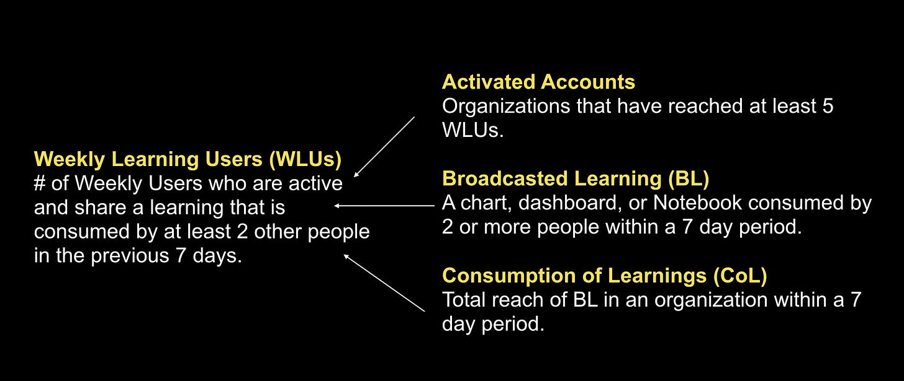
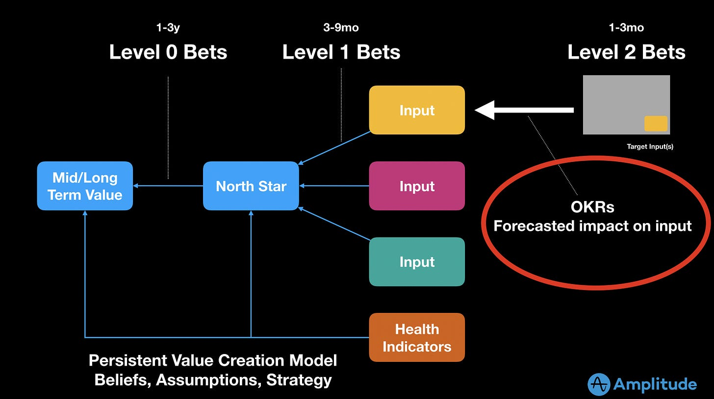

I've done a bunch [North Star Framework](https://amplitude.com/north-star) workshops over the last year. Lately I've noticed something important.

**There is a big difference between persistent models and work (or goal) related models.** OKRs, for example, are a work related model. Work related models involve a specific time-span (e.g. a quarter). The team attempts to achieve The Goal by end-of-quarter.

Meanwhile, a north star metric and related inputs *persist* for as long as the strategy holds (often 1-3 years ) . The constellation of metrics serves as a belief map, driver diagram, or causal relationship diagram. It explains our mental model for how value is created and/or preserved in our product/system.

Here is Amplitude’s north star metric and inputs. Note how this is likely to remain steady for some period of time. There’s no “work” implied.

The two approaches are complimentary. For example, a team attempting to influence **broadcasted learnings** might forecast how the current “work” will impact the rate at which people consume dashboards, notebooks, charts, or dashboards by EOQ.

But here is the important part...

Without persistent models, teams are always chasing their tails. Quarterly OKRs should not feel like a "big deal". But they are exactly that when either 1) teams have to dream up their OKRs from complete scratch without a persistent model to guide them, or 2) OKRs are a cascaded down and teams lack context.

So in my coaching, I have started to spend a lot more time with teams on exploring persistent models, and a lot less time on initiative goal setting. Why? Once you have the foundation set, initiative goals are a lot easier and intuitive (and safer, and more effective).

In your work, how do you balance the use of both types of models?