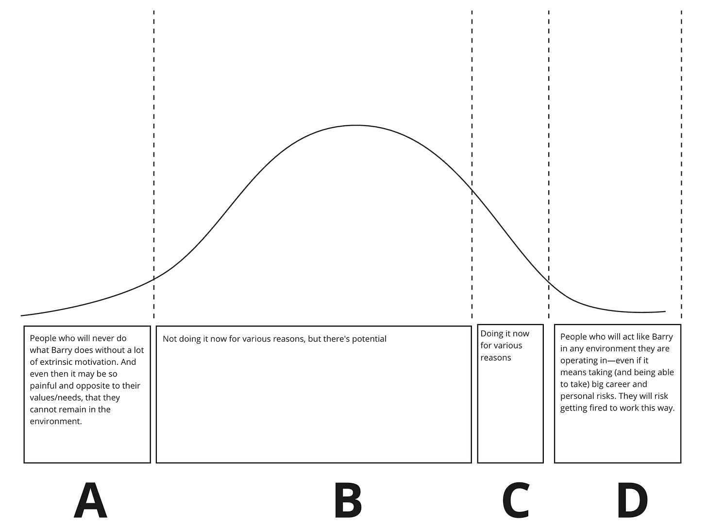

*Two events:*

* *I'm excited to join Laura Tacho [to chat about friction, dissonance, and waste in product development](https://getdx.com/webinar/friction-in-software-development/) (Tuesday, Feb 13, 8:30 AM PST, 5:30 PM CET)*

* *I'm doing [a mid-week, Europe time-zone friendly iteration of my Scoping & Shaping Workshop](https://maven.com/john-cutler/scopingandshaping) (Thursday, Mar 21st, 7–9 AM PDT, 2–4 PM GMT)*

In [last week's post](https://cutlefish.substack.com/p/tbm-271-the-biggest-untapped-opportunity), I floated that "skilled pragmatists" represent a major opportunity for companies to improve outcomes.

Skilled pragmatists are reliable and capable but don't go "above and beyond," jump into the spotlight, or raise issues because they are skeptical that those efforts will be worth the time and effort. As Bob Batcheler notes in the comments, "The risk vs. reward equation does not encourage [skilled pragmatists] to raise their profile until the norms of the organization change."

In that post, [I described "Maria"](https://cutlefish.substack.com/i/141376897/mariaa-skilled-pragmatist), a fictional tech worker and skilled pragmatist. Importantly, I described Maria as facing her career with clarity and agency, not as a victim of learned helplessness or lack of drive. "She is not a pushover or an underperformer. She is a human navigating the weird sociotechnical systems we call companies."

I promised a Part 2 with solutions. I'll do my best, as this is a pretty heavy topic. It may take a couple of posts.

Get Specific

----------

In an email reply to the post, someone asked the following:

>
>
> I think half of my team fits this profile! I chatted with some other managers who felt the same about their teams. How do I *get more out of* these people?
>
>

I asked them to be **a lot more specific.** What exact behaviors do you want *more* of (or less of)? Do not use mushy words like drive, passion, "strong", ownership, "sense", agency, and grit that could mean a million things depending on someone's worldview, belief system, upbringing, and life experiences. Don't hide behind "I know it when I'll see it" or "Act like Barry." And for the love of god, don't use phrases like A Player, 10x, Top Tier, or Rockstar.

I've enjoyed Julie Dirksen's latest book, [Talk to the Elephant: Design Learning for Behavior Change](https://www.amazon.com/Talk-Elephant-Design-Learning-Behavior/dp/0138073686). Buy it. It is accessible and immediately useful. Dirksen provides a "mad lib" behavioral statement format attributed to Dustin DiTomaso in the book. 

>
>
> **Who:** Target audience
>
>
>
> **Will do what:** Target behavior
>
>
>
> **To what extent:** Engagement pattern (amount, frequency, intensity, duration)
>
>
>
> **In what context**: Where, when, with whom, to whom (does the behavior occur)
>
>
>
> **For what outcome to occur:** Outcome goal metric the behavior will affect
>
>

Here is an example I worked out with a real person, imagining what they hoped the Marias on their team would do more often. In their mind, this is what "going above and beyond" looks like.

* **Who**: E2 or above engineers

* **Will do what**: Clean up as they go, refactoring, and leaving the code easier to work with for the next person

* **To what extent**: For tasks normally taking two days, an additional day or two is acceptable for this type of work. For longer tasks that take two weeks, adding an extra 3 to 4 feels about right. 

* **In what context**: This activity is estimated to apply to about half of the tasks undertaken.

* **In what context**: This behavior is expected to occur during regular development tasks, features, or stories, where and when the task is a good candidate for such improvement efforts. This may involve working individually or collaborating with team members, primarily within the development environment and during regular work hours.

* **For what outcome to occur**: The intended outcome is to increase the rate at which we create value for customers, facilitate easier troubleshooting, decrease downtime, enable more developers to work across different code bases seamlessly and improve developer morale.

More Barrys?

----------

Imagine that you have people on your team who work this way, but not enough of them. When you read [Post 1](https://cutlefish.substack.com/p/tbm-271-the-biggest-untapped-opportunity), you said, "Geez, I wish more people would act like Barry. We need more Barrys! How can we get Maria to act like Barry?"

At the risk of vast oversimplification, imagine four categories of people and a distribution.

1. People who will never do what Barry does without a lot of extrinsic motivation. And even then it may be so painful and opposite to their values/needs, that they cannot remain in the environment.

2. Not doing it now for various reasons, but there is potential.

3. Doing it now for various reasons

4. People who will act like Barry in any environment they are operating in—even if it means taking (and being able to take) big career and personal risks. They will risk getting fired to work this way.

**Most people are not A and not D. Most are B and C** but are B and C for different reasons. Why is this important? You have a lot of opportunities, but you will need to do some hard work to understand those reasons. You must practice [perspective-taking](https://en.wikipedia.org/wiki/Perspective-taking#:~:text=Perspective%2Dtaking%20is%20the%20act,a%20variety%20of%20beneficial%20outcomes.) and [cognitive flexibility](https://en.wikipedia.org/wiki/Cognitive_flexibility) and work hard to avoid becoming a victim of your biases and worldview.

Acknowledge Your Biases

----------

Before taking the thoughtful approach, take a moment to step back and observe your feelings about the situation. Get it out of your system. No judgment. Go All-Out-Libertarian, All-Out-Structuralist, All-Out-Tech-Futurist, All-Out-Systems-Thinker, All-Out-Individualist (or Collectivist), or All-Out-Intersectionalist.

What did your parents drill into you (or out of you) growing up? How does the "real world" work? Why are there winners and losers? Where does the individual and context begin and end? How did you get to where you are today? How do you treat "complainers"? Why? What does 'taking responsibility' mean to you personally and professionally? How do you navigate the tension between individual achievement and collective well-being?

Trigger Warning! Here's what *some* people will attribute the Barry situation to:

* You are born with that attention to detail, or you aren't. Not much we can do.

* This is a failure of management, and specifically line management! Hire new managers.

* Talk of 'skilled pragmatists' is just another way to romanticize underperformance.

* If we wanted people to do this, we should have just hired for it.

* Change starts at the top, not by pressuring the individual. We must shift the culture around quality and need explicit messaging from our leaders.

* So, should we accept slower timelines for 'cleaning up'?

* We just need to align incentives. Bake this into the performance calibration cycle!

* People will not do this until we have explicit goals that target this. How else will they push back on the product managers?

* We can't have engineers just deciding this. They'll goldplate EVERYTHING because that is how engineers are wired.

* Do. Or Do Not. There is No Try.

Nobody's listening. Go!

Start Listening

----------

Suppose everyone in your company thinks exactly like you (and shares your life experiences and believes what you believe), then you can stop reading right now. Why? Because your response is so baked into the company's culture, you can reliably trust your gut in this situation. Even if better results are possible, it will be highly unlikely that anything can go up against that level of homogeneity.

But if that is not the case (I hope so, as mono-cultures that lack diversity tend to do worse over the long haul), then read on.

Please take all of that personal stuff and put it to the side. Let it go. Put on your researcher hat. The science is clear: a whole host of individual and structural/contextual factors are at play in this situation. Your personal views represent a narrow slice of that.

### …To People Who Do It

 ###

**As the next step, please find some people in the C and D categories and listen to them explain why they do what they do.** What motivates them? How did they learn how to do this? Were they able to do this at their last job? At the job before their previous job? What helped them make it a habit? When did they think it wasn't appropriate? Are other employees supportive? Do they feel they can make this Behavior public, or do they keep it on the down low? What does it feel like when they're doing it? Do they use any tools to encourage the behavior? Is the behavior automatic, or does it take some motivation? Do they do it alone, or do they do it with other people? Do they feel that the company rewards the behavior? Does it matter? What itches and needs does the behavior scratch and fill? How would they feel if someone told them to stop doing the behavior? How does the behavior fit into their professionalism, and what does it mean to do good work? Who were their role models in this Behavior? If they were looking for a new job, how would they feel if their new job expressly discouraged this Behavior? 

### …To People Who Don’t

 ###

**Then, do some research with Bs.** Describe the behavior, and then start asking questions. Is the behavior familiar? Have they done it before? What do they see as the impact of that behavior? Is it beneficial? Do they value the behavior? What do they do instead to achieve something similar? What is their mental model for what might be getting in the way of doing the behavior? How do they feel about the current system of incentives, and how do those incentives interact with the behavior? What do they think about the people who do this Behavior? Are their tools conducive to this Behavior? How about the environment on their team? Where would they find the time and bandwidth to make this Behavior a habit? 

### …To Everyone

 ###

**Then, step back and explore other views**. Talk to senior leaders about their beliefs surrounding this Behavior. Explore the mythology of the organization— those early stories that continue to permeate and reinforce norms. Try to track the overall adoption of the behavior over the last couple of years or since the company was founded. If senior leaders have openly questioned the behavior, explore their belief system. Look at departmental differences and how they correlate with that behavior on different teams. What's different about those departments, leaders, managers, and team members? Tools? Architecture? Business context? Think of yourself as an anthropologist.

Where does that leave us?

When doing research based on the behavior in the example, you are likely to hear a whole mix of things. Some of these things will assault your sense of being, but you must listen. You will hear things like:

>
>
> C: This was drilled into me at my last job. I wasn't a fan, but my manager made it a requirement, and I started to see the value.
>
>

>
>
> B: I'm under so much pressure to crank out story points that any delay will be a ding against my chance of a promotion. And sometimes, I struggle with some of the more advanced refactoring concepts. It takes other people minutes. It takes me hours. Also, I just have to call this out: most developers who do this are men who have been at the company for a long time.
>
>

>
>
> D: I will be honest: I want my life to be easier at work. I wish I could say I do this for the team or other people, but I mostly clean up as I go when I know I will need to return to the code. I want work to feel smooth and fun; clean code helps. Even if it weren't allowed explicitly, I would still do it out of sight.
>
>

>
>
> B: At a prior job, I did this, but it was pre-pandemic. I was on what felt like a real team and did many things because of the camaraderie. It was fun to hear team members say, "Oh cool, that was great you took care of that!" Now, things seem so distant. I don't get that social confirmation, and it feels better to do what I was asked to do and stop.
>
>

Interesting stuff, huh? You may have felt triggered, but try to put that to the side.

The important point here is that you are:

1. Listening.

2. Do not assume the "user" is exactly like you or inhabits a "real world" built solely on your belief system.

3. May not respond to the same interventions that you would respond to.

Wrap Up

----------

I need to wrap up for today, but I'll continue with Part 3 next week.

The Crux here is that these situations often devolve into a dichotomy between the individual and "the system," nature versus nurture, the needs of the company versus the needs of the individual, people vs. process, etc. Luckily, the reality is much more interesting. If the world were that dichotomous, it would be so boring.

 So start with a clear-eyed view of the behavior you want more of.

Then, Get your views out of your system. Start with a clean slate.

 Then, open up your ears and listen. Embrace the diversity on your team.

In Part 3, we will work on using this to start trying things. Hint: It is probably a good idea to co-design the path forward with the humans involved. Instead of “getting more out of” people, think about “achieve more together, and for each other.”