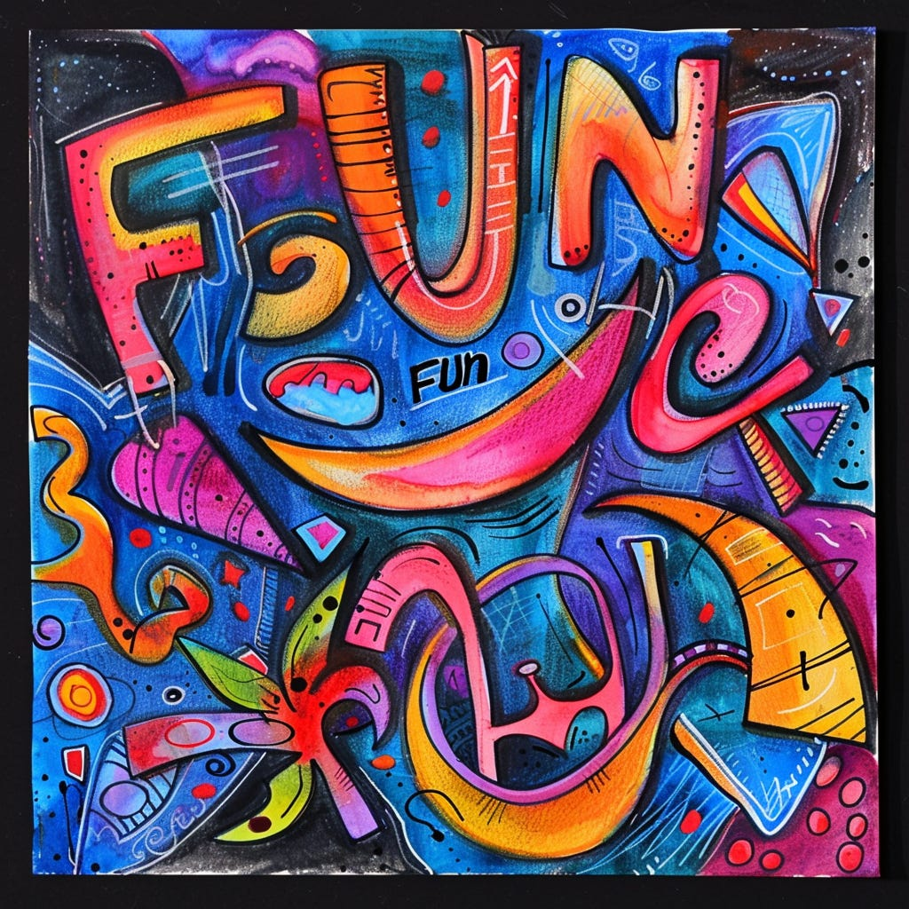

I remember when I landed my first "tech" job. I thought to myself:

>
>
> *This is crazy—I'm getting paid to work with interesting people and solve challenging problems. And we never run out of fun problems to solve, especially when things are working. How cool is this!?*
>
>

It felt like a dream for someone with diverse interests like entrepreneurship, "creative" making (music, in my case), technology, design, etc. In retrospect, if I had paid attention, I could have probably studied some of this stuff at school, but I was clueless. I dropped out and meandered toward tech over a couple of years. I've been so lucky (and privileged) that things eventually worked out the way they did. I rode three "boom" cycles, and the busts didn't impact me much.

When I chat with other product makers (especially those who started before the graduate→job fast-tracks emerged), I consistently hear the same theme: the joy of solving fun problems with interesting people. It's what unites people. 

One of the things driving my writing and advocacy is the core belief in the magic (and yes, fun) of entrepreneurial, creative, cross-functional teams. When things are working, you experience lots of the "right" kind of challenge and minimal amounts of bullshit. You laugh and crack jokes. You savor the wins and the incredible feat of building something that goes on to help humans and help your company make a buck. Things aren't perfect, but they flow. A year goes by, and you barely notice your big impact and how you've all grown as individuals and evolved as a team.

I fear we're losing sight of that.

Recently, I was chatting with a PM. I asked if they were having fun and experiencing joy at their company. They replied:

>
>
> *Not really. Things are so serious right now. I'm not sure talking about fun would go over well. It is strictly business at the moment. Put your head down and go. Everyone is talking about efficiency. People are competitive, backstabbing, and protecting their kingdoms. It's all spin and optics. When, or if, the job market improves, I will find a way out.*
>
>

It broke my naive heart. 

I say "naive" because one could argue that tech exceptionalism was always a bit of a mirage and that low interest rates buoyed a naive and unsustainable promise we sold ourselves. My parents worked in highly bureaucratic organizations for their whole lives (and I benefited from them doing that). Years would pass when something or other would be causing drag on the organization. "This should clear up in four or six years, John!" 

But doom-scrolling LinkedIn suggests something else is happening.

The tech info-sphere is currently awash in talk of real vs. fake, best vs. rest, do this vs. that, tech utopianism vs. AI hysteria, top-tier vs. mid-tier, use AI or be used, and founders vs. workers vs. managers vs. VPs. People are processing that the companies they joined are, well, companies with factions, investors, confirmation bias, and competing needs. Everyone is clinging to narratives to explain what's happening, even when it comes at the expense of others ("This will be hard for you to hear, but \_\_\_\_\_\_\_"). Workplace loyalty is at [an all-time low](https://knowledge.wharton.upenn.edu/article/is-workplace-loyalty-gone-for-good/), and outside of work, [America has a loneliness epidemic](https://www.npr.org/2023/05/02/1173418268/loneliness-connection-mental-health-dementia-surgeon-general).

It's all so…paternalistic, aggressive, contentious and divisive. And bewildering—narrative soup.

To quote a designer friend who is mid job search:

>
>
> *Fun isn't a top priority at the moment. Landing a job is. I couldn't care less what the company is like as long as it believes designers have a right to exist and get a reasonable paycheck. I'm more interested in a boring, big company that is stable and has decent leaders, even if they move slowly. My last company was supposed to be amazing, and that's what we'd say publicly because people are too scared to tell the truth out loud, but it wasn't like that.*
>
>

Totally understandable.

One could write this off as a byproduct of the times (or the end of an era, or late-stage capitalism, or x), but I am uncomfortable with that. It's all a self-reinforcing loop—a doom loop that's dividing people. We need to find ways to rekindle and amplify the excitement, fun, challenge, and joy—for our well-being and the well-being of others. We need to lift people without being so serious.

Whoever has the power and influence to create bastions of challenging fun where teams can experience how rewarding it can be to make stuff and have an impact together—I think that's what we need now. It is also what will jumpstart teams and kickstart hiring because teams having fun will be much more impactful, and real teams will be less divisive.

Productivity? Efficiency?

I’ll take “Having fun building stuff that has impact” any day.

Could you do me a favor? Have a story of something your team celebrated recently Share it as a comment [here](https://www.linkedin.com/posts/johnpcutler_the-fun-thread-will-make-sense-if-you-read-activity-7173443464154611713-2k5Y?utm_source=share&utm_medium=member_desktop). Let’s get some good news going!