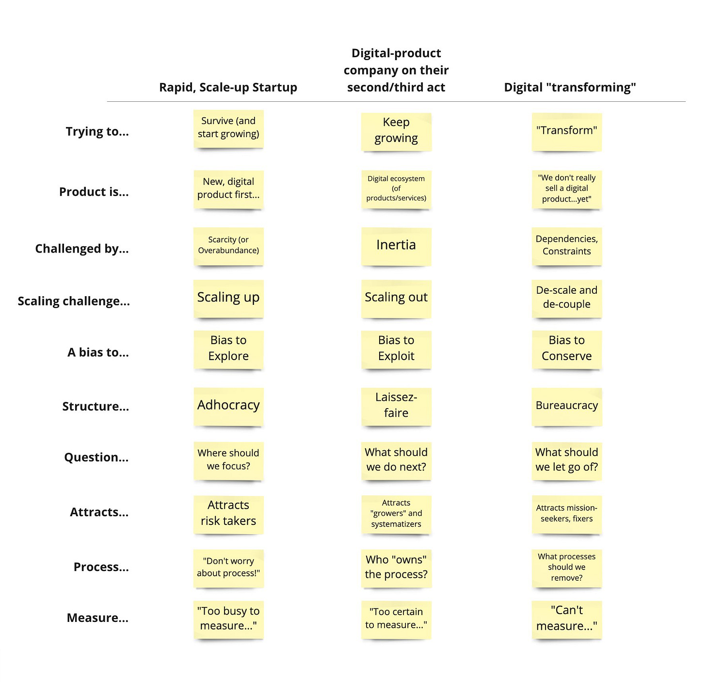

I’ve shared this previously, but I thought it might be interesting to share it with my broader and more diverse newsletter audience. The table shows some characteristics of companies at different stages of evolution.

Like any model, this is *wrong,* but reflecting on the patterns may be useful. The key point is that meaningful differences exist between rapidly growing startups/scale-ups, more established tech companies, and non-digital-product-selling companies looking to modernize.

You can also experience all three motions in the same company (and experience the shifts and tensions as you move between motions, which could be unique motions unto themselves).

*(Aside: Here’s [a library of images I’ve shared over the years](https://airtable.com/appJPo2Cv552sqnU6/shrTrqgIadVcLwKeD). Each of these would probably be worth a post, but I’m not sure the newsletter format is right. Suggestions are welcome. What should I do with all of these images that were share originally in social feeds?)*