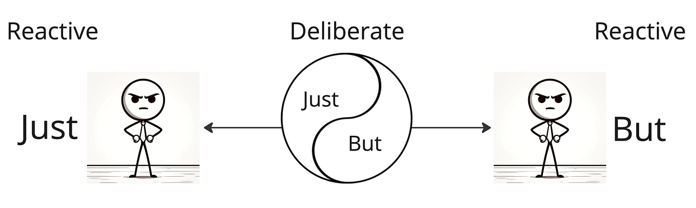
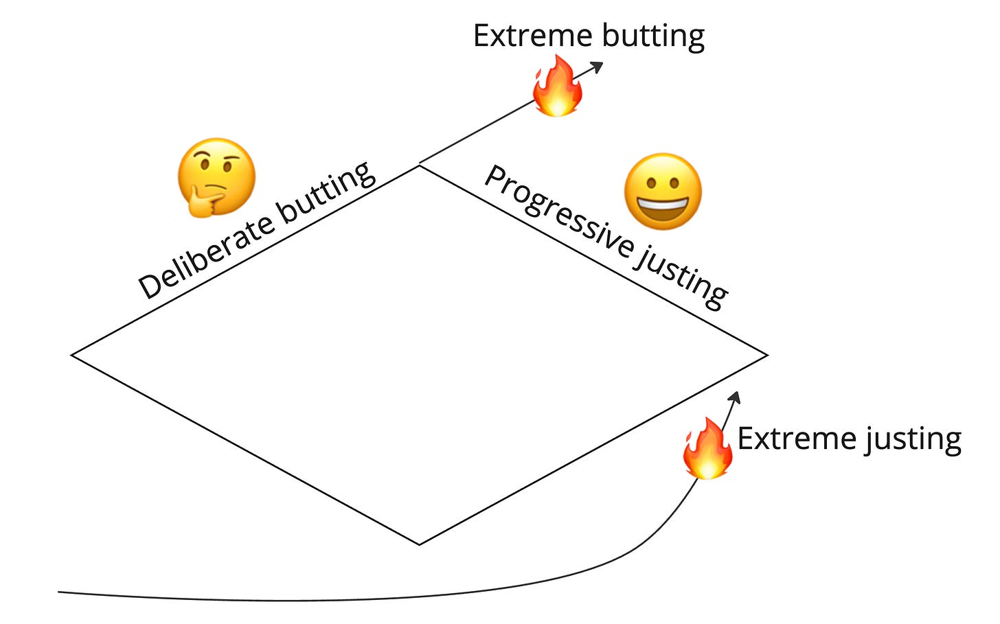

In the past, I've written about how the word "just" is seductive.

We just need to \_\_\_\_\_\_\_\_\_!

But "but" is also seductive. Given any proposal, you can always find a *but*. 

But did we consider \_\_\_\_\_\_\_\_?

But what about \_\_\_\_\_\_\_?

If *just* is context-free, then *but* is context-heavy. If *just* is biased toward action and simplification, then *but* is biased toward questioning and exploration. Just and but are polarities: you need both. Just has answers. But has questions.

I'm wrong (because all models are wrong), but it feels like we all have a bias to just or but. Some people are amazing justers. Their bias to *just* helps the team move forward and converge. And some people are amazing *butters*. They bring up the caveats, nuances, edge cases, complexity, and traps. Some people seem to do both reasonably well.

Justers and butters save lives in different ways: one by acting fast, and the other by preventing the adverse drug interaction. Put justers and butters together—provided they trust each other—and you're in good shape. Without trust, a juster and butter will just butt heads incessantly.

Of course, both can go wrong. Extreme/reactive justers have an allergy to anything and anyone they perceive as a twist (butters). They are seduced by simplification. Extreme/reactive butters relish poking holes in anything. They are seduced by complications and are allergic to anyone they perceive as oversimplifying, rushing to judgment, or making a context-free statement (justers).

Experience and skill help us know when to just and but. An inexperienced marketer figures you just need to crank out the landing page. The experienced marketer remarks, "*But* we need an actual strategy before jumping in!" Later that day, the experienced marketer knows they "*just* need to execute" a routine request, while the inexperienced marketer gets spun around exploring various edge cases.

Our approach changes as an effort progresses. When we diverge, we're butting. When we converge, we're justing.

Would any startups ever get off the ground if someone didn't do a bit of justing? Or ask, "*But* isn't there an easier way?" Would we make deep scientific discoveries if butters weren't there to question every assumption and dig beneath the surface? Or *just* keep looking. 

Maybe we're all just-butters—justers for our ideas, and butters for other people's ideas (when we don't agree, or when we just want the glory of doing what we want). Or justers when it comes to blaming others for their faults and butters when explaining our missteps.

What's clear is that when we're working with other people, it is important to provide context, explain the why, and embrace the polarity. And we can all benefit from self-awareness, especially when it comes to our triggers and defaults.

Questions to ask yourself:

----------

Am I more of a juster or a butter in my approach to problems and decisions? What examples from my recent work illustrate this tendency?

How does the balance of justers and butters on my team affect our ability to innovate and execute? Are we missing one of these perspectives, and how does that impact our outcomes?

In what situations has my bias towards action (justing) or questioning (butting) served me well? When has it led to mistakes or oversights?

How effectively do I communicate with team members who have a different bias? What strategies can I develop to improve interactions with justers if I'm a butter, or with butters if I'm a juster?

Reflecting on my current or past teams, how has the level of trust influenced the productivity and harmony between justers and butters? What steps can be taken to build or restore trust?

Can I identify a time when I fell into the trap of being an extreme juster or butter? What were the consequences, and what did I learn from that experience?

In what situations might I need to adopt a more juster-like or butter-like approach than I typically would? How can I develop flexibility in my thinking and problem-solving?