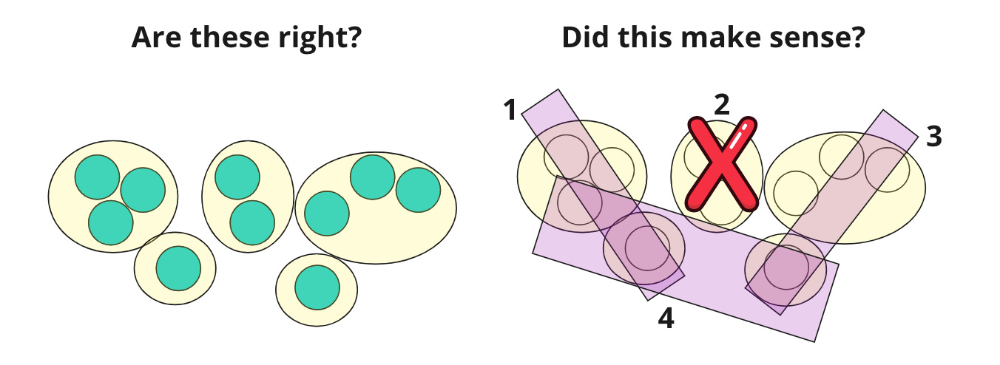

We have ten companies.

I ask marketing team A, "is there any way we can market to all of these customers using the SAME strategy?"

I ask marketing team B, "which companies are similar?"

They give it a go:

Note the differences in their approach. Team A attempts to find a message that will resonate with all customers. Team B groups the customers without considering whether a single message will resonate. Team B doesn't try to solve the optimization problem (yet).

I chat with Team B and ask them to develop a marketing strategy. They come up with this:

They realize a couple of things very quickly:

1. Catering to everyone is doable (A's approach) but likely not very effective.

2. They need to focus. #2 isn't viable

3. Given current resources, there may be a way to try three approaches (#1, #3, and #4). #1 and #2 are focused on clusters. #4 spans clusters with a more generic message.

Stepping back, what have we learned here? Teams fall into the Team A trap all the time. If you look hard enough, you can persuade yourself there's a common thread. The better approach is to observe what exists first. And then strategize.

There is a risk with approach B, however. Over time it can start to look like this:

Team B throws away the hypothesis (the original clustering logic and the strategy-to-cluster mapping). What's left are the tactics. Team B perceives the world from the lens of its tactics. This approach is a big problem when Team B figures out that there was a flaw in their logic! 

What if they need to go back and reconsider their original clusters? Or our tactics?

What can teams do about this?

The most important thing you can do is to 1) take the Team B approach and 2) keep a careful history of your clustering and tactic mapping efforts. Don't lose the thread back through your various hypotheses.

You can apply this advice to any clustering and segmentation your company performs. When you do so, you realize that different groups will have distinct clustering and tactical approaches. For example, it makes sense for product to view things one way and marketing to view things another way. The question is: combined do these approaches complement each other? If marketing and sales can land a customer, but the product isn't well suited for that customer, and it is difficult to make that customer successful, is your approach working?