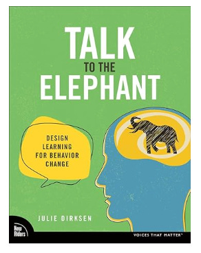

In case you missed these:

* [The tough reality of being a "glue person"](https://cutlefish.substack.com/p/the-tough-reality-of-being-a-glue?utm_source=activity_item)

* [Keep Product Management Messy](https://cutlefish.substack.com/p/keep-product-management-messy) (about learning product and “it depends”)

---

*Like the newsletter? Support TBM by upgrading your subscription. Get an invite to a Slack group where I answer questions.*

[Support the newsletter](https://cutlefish.substack.com/subscribe)

---

In product, we're bombarded by high-level concepts like empowerment, data-driven, product-led, customer-focused, accountability, getting into the details, and high agency. But teams have trouble putting these ideas into practice. Why? And what can you do about it?

When I ask people to describe the behaviors these things might entail—what I would observe (see and hear) if these things were happening—I often get blank stares.

**Me:** "Could you help me understand this for a second? Say our teams were more empowered; what would I see more or less of?"

**Them:** "They'd be more empowered. Less of a feature factory!"

**Me:** "Great. But can you just think about the last couple of weeks? What would I have seen more or less of? What wouldn't have happened?"

**Them:** "Well, we wouldn't have been just told to build that feature."

**Me:** "What would have taken the place of that? Describe the conversations you would have had. How would you have communicated those decisions? What would change in terms of the day-to-day? Don't overthink my question: what would I see?

Pause.

One of three things typically happen in this situation:

1. When prompted, the person can start describing behaviors in detail **based on their first-hand experiences**. They've internalized the signals and never really put these things into words before. They just needed some prompting. Sometimes, that experience is highly contextually relevant, and sometimes, it is a bit more distant.

2. When prompted, the person can describe the behaviors **from a theoretical perspective** based on what they've read or maybe observed from afar.

3. They actively resist the exercise because they feel strongly that these behaviors "can't be described" and "I know it when I see it!"

If your conversations involve more than one person, things get very interesting! People speaking from first-hand experience often have different experiences. People speaking from theory have different theories. And the stubborn people are all uniquely stubborn. 

An interesting dynamic here is that you often find people who are 

1. Huge advocates for things they've never done first-hand

2. Huge skeptics about things they've never done first-hand

3. Huge advocates and skeptics for things they HAVE done first-hand but are now being asked to adapt to the current context

I remember meeting someone who was a big advocate for trunk-based development. I asked if they had ever actually tried trunk-based development. They hadn't, but they also seemed to have a ton of the theory down and the principles behind why it *might* work in context. Meanwhile, I've also met people who 1) rip trunk-based development apart and haven't tried it and 2) people who have done trunk-based development who think it applies *everywhere* because they did it *somewhere.*

How interesting! I often wonder what differentiates people who can get "bought-in" to something they haven't done first-hand from those who can't.

So What?

----------

Why is this helpful?

Describing actual behaviors can be extremely powerful. It cuts through the context collapse that tends to accompany vague concepts. I've recommended this book several times, but I appreciate [Julie Dirksen's Talk to the Elephant](https://www.amazon.com/Talk-Elephant-Design-Learning-Behavior/dp/0138073686/ref=sr_1_1). It is accessible, actionable, and comprehensive.

At first, I was hesitant about the phrase "behavior change," but reading the book helped me address that fear. Instead of getting hung up on powerful but ultimately wishy-washy words, I jump straight to discussing desired outcomes and behaviors. Behaviors are salient—you can discuss them and compare them between contexts. It is a bit like the difference between saying you want to "delight users" and describing the behaviors you might expect if users were actually delighted. The latter is much more effective. You can use the same approach regarding internal ways of working and improvement.

Here's a rough, high-level overview of the approach.

### Goal

 ###

First, I try to focus on the high-level opportunity, goal, or problem. I don't linger too long here because some problems are messy and defy definition and classification.

---

**Example:** Make more data-informed decisions. Problem: We have been making objectively not-great decisions lately that have reduced our return on investment for our R&D activities.

---

### Behaviors

 ###

Next, assuming we have some common language around an opportunity, I use discussions about behaviors as a sense-making activity. Are we in the ballpark? Is there convergence or divergence across the team? Do people offer up specific or vague behavior descriptions? Has anyone done this? In any context? In a narrow context?Are there any experts we can learn from? Is expertise even the issue?

The goal is to arrive, as a team, at some specific behaviors you'd like to encourage/reinforce/see. Use the discussion of behaviors as a way to explore the issue. Gradually hone in on some specific behaviors, always remembering to frame them as a hypothesis for achieving some sort of objective or solving some sort of problem. 

---

**Example:**

After much discussion about the behaviors associated with being data-driven, the team agreed that it would be reasonable to try a behavior a team member had read about in Cedric Chin's awesome article ["Becoming Data Driven, From First Principles](https://commoncog.com/becoming-data-driven-first-principles/)." One or two members did this at a prior company, but not as rigorously as Chin recommends.

>
>
> **Behavior: Regularly review and analyze key performance metrics**
>
>
>
> **Who**: Product teams
>
>
>
> **Will do what**: Conduct regular, in-depth reviews and analyses of key performance metrics
>
>
>
> **To what extent**: In a weekly meeting, dedicating time to discuss trend patterns and metric shifts and identify both routine and special variations in the data
>
>
>
> **In what context**: Using a centralized data dashboard that includes tools like Process Behavior Charts (PBCs) and Statistical Process Control (SPC), accessible to all team members
>
>
>
> **For what outcome to occur**: To pinpoint areas for improvement, ensure data-driven insights inform product decisions and align actions with business objectives.
>
>

---

### Gaps and Conditions

 ###

Once you narrow down behaviors, you'll be in a much better position to think about what is getting in the way of these behaviors. Dirksen suggests using the COM-B model, which "outlines the necessary conditions for any behavior to be enacted." COM stands for Capability, Opportunity, and Motivation. The conditions include:

**Capability**

* *Physical capability*: Physical skills, strength, or stamina needed for the behavior

* *Psychological capability*: Knowledge, cognitive skills, and mental stamina required

**Opportunity**

* *Physical opportunity*: Environmental factors like time, resources, and cues that support behavior

* *Social opportunity*: Influence of social norms, cues, and cultural expectations

**Motivation**

* *Reflective motivation*: Conscious goals, values, and beliefs that drive behavior

* *Automatic motivation*: Subconscious emotions, drives, and habits affecting behavior

Dirksen makes a great point that training and information (psychological capability) are often NOT the issue. However, it is way easier to sell, so consultancies like to frame things as skills issues or magic tools they can sell.

She writes:

>
>
> The following are problems that may have a training component, but they're not first and foremost about teaching learners how to do the behavior. Sometimes training can help, but often other issues in the environment or the system also have to be addressed for the behavior to change:
>
>
>
> * Lack of feedback
>   
>   
> * Unclear goals
>   
>   
> * Unlearning an existing behavior
>   
>   
> * Unawareness of consequences/ bigger picture
>   
>   
> * Lack of environment or process support
>   
>   
> * Anxiety/ fear/ discomfort
>   
>   
> * Lack of confidence/ belief about capabilities
>   
>   
> * Mistrust
>   
>   
> * Social proof
>   
>   
> * Lack of autonomy/ ownership
>   
>   
> * Learned helplessness
>   
>   
> * Misaligned incentives
>   
>   
> * Lack of identity or value alignment
>   
>   
> * Emotional reaction
>   
>   
>
>

This helps us frame some potential hypotheses about what is getting in the way or what conditions might be needed—not necessarily forcing ourselves to have a single root cause but entertaining the idea that some intervention areas might have more leverage than others. 

---

**Example:**

#### **Capability**

 ####

* **Physical:** Screen fatigue from long reviews.

* **Psychological:** Gaps in data literacy, potential cognitive overload, and attention demands.

#### **Opportunity**

 ####

* **Physical:** Limited meeting time and resource constraints (e.g., poor data tools, outdated data).

* **Social:** Lack of buy-in and low prioritization of data reviews in company culture.

#### **Motivation**

 ####

* **Reflective:** Misalignment with goals, lack of perceived value, weak leadership support.

* **Automatic:** Competing priorities, stress from negative metrics, habit of disengagement.

The team collects some quotes to describe non-training challenges

>
>
> "I feel like we're just throwing things into the void. We get the metrics, but there's no follow-up on how we're doing or if we're improving."
>
>
>
> "I'm constantly worried I'll say the wrong thing in these meetings. There's so much pressure to perform, but no clear guidance on what that means."
>
>
>
> "It's hard to stay motivated when you're not sure what success even looks like here."
>
>
>
> "We're expected to be data-driven, but our tools are outdated and unreliable. It feels like we're set up to fail."
>
>
>
> "No one else seems to think this is a big deal, so it's hard to take it seriously. Everyone's just going through the motions."
>
>
>
> "Just thinking about the next metrics review makes me feel stressed and defensive. It's hard not to take it personally when the numbers aren't good."
>
>

---

### Intervention Strategies

 ###

Which brings us to BCTs. The acronym isn't as big brother as it sounds.

Behavior Change Techniques (BCTs) cover a range of strategies for encouraging positive behavior change. After 1) figuring out the target behaviors and 2) outlining the conditions with COM-B, the next step is to prioritize some interventions.

Key methods include setting goals and planning, providing feedback, and using social support to reinforce desired actions. Education and awareness play a role by shaping knowledge and highlighting natural consequences. Techniques like repetition, associations, and environmental modifications help make behaviors easier to adopt, while rewards, scheduled consequences, and self-belief strategies increase motivation. Finally, BCTs address identity and covert learning, encouraging individuals to see the behavior as part of who they are and to learn through observing others.

---

**Example Interventions:**

#### **Structured follow-up system**

 ####

*Strategy: To strengthen capability and reflective motivation, develop a consistent follow-up process with regular feedback from leadership on actions taken from metrics. This includes Feedback and Monitoring and Social Support to reinforce continuity and accountability.*

*Tactic*: Develop a structured follow-up system to ensure actions are taken based on metric insights, addressing the feeling that reviews "just throw things into the void." Regular check-ins on progress and leadership feedback on how teams use the data can help create a sense of continuity and purpose.

#### **Short, targeted training**

 ####

*Strategy: Offer brief, focused training sessions on data skills to build psychological capability and boost reflective motivation. Use Shaping Knowledge and Repetition to gradually enhance data literacy, reducing cognitive overload and improving confidence in analysis.*

*Tactic:* Offer short, targeted training on data literacy, focusing on tools like Process Behavior Charts (PBCs), Statistical Process Control (SPC), and techniques for recognizing routine versus special variation. These micro-trainings on trend analysis and data interpretation will build psychological capability, reduce cognitive overload, and boost confidence in understanding and presenting insights without overwhelming team members.

#### **Open dialogue and normalize mistake**

 ####

*Strategy*: Foster open discussions about metrics and normalize mistakes, led by leaders who model vulnerability, to create a supportive social opportunity and increase automatic motivation. Implement Social Support and Identity to reduce anxiety and build psychological safety, encouraging team-wide engagement.

*Tactic*: Encourage open dialogue and normalize mistakes during these sessions to reduce fear of judgment. Team leaders can model vulnerability by discussing their own learning points from metrics, which helps create a culture where team members feel safe to voice doubts or questions.

---

Conclusion

----------

Dirksen's book is great. Check it out.

I've personally moved on from fluffy words. I've gotten a lot of value out of being specific about problems/opportunities and behaviors. Yes, the words "behavior design" and "behavior change techniques" can feel kind of icky, but if you can overcome those hurdles, I think there's a lot of value here.

If we think about culture as what we actually do and say while working—not just high-level mission statements and aspirational ideas—it gives additional support for thinking in terms of behaviors.

If you take away one thing from this post, try discussing specific behaviors with your team instead of high-level concepts. Let me know how it goes.

---

*Like the newsletter? Support TBM by upgrading your subscription. Get an invite to a Slack group where I answer questions.*

[Support the newsletter](https://cutlefish.substack.com/subscribe)

---