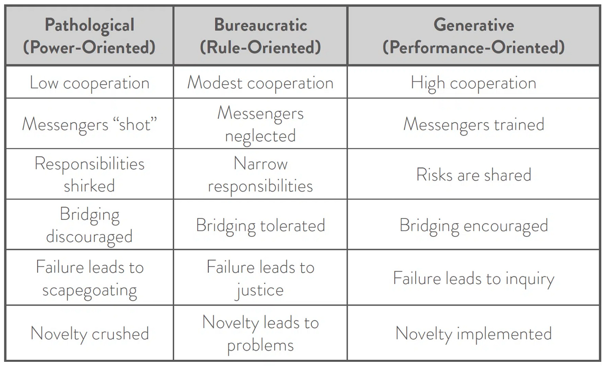

*A quick post this week as I've been busy starting [a new full-time job](https://www.linkedin.com/posts/johnpcutler_im-excited-to-share-that-i-am-joining-dotwork-activity-7270589929057861632-szaB?utm_source=share&utm_medium=member_desktop). I'm back in the PM game. Wish me luck! I will keep writing as always, so thank you for supporting my writing habit.*

---

Rapid-growth tech companies often operate as adhocracies—they do whatever it takes to grow, move quickly, etc. The 0-1 stage is characterized by a lot of startup-wide bridging and fluidity. After the 0-1 stage, there's a tendency to favor team independence, clear spheres of ownership, and fewer global/mandated processes and rules.

In comparison, large enterprises can feel like rigid bureaucracies. Getting *anything* done is incredibly difficult. There are tons of centralized rules and mandated ways of working. When these companies try to "transform," they must descale, de-couple, and disentangle the institutionalized incoherence.

Implicit vs. Explicit Bureaucracy

----------

With rapid-growth companies, I have observed that in the quest for minimal bureaucracy, there is often an accumulation of *implicit bureaucracy.* Unspoken layers of constraints, norms, and rules accumulate. The culture discourages talking about these things—it is important to keep up the veneer of independence. "People should just be able to work it out! This is why we try to hire the best! We shouldn't need new processes to fix this!"

In many cases, the mess gets offloaded onto integrative roles like program managers, centralized ops, researchers, platform teams, etc. That way, teams can preserve the facade of independence while the integrators soak up the complexity. Ironically, it can often be *harder* to do these types of roles in a rapid-growth tech company vs. a large enterprise due to the inertia around decentralization.

The Cycle

----------

As it gets harder and harder to get things done, leaders *sense* the creeping (but largely implicit) bureaucracy and get paranoid. "What's going on?" People's reluctance to address it openly exacerbates the problem ("We were told to bring solutions, not problems!"). This kicks off a wicked cycle where leaders try to quash the rising tide of bureaucracy by playing process whack-a-mole and singling out individuals instead of digging deeper. Until the house of cards collapses, at which point you must do something drastic like layoffs, org-flattening, and/or a hard swing over to top-down control.

The Valley

----------

I was recently chatting about these swings with someone from a famous, often-discussed rapid-growth tech company, and I shared Dr. Ron Westrum's [Organizational Typologies](https://itrevolution.com/articles/westrums-organizational-model-in-tech-orgs/) as a point of reference.

I know there are several issues with the model from sharing it in the past, but it served the conversation well. Westrum divides organizations into three categories—pathological, bureaucratic, and generative—with the important clarification that a company could have many different typologies operating at once.

The conversation was fascinating—this quote in particular:

>
>
> *Here, ownership as a concept is diametrically opposed to a more collectivist, helping mindset. People are really motivated to own things – which means they're not too interested in helping with stuff that someone else 'owns'. 'Ownership' = 'getting credit' in this environment.*
>
>
>
> *Within a given organization the cultures can vary wildly. My team used to report into global [department name] which was far to the generative end (though soon to end unfortunately with a major import of leaders from [company known to be less generative]). Whereas the teams that are 'closer to the sun' e.g., [CEO and founder] are much more pathological. There's a complete skip of the bureaucratic column here.*
>
>

The more integrative "global" (glue, integrative) group cultures tend to be more generative, but bridging was challenging due to team independence (local generativity, I'm guessing) and disincentives around cooperation, which the leadership team mirrored and modeled!

And, to top it off, there was an influx of more power-oriented leaders.

Anything to avoid *explicit* rules and processes.

(If you've noticed the language around layoffs recently, some ideas here may fully click.)

Unless you've worked in Silicon Valley, it can be hard to fully understand the heady mix of process-phobia, individualism, generative approaches (performance-oriented), and pathological currents. People often point to the valley as being "agile," and this is likely correct given a team-centric interpretation of the term, but when it comes to types of agility that are more collectivist and involve collaboration across groups, the picture is much more complex.

In rapid-growth companies, teams knowingly avoid and work around the global teams, and the pressure is on the global teams to interject and bridge. In big enterprises, the opposite is true: local teams are at the whim and whimsy of the global rules.

Thoughts…

----------

Why is this important? A couple reasons:

1. Silicon Valley will always argue that all you need to do is hire the best, hire great leaders, have an audacious mission, and get out of the way. Process is evil! Process is for mediocre people! Avoid bureaucracy at all costs!

2. While a key driver for its success, these biases can create blind spots around the potential of bridging/global functions and more collectivist continuous improvement efforts spanning groups.

3. Often, in the quest to stamp out bureaucracy, leaders create even MORE bureaucracy, which is implicit and difficult to navigate or understand. Or there's a shift to a power orientation. Or there's a collapse. Or all of the above.

4. One person's bureaucracy and heavyweight process is another person's "Let's create some lightweight working agreements so we can tackle this bigger problem together." It is worth discussing this with your team.

5. Large enterprises that are "transforming" should take inspiration from everywhere but remember that the fundamental motion they are undertaking is not the Silicon Valley challenge. It is more of a get the train moving (separate the train cars to descale) vs. an attempt to fix the train while it is barreling down the tracks (scaling and taming pendulum swings). This is especially relevant if you attempt a "projects to products" or product operating model shift. There is a high likelihood that the next couple of years will look very different from "the movies," and that is OK.

6. Consider the value of scaffolding and temporary process. Ambitious things often require some structure. If you institutionalize that structure, you run the risk of hiding behind it. I think is applicable for both companies that are scaling up, and companies looking to de-scale and de-couple.

Thanks again for supporting the newsletter across different career adventures.