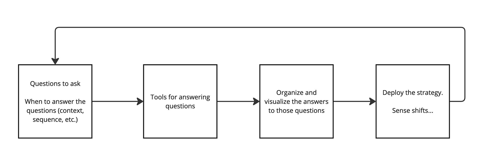

*Note: A big thanks to my co-worker John May for brainstorming some of these ideas. At Dotwork, we're working on a strategy campaign feature for our design partners. This effort has forced us to step back and consider the role of strategy frameworks and how to move from strategy as an abstract box-filling exercise to something much more collaborative and interactive that teams can "latch into" with their strategy, bets, etc.*

---

Another week, another "Why do people overcomplicate strategy? Here is my bulletproof three-step framework!" LinkedIn post.

OK. Let’s back up.

What do all strategic frameworks have in common, to some degree?

**All strategic frameworks are:**

----------

1. A collection of tools to determine what questions you need to answer and when you need to answer them (context, sequence, etc.)

2. Tools that help you answer those questions, ranging from simple canvases to complex mapping and sensemaking techniques

3. A novel way of organizing and visualizing the answers to those questions

4. In some cases, instructions on how to deploy the strategy and how to understand if the strategy is "working" or needs refinement

**For example**

### **Geoffrey Moore's** ***Zone to Win*** **offers up:**

 ###

1. **Questions:** "What are the key areas where we must win to ensure long-term growth?"

2. **Tools for Answering:** The four zones: performance, productivity, incubation, and transformation

3. **Organize/Visualize Answers:** Map initiatives into zones based on their goals and the organization's strategy.

4. **Deploy:** Assign leaders and resources to each zone. Use zone-specific metrics to monitor progress and adjust as needed.

### **This is a vast oversimplification, but Wardley Mapping (Simon Wardley) might be:**

 ###

1. **Questions:** Who is the user (or users)? What are their needs? What activities/capabilities are required to meet these user needs? How are the components connected, and which rely on others to function? How visible are these components to the user(s)? How quickly are things moving "to the right" (from genesis to commodity)?

2. **Tools for Answering:** Wardley Mapping (value chains plotted against stages of evolution)

3. **Organize/Visualize Answers:** Identify areas for innovation, optimization, or outsourcing. Use the map to align components with their stage of evolution.

4. **Deploy:** Use the map to test assumptions, explore scenarios, and align decisions with strategic goals. Update the map regularly to reflect the situation and new insights. Organize teams based on stage. Use appropriate working styles based on stage.

*Fun tidbit: Moore is often described as a "quick read." While Wardley was recently described to me as needing a "strategy PHd." Ben Mosior does [a good job of making WM accessible](https://www.youtube.com/watch?v=tPpYaFNKqoY).*

So Why Is Strategy Hard?

----------

This explains why strategy can be so "hard" and why there are so many strategy frameworks that seem interrelated and similar but have unique twists.

First, you can have the perfect list of questions to answer for your context, but you still need to answer the questions under conditions of uncertainty. Answers don't magically fall from trees—or at least, most of the time, they don't. Similarly, you can have a great list of questions, but at the moment, only 5% of them need answers, and your answers will be low-confidence at best.

Filling out a beautiful canvas or making a map might make you feel good, but it is just a starting point.

Next, while there are heavy overlaps, different frameworks focus on different questions, organizational contexts, business landscapes, experience levels, thinking styles, and tolerance levels for "messy" thinking. For example:

* Wardley Mapping appeals to visual/graph systems thinkers who are highly cognitively flexible and able to process complexity.

* Blue Ocean Strategy helps organizations escape crowded markets.

* SWOT, while much maligned, is a simple starting point.

* I know—OKRs are not a strategy, but some people are heavily wired to goal-oriented thinking. That's the only way they can express strategy.

* Porter's Five Forces focuses on market positioning and competitive dynamics—themes common to many frameworks—but does so in a way that emphasizes the broader forces shaping industry profitability rather than just internal strengths and weaknesses.

* Roger Martin emphasizes strategy as "a set of interrelated and powerful choices that positions the organization to win." Good when you want to stress strategic decision-making.

Some people[ are masters at making strategy accessible](https://gibsonbiddle.medium.com/12-step-by-step-exercises-to-define-your-product-strategy-b27a81edc918). Gibson Biddle has all sorts of wonderful acronyms and frameworks like DHM (Delight, Hard-to-Copy, Margin-Enhancing), GEM (Growth, Engagement, and Monetization), GLEe Model (Growth, Love, Efficiency, Edge), Leadership Ladder, Wicked Hard Trade-Offs, etc. Gibson would be the first to acknowledge that while the mini-models and ways of teaching are effective and novel—there's a reason his courses get good ratings—the underlying ideas themselves are not "new."

The reverse of Gibson is someone like Richard Rumelt. Rumelt leaves things very open. It still is a framework; Rumelt provides structure in the form of "the kernel" of strategy—diagnosis, guiding policy, and coherent actions. However, he avoids prescribing specific tools or processes.

Revisiting our four points, here’s Rumelt:

1. **Questions:** What is the challenge or problem we are solving? What are the critical forces shaping this challenge? What would success look like, and what constraints do we face?

2. **Tools for Answering:** Rumelt doesn't prescribe specific tools, but his books cover topics such as using judgment, experience, systems thinking, and analyzing trends and patterns.

3. **Organize/Visualize Answers:** Organize answers into the kernel.

4. **Deploy:** Align coherent actions with guide principles. Iterate and learn. Clarify and focus.

If Biddle is a big band orchestra, Rumelt is free jazz.

Why This Matters

----------

Strategy isn't inherently hard because of frameworks or because we somehow lack a strategy definition. Yes, skill matters. Knowing which questions to answer, and when, and how, matters. If you show someone new to strategy a Wardley Map, you'll see someone's head explode.

But most of all, it's hard because of the messy, dynamic, and human contexts in which frameworks are applied. Strategy is not just about frameworks or decision-making tools; it's about negotiating a narrative, identity, and power within the organization. It's (ideally) about shifting to humility and accepting uncertainty (vs. an ironclad 50-page deck that tries to anticipate objections and squash them), which in turn enables adaptability and probabilistic thinking.

It is about making choices together:

John did a quick [Roger Martin](https://rogermartin.medium.com/)-inspired demo highlighting this point. This type of thing is easy for us to add, so we'll probably add a good cross-section of the popular (and not-so-popular) frameworks.

Intrigued? Involved in product operations and deploying strategy in your company?Visit [here](https://www.dotwork.com/), scroll to the bottom, and click on I**nterested? Let's Chat!** I’m in full research mode, and would love to chat.

---

Bonus!

----------

If you took my prioritization workshop in 2024, you had a chance to meet Carey Caulfield (we ran the simulation together). [Carey is giving a course on Maven](https://maven.com/careycaulfield/hackathon-blueprint) around something she is super passionate about: organizing effective hackathons and innovation events. Check it out if that is your thing!