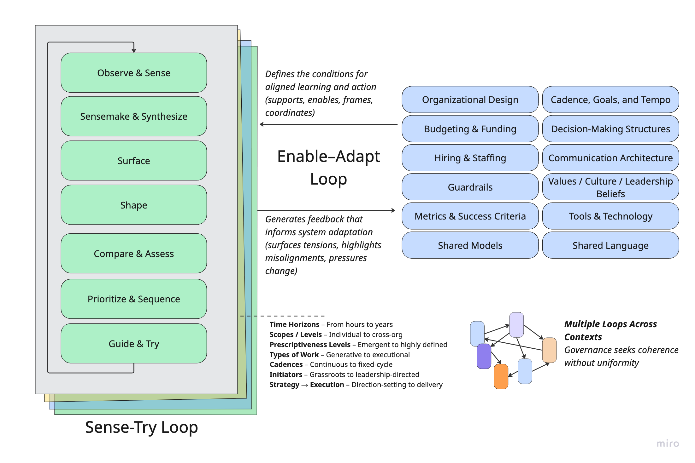

Information overload, lossy models, telephone games, the lure of loops, pretty-but-mostly-worthless-cascades, and the quest for the one roadmap view to rule them all. This week's post is all about the models we use and how information moves around (or doesn't move around) in an organization.

Here's an overview. It's like 5 short posts in one longer post.

**[Cascade Flattening](https://cutlefish.substack.com/i/160175243/concept-cascade-flattening)**  
Stop over-engineering goal trees. Focus on the layers you actually engage with.

**[Volume, Filters, and Interfaces](https://cutlefish.substack.com/i/160175243/concept-volume-filters-and-interfaces)**  
Help leaders get the right level of detail through structure, rituals, and shared interfaces.

**[No View To Rule Them All](https://cutlefish.substack.com/i/160175243/concept-no-view-to-rule-them-all)**  
Question the myth of the universal dashboard. Clarity comes from purpose-built views.

**[The Seduction of Loops](https://cutlefish.substack.com/i/160175243/concept-the-seduction-of-loops)**  
Spot the trap of over-nested loops. Real work happens at different speeds and scales.

**[Model Traps](https://cutlefish.substack.com/i/160175243/concept-model-traps)**  
Understand how simple models shape power, attention, and what gets left out.

**Concept: Cascade Flattening**

----------

Imagine you are trying to improve your personal health. You start with a "North Star" with a qualitative, directional, and aspirational goal like "Feel energized and strong every day." And then you dutifully start creating a tree of goals to support that. You get carried away and end up with something five levels deep, like:

* Feel energized and strong every day →

* Improve physical health →

* Enhance cardiovascular endurance →

* Establish a weekly running routine →

* Run 5k every Monday, Wednesday, and Friday

It's a fun exercise, and it looks great in a goal-tracking tool or deeply customized Notion board. But are you really going to create rituals, track progress, and hold yourself accountable for all five levels of the tree? Probably not.

Your day-to-day involves focusing on key things you can control like getting that run in, drinking enough water, or getting to bed on time. Meanwhile, you're watching simple indicators (like resting heart rate or energy levels) that tell you if the whole system is moving in the right direction.

The middle layers? They help you think through the structure, but they're just sitting there in practice. You're not interacting with them. You're not making decisions at that level. Without dedicated rituals or attention, those middle layers become stale and useless.

### **Lesson/Concept**

 ###

The lesson here is that deep cascades, while interesting and helpful for thinking through a play and strategy, often leave you with worthless information. They make sense at the outset but become a big drag over time.

If the entities actually mean something and are reinforced through rituals and attention, it's one thing. That means they serve a purpose. But when you're just satisfying the intellectual urge to categorize or the political urge to align things with hierarchical levels of the organization, you're probably wasting time and energy. A good signal you're off track is when the middle "themes" or variables seem purpose-built for slideware and for giving the team the warm, fuzzy feeling that things are nice and simple.

### **Active Practice**

 ###

1. Pick a goal you're pursuing: personal, team, or org-wide.

2. Write out the goal cascade: start with your North Star and break it into subgoals or layers.

3. Circle only the levels you interact with regularly (e.g., use in planning, decision-making, or tracking).

4. Reflect: Are any middle layers just serving as labels? What would happen if you collapsed or replaced them with a simple tag or theme?

**Concept: Volume, Filters, and Interfaces**

----------

Consider four scenarios:

1. **Email Blast**. A CEO sends an email to every employee in the company. "In 500-1000 words, tell me what you are working on, and describe what is getting in your way." That's the extent of the advice.

2. **Focused Email Blast**. A CEO sends out an email with the following instructions. "As you know, Project Votron is of critical importance. If you are contributing to Voltron directly or working on something potentially blocking or competing for resources with Project Voltron, please share your current areas of focus, recent progress, and any specific blockers. Voltron is critical. I need to get up to speed on the details ASAP."

3. **Hierarchical Telephone Game.** A CEO gets their information through normal feedback channels. Her direct reports give her status updates. Those direct reports get their information through status updates and on and on. The leadership team always seems to learn about things past the window where they could have intervened to help. Meanwhile, they are already thinking about pivoting the strategy based on feedback from the board.

4. **Flat Weekly Review.** The leadership team reviews 200 initiatives weekly using a ritual reminiscent of Amazon's WBR. The list is "flat" and normalized, using consistent visuals and shared language. While the items are diverse in terms of scope, risk profile, etc., they are presented so that the team can rapidly flip through them. If there's a question, the expectation is that someone in the room is on top of the details and can provide additional information.

### **Lesson/Concept**

 ###

How do these examples vary? What are the underlying principles?

#### **Email Blast**

 ####

The **Email Blast** would trigger immediate overload. The CEO could not process and act on the information because there is no translation layer or shared model to make it legible or actionable at the top. The volume of information is imposing, but consider a situation where the CEO sent out a structured survey instead. The volume would still be high, but it would be much easier to identify patterns and know where to dig deeper.

**Lesson**: High volume isn't the problem; the problem is a lack of structure and context bridging.

#### **Focused Email Blast**

 ####

In the **Focused Email Blast** example, the scope of the request is extremely narrow, but the audience for the request (all employees) is very broad. The CEO will need to wade through a lot of unstructured content, but because the request is specific to something they care about, they will likely have a high signal-to-noise ratio.

**Lesson:** Specificity wins, even when the volume of information is high, and there is less filtering. Humans are surprisingly good at sifting through large amounts of loosely structured input as long as it's directly relevant to something they care about. Pattern recognition kicks in, and the value of breadth outweighs the messiness of the format.

#### **Hierarchical Telephone Game**

 ####

The **Hierarchical Telephone Game** example is very common in organizational contexts. From a control theory/information theory standpoint, there are three relevant dynamics at play:

1. Every layer of abstraction compresses and reshapes the message, stripping out nuance and weak signals. Compression creates clarity but risks distortion.

2. Information moves slowly through the hierarchy. When the leadership team receives a signal, it's often too late to do anything meaningful. By the time you're acting, the situation has shifted.

3. What gets passed up is shaped by what people think leaders want to hear, not necessarily what they need to hear. The result? The view from the top no longer reflects the truth on the ground.

**Lesson**: In ideal circumstances, hierarchies can offer valuable clarity and compression. Each layer understands what their boss cares about and tailors the message accordingly. But in less-than-ideal circumstances, this same structure becomes a distortion engine.

#### **Flat Weekly Review**

 ####

The **WBR-like example** demonstrates the mix of factors needed to make high-volume review productive:

1. Consistent presentation makes it easy to scan and compare items quickly.

2. The WBR is a highly choreographed ritual with repeating patterns. This rhythm makes it easier to process information, and the shared norms help people know what to expect and how to participate.

3. There's an expectation that people with relevant context will be in the room. The interface doesn't need to contain all the information, but just enough to flag issues and trigger follow-up from the right people.

4. Diverse initiatives can be represented as long as there's a common interface. Compression is available, but it's useful compression—it reduces noise without removing meaning.

**Lesson**: Scale requires shared interfaces, lightweight structure, and reliable rituals. When people know how to read the information, how to participate, and when to dig deeper, they can review hundreds of diverse efforts effectively. The goal isn't to eliminate complexity, rather it's to make complexity legible.

### **Active Practice:**

 ###

1. Consider a recent situation where you had to make sense of a lot of input (e.g., team updates, customer feedback, initiative tracking).

2. Was the volume the real problem, or was the lack of a shared structure or translation layer?

3. How could you improve legibility next time?

Concept: No View To Rule Them All

----------

Teams spend endless cycles looking for the "big picture to rule them all." Somehow, there has to be a way to see everything we care about all at once, right? I've observed teams experiment with roadmap layout after roadmap layout, dashboard after dashboard, and review format after review format in the endless quest for that magical moment of high clarity and low cognitive overhead.

But this is largely wishful thinking. There's no free lunch. High-level views always come at the expense of compression. And the problem runs deeper than just format.

Take air traffic controllers. They do work with big-picture views. So it's possible, right? Well, yes and no. Air traffic controllers are doing an extremely specific, time-sensitive job. Their dashboards are highly tuned to that job. Every symbol, every radar sweep, and every visual cue is there to help them make rapid, safety-critical decisions.

### **Lesson/Concept**

 ###

There's a well-established principle in control systems and human factors design: views must be coupled to the task. A "picture of everything" isn't useful unless it helps the operator do something specific. The failure mode is not a lack of data, it's mismatched context and role-agnostic framing.

There is no universal big picture, only role-specific, moment-specific views that are good for a particular purpose. The dream of a single, unified, evergreen dashboard is seductive but misleading. Clarity comes from designing views that serve a specific job and ensuring people know when and how to use them.

### **Active Practice**

 ###

1. Consider a dashboard, review format, or roadmap view you currently use.

2. What decision, judgment, or action is it meant to support?

3. Is it designed for a specific role or job?

4. Try rewriting the "title" of the view or format as a question it's meant to help answer. (e.g., "What's off track this month?" or "Where is there a delivery risk?")

5. Try creating two versions of the same view for two different roles. What changes?

*Note: This concept may seem funny, coming right after the claim that the WBR-like approach works so well. I'm trying to point out that the WBR-like view isn't some magical exception. It's a well-scoped, ritual-based activity with a clear purpose. The format works because the goal is specific, the participants know what to expect, and the ritual reinforces shared norms over time. There are no "unicorn insights" being pulled from thin air.*

Concept: The Seduction of Loops

----------

I can't count how many slides I've made over the years with loops. Loops with nested loops with nested loops. Years, quarters, and month loops. Discovery loops leading to delivery loops.

It makes sense: knowledge work is inherently loopy. In this section, we explore loop opportunities and loop traps.

### **Lesson/Concept**

 ###

If you step back, you start to see common patterns in the various ways we describe how knowledge works, and more broadly, how we make sense of things and act.

What do you notice about the various named frameworks and models below?

Here's what I noticed.

The basic idea is that you start by taking in information, try to make sense of it, identify options, assess those options, prioritize and sequence what you might try, and then try it (course-correcting along the way). You can apply this pattern at the highest level of strategy. You can also apply it to a trivial development task. The shape is familiar, but the scale, timing, prescriptiveness, and rhythm vary.

This pattern can be applied to the highest-level company strategies and to the smallest, trivial development task. The loop varies in terms of time, prescriptiveness, the nature of the effort, etc., but it has a certain shape and rhythm to it.

In this image, I try to describe the core parts of the loop, how these loops vary across contexts, and the various things we do to enable and support these cycles.

The familiarity of this structure presents major opportunities, but it can also lure you into some common traps.

### **Opportunity**

 ###

The opportunity is that this familiar structure lets you reuse concepts and language across levels. You can operationalize "strategic opportunities" in a way that mirrors team-level ones. Both are grounded in insights. Both involve shaping, surfacing options, evaluating, and making calls. At any moment, you might decide to walk away from an opportunity that doesn't hold up.

### **The Trap**

 ###

The trap is assuming all these loops are neatly nested and synchronized. You start linking everything: Strategic Opportunity A ↔ Sub-opportunity B ↔ Team-Level Initiative C. Years, quarters, months, weeks, and days. It looks great on slides ("Oh, nice, that is so simple and makes sense!"), but reality rarely conforms. At any given moment, you've got loops spinning at different speeds, levels of formality, and directions.

Sometimes, a big project is just a big project. It doesn't need to fit into another loop. Sometimes, your "strategy" must move in six-week sprints, not twelve-month arcs. These "shapes" of work might be happening concurrently in your company. You absolutely wouldn't approach them the same way:

### **Active Practice**

 ###

1. Think about a slice of your organization—maybe a product area, a team, or cross-functional efforts.

2. Identify 3–5 loops that are currently in motion. These could be strategic efforts, discovery sprints, roadmap development, delivery cycles, operational reviews, etc.

3. For each loop, ask:

   1. What is the time horizon?

   2. Who is involved?

   3. What type of work is it focused on (e.g., direction-setting, coordination, execution)?

   4. Are any of these loops truly "nested"? Or are they just loosely coupled?

4. Where might shared language or rituals help these loops stay in sync without forcing alignment?

Concept: Model Traps

----------

### Setup Example

 ###

It's very common for product marketing teams to assign "tiers" to releases and launches that describe the level of effort, visibility, and strategic importance. A Tier 1 launch might be a major new product release with executive involvement, a press campaign, and coordinated efforts across marketing, sales, and customer success. A Tier 3 launch, by contrast, tends to fly under the radar, limited to a release note or a quiet changelog mention.

For the purposes of this post, let's call this tiering system a *model.* It is a simple way to describe different types of launches. And let's call the process for assigning tiers and defining what each tier entails a framework built around that model.

The distinction is blurry in practice. Frameworks almost always include one or more models, and models can evolve into frameworks once you add enough guidance or processes around them.

But like all models, this one has limits.

A release might involve a massive internal lift (training, migrations, tactful outreach) yet barely register as a blip for marketing or executives. Tiering systems also tend to miss subtler forms of impact, such as developer community engagement, partner ecosystem effects, or high-leverage internal product changes.

Still, none of this means you should abandon simple tiering models. They're useful. The real risk lies in stretching a model beyond its original design or relying on it as your only lens for planning and prioritization.

### **Model Limits**

 ###

This is where it gets interesting. In practice, you'll often see a few recurring patterns:

* A model limit: Organizations tend to prefer a small number of universal models, even when those models lose effectiveness as complexity increases.

* Some needs take precedence: Highly visible, customer-facing work often wins over equally important behind-the-scenes efforts.

* Some people (and their needs) take precedence: What a senior product marketing leader cares about often outweighs the concerns of a support team lead.

The result? A few "winning" models emerge—ones that do certain jobs well and others poorly. It's like network protocols. TCP dominates, even though it's not perfect for all use cases. The customer education team lives with the product marketing tiering system, like real-time apps live with TCP. They adapt, work around the constraints, and sometimes wish for something better.

I've seen the same dynamic play out with:

* Horizon models

* Three-pillar strategy frameworks (e.g., breadth, depth, efficiency)

* North Star Metrics

* The KTLO vs. growth divide

* Top-line vs. bottom-line framing

* "Simple" strategy narratives that sneak into kickoff decks

These tools help with alignment, but over time, they **shape how work is framed, valued, and resourced** in ways no one fully intended.

* Shared models and frameworks work because they offer a degree of interoperability.

* To be interoperable, they must compress complexity, and that compression will always leave things out.

* As a result, some voices and work types get deprioritized in ways that mirror power and influence dynamics.

* Not all compression is equal. Some models preserve depth and flexibility. Others flatten nuance and lock it out.

### **"Good" Models: Two Examples**

 ###

Let's step back from internal models for a moment.

A great example of a *good* model is Team Topologies by Matthew Skelton and Manuel Pais. The core ideas of four team types (stream-aligned, enabling, complicated subsystem, platform) and three interaction modes (collaboration, facilitation, X-as-a-service) are intuitive and easy to communicate.

But the model invites depth. You can explore cognitive load, team evolution, boundaries, and architecture in greater depth. It compresses complexity just enough to help you act while still encouraging richer exploration and adaptation.

Now compare that to MoSCoW prioritization: Must have, Should have, Could have, and Won't have (this time). MoSCoW is helpful in a pinch. It creates a shared vocabulary. But it tends to flatten nuance. It's a conversation starter, not a decision-making tool. In murky or political contexts, it rarely holds up.

It's not that MoSCoW is bad. It just offers a different kind of utility. Its simplicity makes it prone to semantic compression. You get clarity but at the cost of subtlety.

### **Lesson:**

 ###

Yes, all models are wrong, and some are useful (thanks, George Box). But what makes them wrong, and what they enable or suppress, matters.

* Models are useful in different ways.

* Models are wrong in different degrees (and in different directions).

* Some models invite further thinking. Others shut it down.

### **Active Practice**

 ###

1. Pick a model or framework your team uses (ideally, one widely adopted and shapes planning, prioritization, or communication).

2. What complexity does it compress? What does it leave out?

3. Is the model used to guide thinking or has it become a checklist or gate?

4. Who benefits most from how this model is used? Who might be underserved by it?

5. Are teams using the model as a shared lens or treating it as a fixed system?

6. Can the model invite more depth or flexibility without losing its utility?

---

Hope this post was interesting!

*Like the newsletter? If you got this far perhaps? Support TBM by upgrading your subscription. I’m cooking up some supporter goodies like an AMA, Slack community, etc. More info soon.*

[Support the newsletter](https://cutlefish.substack.com/subscribe)