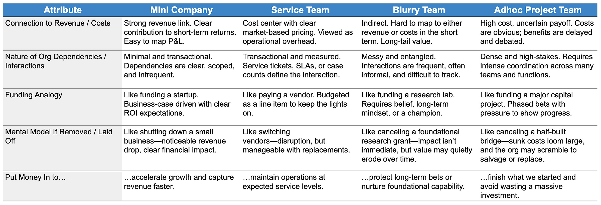
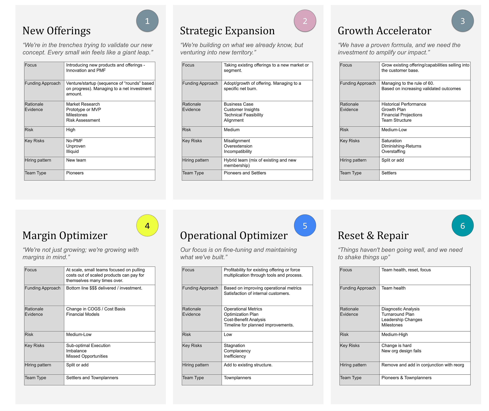
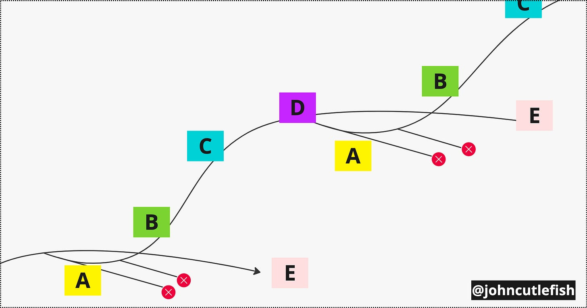
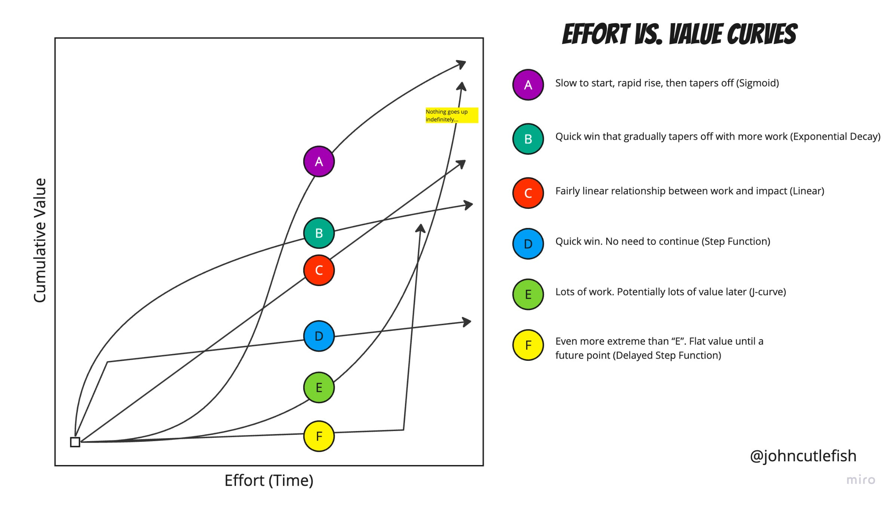
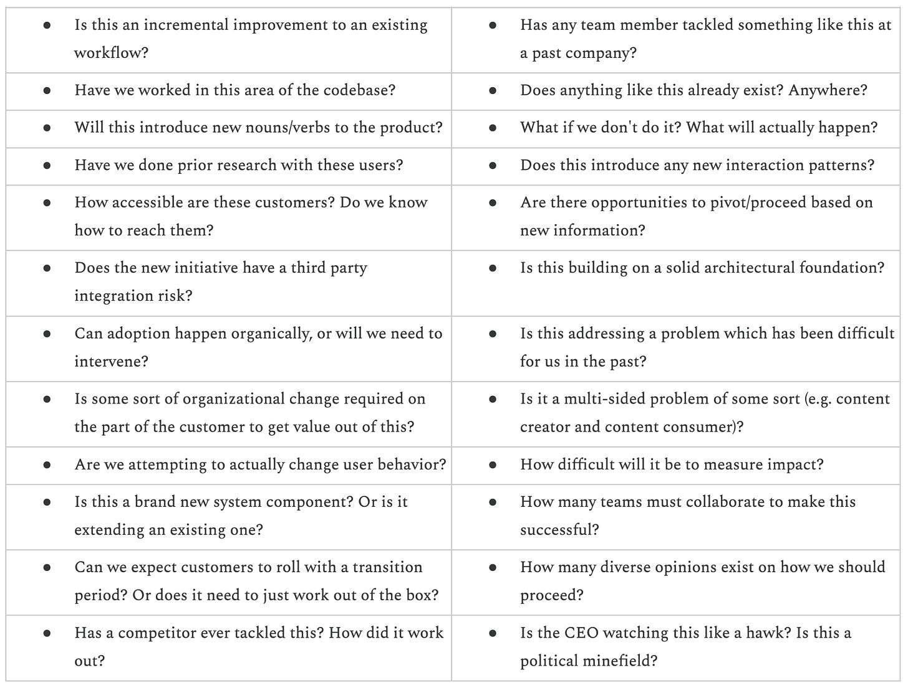
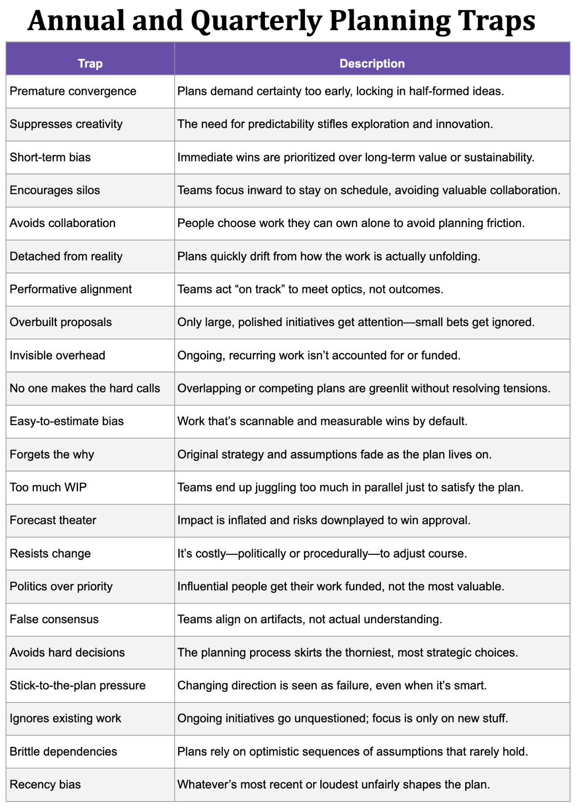

*If you like my newsletter and are interested in finding a way to support my writing, please consider becoming [a paid subscriber](https://cutlefish.substack.com/subscribe).*

---

This post is all about planning, funding, and context. My main thesis is as follows:

In a lot of early-stage startups and companies experiencing rapid growth, there is basically only one context. Any variation is consumed by inertia and the “one thing”. But as these companies grow and mature, it becomes increasingly untenable to treat everything the same way.

So let’s take a safari through the different kinds of context that start to show up as companies grow—team types, stages, shapes of work, and more. Then we’ll look at some common anti-patterns that emerge when context gets ignored, and wrap with a few high-level ideas for finding a better path forward.

A Context Safari

----------

Join me for a tour of why context matters when considering funding and planning. We'll cover:

* A comparison of four very different teams

* How funding varies by team stage

* How approaches vary by effort-value curves for work

* How approaches vary by specific details about work

* How approaches vary by the core business model and role of "tech" in the business

### Four Team Contexts

 ###

We'll start with a high-level exploration of four teams and the mental model for funding.

Take four high-level team/funding situations:

#### Company-In-A-Company

 ####

This team operates almost entirely autonomously. They have a direct line to short-term revenue. Their work is visible, they move fast and deliver frequently, and it's obvious when things aren't going well. They essentially function as their own business—with a clear P&L, a business plan, and accessible financials. It's purely transactional when they need help from other teams (e.g., they handle hiring themselves but need HR to provision account access and maintain employee records).

It's easy to imagine this team getting spun off into its own company—the boundaries are that clear. A finance partner assigned to them could treat them like an independent entity, handling forecasts, closing books, and budget requests in isolation.

#### Service Team

 ####

This team is in full "service mode." The company has kept them in-house, but outsourcing would've been entirely feasible. When the company "pays" for their work, it does so with a clear understanding of the market rate. It's a transactional relationship, not viewed as a strategic differentiator. Investments here are classic opex—the cost of keeping the business running.

The relationship resembles that of an internal vendor, operating against well-understood ratios and outputs (e.g., cases resolved, workstations managed, people trained). The company constantly seeks to reduce costs and increase capital efficiency with tight feedback loops. If this team disappeared tomorrow, they could be replaced (at least in theory).

#### Blurry Team

 ####

This team is in a murkier space. Their value is recognized, but it accrues over longer timeframes. There's little direct connection to short-term revenue—sometimes none. They often sit lower in the "value stack," several steps removed from customers and business outcomes. If they stopped operating, other teams might compensate in the short term.

Growing this team requires either 1) being so clearly understaffed that no one questions it or 2) a deep act of conviction—someone willing to advocate stubbornly for the team's value. When budgets tighten, even past supporters can turn into skeptics. Their work often overlaps with other teams; they assist and enable, blurring where their energy truly goes. Sometimes, they ship independently. Other times, they serve as a platform or support function—helping other teams orient and accelerate.

#### Adhoc Project Team

 ####

A swarm of people is pulled into a big, messy project. The bandwidth and mindshare demands are enormous. Coordination costs alone could fund entire teams. Time, opportunity cost, attention—all get poured in. Yes, the project is supposed to produce value, but the sheer size and interdependencies often lead to premature convergence and rushed solutions.

The teams involved are stuck, juggling their own departmental goals while meeting the demands of the cross-cutting initiative. From a finance angle, this resembles a capital project: you're betting time and resources now in hopes of a future payoff. The only lever for managing cost is staged investment—phased funding meant to curb risk and limit runaway scope.

**Summary:**

* Company-In-A-Company: It feels like a mini business with its own economics—clear ROI, minimal dependencies, startup-style funding, painful to lose, and easy to justify growth.

* Service Team: Feels like a cost-controlled service provider—predictable costs, transactional relationships, vendor-like funding, easily replaced, funded to maintain.

* Blurry Team: It feels like a long-term capability bet—unclear short-term value, messy collaboration, belief-driven funding, quietly essential, funded to protect the future.

* Adhoc Project Team: Feels like a massive bet you're stuck finishing—high cost, intense coordination, capital-style funding, hard to unwind, funded to avoid waste.

---

**Context That Matters:**

* The team's proximity to revenue or measurable outcomes

* Whether the team operates independently or relies heavily on others

* How well the team's impact can be traced, forecasted, or defended

* How easily the team could be replaced, outsourced, or sunset

---

### Team Stages

 ###

So far, we've looked at some high-level team examples. The next layer to explore is a team's stage. Even if a team operates autonomously (Company-In-A-Company), it still moves through different phases—from launching new products and searching for product-market fit to expanding, scaling, optimizing margins, fine-tuning operations, and eventually resetting when it hits a local maximum.

You can't apply the same funding and hiring logic to every team. The details and nuances matter. Many models exist for this, but they tend to follow a similar arc.

**Example Team-Context Model**

* **New Offerings**: High-risk product validation funded like a startup—milestone-based and iterative.

* **Strategic Expansion**: Entering new markets with known products—funded by targeted burn tied to feasibility and alignment.

* **Growth Accelerator**: Scaling proven models—funded by ROI logic and growth performance (e.g., rule of 60).

* **Margin Optimizer**: Driving profitability—funded through efficiency gains and cost reduction.

* **Operational Optimizer**: Fine-tuning internal systems—funded by operational metrics and internal satisfaction.

* **Rebuilding after a breakdown:** Funded based on the cost and expected benefit of restoring the team to a functional, productive state.

This progression maps to the general idea of [hill climbing](https://cutlefish.substack.com/p/tbm-4852-hill-climbing). The concept is simple: the journey of improving a capability, solving a problem, or pursuing an opportunity often resembles climbing a hill. There's early exploration to find a viable route (A), a stretch of rapid growth and progress (B), a tougher but still fruitful phase (C), and eventually, a plateau or local maximum (D), followed by a controlled decline (E) unless you disrupt yourself and begin a new ascent.

You can apply this model to whole companies—disrupting an industry by climbing higher while others stall—or to teams steadily evolving a capability over many years. Not everything needs to keep climbing forever, and not every team needs to excel at everything.

For our discussion, this is another powerful reminder that context matters. How you fund and govern a team in the A phase radically differs from how you support them in the B–C years, the D plateau, or the decision to either reset (start a new A) or manage a graceful descent into obsolescence.

---

**Context That Matters:**

* Whether the team is exploring something new or scaling something proven

* How confident the team is in the problem, solution, and fit

* Whether value is expected in the short term or only after a long climb

* If the team is driving growth, improving margins, or stabilizing operations

* Whether the current mode is acceleration, optimization, or reinvention

* If the team is still climbing—or managing the plateau before a reset

* Whether leadership sees the team as a future bet or a past investment

---

### [Effort-Value Curves](https://cutlefish.substack.com/p/tbm-220-effort-vs-value-curves) and Work Shapes

 ###

Context awareness extends to The Work. Let's close this section by exploring effort–value curves and general shape-of-work questions.

#### Effort-Value Curves

 ####

*Note: These labels don't match the hill climbing labels. Apologies.*

Consider some common "shapes" for how value accrues as a function of time.

Imagine you're on a finance team. You have thirty teams working on Shape F efforts—initiatives that require long stretches of heads-down work with little to no incremental value. In parallel, thirty teams independently pursue Shape B or Shape C efforts. The difference in risk is enormous.

With Shape C teams, you can set a few actionable input metrics and monitor regular progress—if they're moving the needle, they're probably fine. Shape B efforts require more monitoring to determine when returns taper off, but the approach is similar.

Shape F is an entirely different beast. There's no early signal and no way to track steady progress. Governing these investments requires a different mindset and more creative approaches to planning, accounting, and oversight.

#### Work Shapes

 ####

Finally, to land the point here, we'll look at questions that shape how teams approach an effort. Imagine that you answered these questions for opportunities, projects, bets, [whatever you call them]. And then you clustered your replies. See [here](https://cutlefish.substack.com/p/tbm-752-risk-checklist-activity) for the original post with these questions.

Consider how you might approach some common clusters:

#### Low Risk, High Familiarity, Known Patterns

 ####

* Incremental improvement to an existing workflow

* Worked in this area of the codebase before

* Customers are accessible and familiar

* No major org change or behavior change needed

* Easy to measure impact

**Team Approach:**

Treat it as a fast-track optimization. Use lightweight planning, minimal research, and a short experiment cycle. There's little need for coordination or deep validation—it's a classic "let's just ship it" scenario.

#### High Uncertainty, Unfamiliar Domain, Major Change Required

 ####

* Brand new system component with no prior work in this area

* Introduces new nouns/verbs and interaction patterns

* No prior research on these users

* Customers are hard to access, and change requires an organizational shift

* Adoption won't happen organically—needs active intervention

* Difficult to measure impact

* Unknown if built on a solid architectural foundation

* No existing comparable efforts inside or outside the company

**Team Approach:**

Treat it as an exploration initiative with strategic guardrails. Spin up a cross-functional discovery team. Do not rush to build. Start with user research, prototyping, and stakeholder mapping. Carve out space for ambiguity. Define early signs of promise rather than betting on outputs. Use a venture-style funding approach with tight, learning-focused milestones. Set executive expectations: This is not about efficiency—it's about learning what's possible.

---

**Context That Matters:**

* How (and when) value is expected to show up

* Whether the work is a quick win or a long campaign into the unknown

* How well the team understands the domain, code, or users

* How much behavior, system, or organizational change is required

* How measurable the outcome is (or isn't)

* If the team is optimizing, exploring, or inventing

---

### The Product vs. Enabling The Product

 ###

We'll end with perhaps the most important contextual factor: the core mental model for where technology fits into the company's business model.

In companies that sell digital products, there's often a deep-rooted appreciation—especially during the startup and growth phase—that product investments are long-term bets. In this context, the entire company operates like the "Mini Company" model, which isn't an organization emerging from decades of treating technology as a centralized cost center guarded by the PMO.

That doesn't mean funding is frictionless. These companies still wrestle with shared teams, platform investments, and the challenge of committing to long-term work without immediate payoff. But because "the product" *is* the business—the thing that gets sold—they approach funding and planning from a fundamentally different starting point.

Over time, as growth slows and focus shifts toward profitability and efficiency, the narratives more resemble those of non-digital-product companies. The stories begin to merge in spaces like e-commerce, mobile ordering, trade optimization, and tech-enabled logistics, where the link between investment and return is tight, and the importance of tech is undeniable. Still, a key difference remains: in one case, the product *is* the product. On the other, technology merely supports the product—be it shoes, insurance, toys, vacations, or something else entirely.

---

**Context That Matters:**

* Whether tech *is* the product or just supports it

* How directly product work ties to revenue

* If long-term bets are expected—or need constant justification

---

Contextual Factors and Anti-Patterns

----------

This context isn't just theoretical—it gets overlooked when funding and planning break down.

### **One-size-fits-all processes**

 ###

Using a single model to plan, fund, strategize, or set goals across all teams simply doesn't work.

### **Pure ad hoc**

 ###

At the other extreme, some organizations rely entirely on leadership finesse and hallway influence. Everything is "it depends," but no one knows what it depends *on*. The system works—until it doesn't.

### **False precision in pursuit of certainty**

 ###

Funding and planning models that demand early clarity and exactness often distort incentives, push premature convergence, and penalize ambiguity—even when ambiguity is necessary.

### **Avoidance masquerading as pragmatism**

 ###

Some teams avoid ROI, allocation, or value discussions altogether. The justification? "Those conversations derail into unproductive debates." So, instead, they just don't have them.

### **The Most Damaging Anti-Pattern: No Theory at All**

 ###

Of all the issues, the most damaging might be this: not even forming a basic theory of investment and value for each team.

I'm amazed by how many companies can't articulate why a team exists—what kind of bet they represent, what value they create, or even what would happen if they stopped working. Even a blunt thesis like "we pay their salaries to build what we want them to build" is better than nothing.

Sometimes, I'll give teams a few baseline financial metrics and ask:

"Imagine your team did nothing for six months—what might change here?"

You'd hope for an answer like:

>
>
> We're a platform team deep in the stack, so the impact wouldn't be immediate. However, teams would experience a 10–15% drop in velocity over time due to a lack of support and growing maintenance debt. Onboarding new services would slow. Our infrastructure costs might creep up 5–10% without active tuning. It wouldn't appear this quarter, but next year's roadmap would be at risk.
>
>

The details aren't the point. What matters is the ability to form a reasonable hypothesis. But too often, teams default to silence or vague generalities—usually out of fear that whatever they say will be weaponized or misunderstood.

It's easier when a team owns a distinct SKU or revenue line—the answer tends to come faster. But even then, there's often confusion about what stage the team is in, what kind of bet it represents, and how it contributes to the top or bottom line.

Way Forward

----------

If you own a group of franchise restaurants, build buildings, run a brand conglomerate, or lead a company where every team 1) operates independently and 2) sells its own product, you will not need this section. Your challenge has a well-known playbook.

But very few product and tech organizations are that clean. Instead, you have:

1. Constraints you can't immediately remove

2. Teams at different stages

3. Teams with different proximities to customers and business outcomes

4. A variety of opportunities, bets, and work "shapes."

5. Teams with more or fewer dependencies

6. Initiatives with more or fewer dependencies

You already know a mono-process won't work. So what will?

### **1. Start with a working theory for each team.**

 ###

How does the team contribute to near--, mid-, or long-term results? Does their work increase revenue, protect it, reduce costs, or prevent cost growth? What stage are they in? What shape of work do they tend to take on? How independent are they? How do they interact with others? What kind of Team Topology do they align with? Importantly, focus on the team's general mission, scope, and capability areas—not just their current roadmap. The goal is to surface durable, non-ephemeral traits that shape their value. *And yes, this step is risky.* Your research may be perceived as asking each team to "prove their worth." Framing matters. Make it clear this is about understanding—not assessment.

### **2. Zoom out to how the company sees investment and return.**

 ###

Does the organization think of multiple "businesses," each with its own P&L? Or is there one centralized tech/product function serving many internal customers? When executives talk about "strategic initiatives," how are they framed? Are they multi-year, outcome-focused bets? Or "build this" project directives? Your goal here isn't to challenge the model—just to understand the mental maps people already use.

### **3. Then, dig into how work actually gets done.**

 ###

Is everything treated like a big, messy project? Or is it a hybrid—some efforts owned by a single team, others requiring broad coordination? Do efforts move through standardized "stages," or are workflows more adaptive? How do different work shapes travel through the organization—from idea to leadership support, execution, and measurement?

### **4. Explore constraints.**

 ###

By this point, you'll likely have surfaced the real constraints shaping your current model. These may include:

* Architectural dependencies that force team collaboration

* Legacy funding models built for a centralized IT structure

* Inertia from hyper-growth years—teams that *should* coordinate more but still act like independent units

* Clogged feedback loops—making outcome-based planning feel disconnected from reality

* Technical debt and brittle systems

### **What You're Trying to Do (Broadly)**

 ###

At a high level, you're trying to design planning and funding paths that minimize the downside and maximize the upside. Depending on your context, this often involves a mix of patterns.

For example, you might have:

**Independent Teams with Clear Impact**

Individual teams or product groups with a clear line to revenue and customer outcomes. The teams operate with reasonable independence. You might considering applying a team stage model here.

**Large, Messy Projects**

Cross-cutting efforts spanning multiple teams require intense coordination and close scrutiny to manage risk and scope.

**Shared Outcomes with Lightweight Coordination**

These are goals that multiple teams can contribute to independently but still require gentle steering to ensure alignment over time.

**Tiny, Opportunistic Experience Tweaks**

Low-cost, incremental improvements involving many teams are often absorbed in flex time and not worth centrally planning unless bundled.

### **The Goal**

 ###

You're trying to identify discrete "motions" that:

1. Mean something to everyone involved

2. Can be planned, staffed, and funded

3. Can be compared when resources are constrained

We already know that a mono process will not work. We also know that vague categories like *"KTLO vs. Innovation"* or top-down strategy pillars often fail to capture the real complexity. And importantly, while companies may appear structured around clean business units, team dependencies usually run deeper than expected.

### **Toward a More Useful Model**

 ###

The aim is to build a model that captures just enough contextual nuance to be effective—not so abstract that it's useless and not so detailed that it's unworkable.

When lucky enough to have many independent teams, you can take a team-centric, stage-based view (e.g., "What stage of growth is this team in?"). But when the work is highly entangled, you'll need to zoom out and frame things in terms of capabilities, motions, work shapes, objectives, and value streams—concepts that acknowledge shared infrastructure, overlapping goals, and complex delivery paths.

Conclusion

----------

If there's one takeaway from this context safari, it's this: you can't plan and fund in a vacuum. Teams differ. Work differs. Business models differ. And yet, many organizations still default to rigid, one-size-fits-all approaches.

The goal isn’t perfect classification. It’s to build shared understanding. To develop just enough structure that teams can reason clearly, leaders can fund wisely, and strategy can flow.

You’re not trying to eliminate complexity. You’re trying to make it legible enough to navigate, but not so legible that you force a monoprocess on everyone.

Start with real conversations about where teams are, what kind of bets they represent, and how their work connects to broader outcomes. Map the assumptions. Name the constraints. And design a planning and funding model that’s honest about the messy middle ground most organizations actually live in.