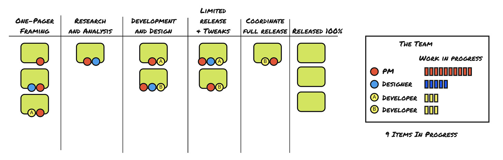
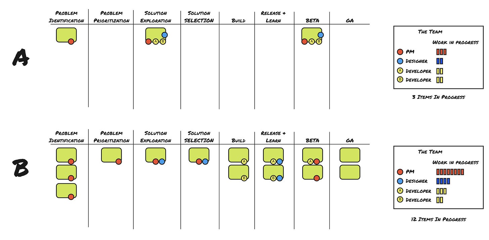
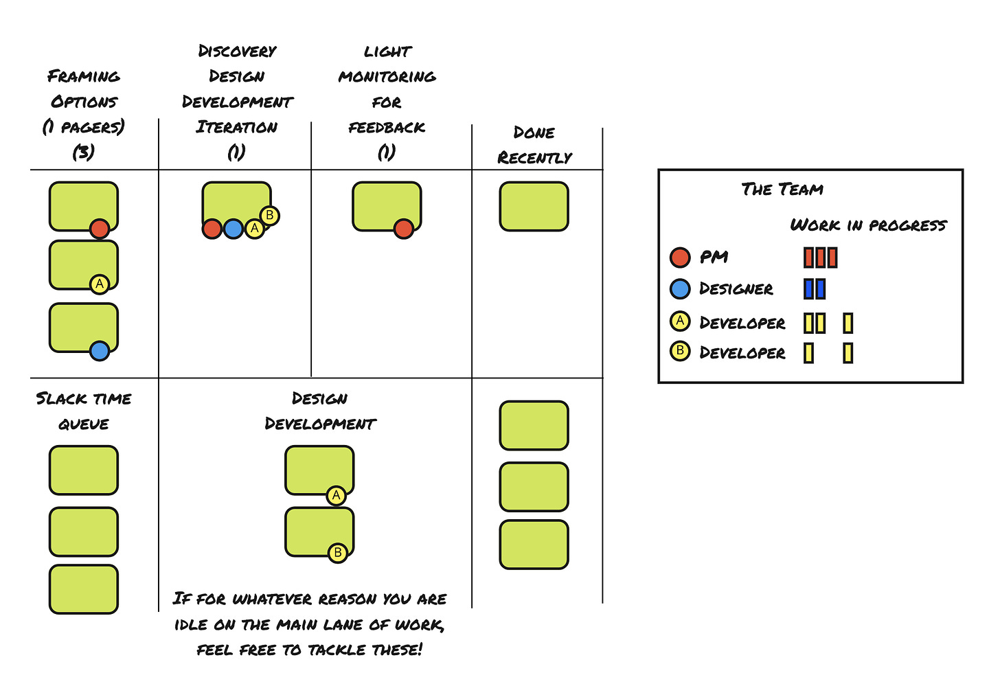

In this post I am going to try something a bit different.

I am going to:

1. Share boards inspired by real world teams (I see lots of boards)

2. Share what I see in the boards

3. Share links to what people on Twitter see in the boards

4. Invite you to chime in on the Twitter thread(s)

Why? I think we can learn a lot from how people perceive these things. After one hour, the threads are hopping.

Single Team

----------

Here’s the first board.

What do I (John) notice about this?

* The product manager is spread incredibly thin. Are they micro-managing each and every detail? Or are they getting pulled into a million discussions?

* The designer is spread thin as well. They are juggling framing bets, doing research, pairing on items in **Development and Design**, AND monitoring and tweaking things in **Limited Release**. Poor designer.

* It is promising to see developers and designers involved in one-pager framing, but a little concerning that neither developer is involved in **Research and Analysis**.

* The developers are 1:1 with work, so there’s no pairing happening. Why? There is designer/developer pairing which is positive.

* There’s a lot of work in progress between **Development and Design**, **Limited Release**, and **Coordinate Full Release**. That is a lot to juggle. The multi-tasking costs alone would be a big drag. 10 things? 5 things? 3 things? That’s a lot of switching.

* Overall: Too much work in progress. Overworked PM. Overworked Designer.

Read what [other people noticed about this](https://twitter.com/johncutlefish/status/1433294005589053444?s=20).

Team A vs. Team B

----------

OK. Here are two teams using the same columns.

What do I notice about this?

* Team A has 1/4 the amount of work in progress. I would expect them to have much faster flow and focus. Note how they don’t have work in every column. I see this as a good thing. We don’t need to fill every column.

* Team A does solution exploration together. Team B delegates solution exploration (and solution selection) to product management and design.

* Team A is focused on two modes currently: **Solution Exploration**, and tending to the item in **Beta**. These modes feel like a nice compliment to each other—one divergent and one convergent.

* Team B’s product manager and designer are all over the place.

* I sense that Team B’s product manager has been tasked with putting together a roadmap, hence the four items in **Problem Identification** and **Problem Prioritization**. No other team members were involved.

* Team B assigns individual projects to individual developers. I wonder why they aren’t pairing? Is it a team of 4, or two teams, one per developer?

* Team B is juggling two stages of release in addition to **Build**.

* We can argue about the number of columns here, but I do credit the teams for at least calling the kettle black and making how they work visible.

* Overall, Team B has crazy high WIP. Team B is optimizing for starting not finishing. I’m sure they *seem* VERY BUSY, but I’m not sure all that WIP is helping them.

Read what [other people noticed about this](https://twitter.com/johncutlefish/status/1433299668033687552?s=20).

Slack Queue and “Main Lane”

----------

Last example.

What do I notice about this?

* It looks as if everyone is empowered to frame options using 1-pagers.

* Instead of creating columns for discovery, design, development, and iteration/optimization, they lump that into one stage. This suggests that it is more fluid and collaborative. Since it is just a single item, there wouldn’t be much guessing as to “where the effort is”.

* The product manager seems to own monitoring for feedback after the period of iteration. Are other people not involved at all?

* The use of the **Slack Time Queue/Lane** is very interesting. I’m guessing they occasionally hit a point where there’s down time on what they call the “Main Lane”.

Read what [other people noticed about this](https://twitter.com/johncutlefish/status/1433313019941978117?s=20).

Conclusion

----------

One thing you probably noticed about these boards is that they make a point of visualizing non-coding work. In my experience, teams have far more work in progress than is reflected in the *ticketing* system.

While it is important to visualize the work, not the workers, it does help to see what people are working on. Obviously, it is only possible to work on one thing at once, but we keep all of those open things in our head somewhere. We often rationalize that we’re “only contributing a bit” to something. Even still, it is in our head.

Action Item: Visualize what is actually happening on your team.