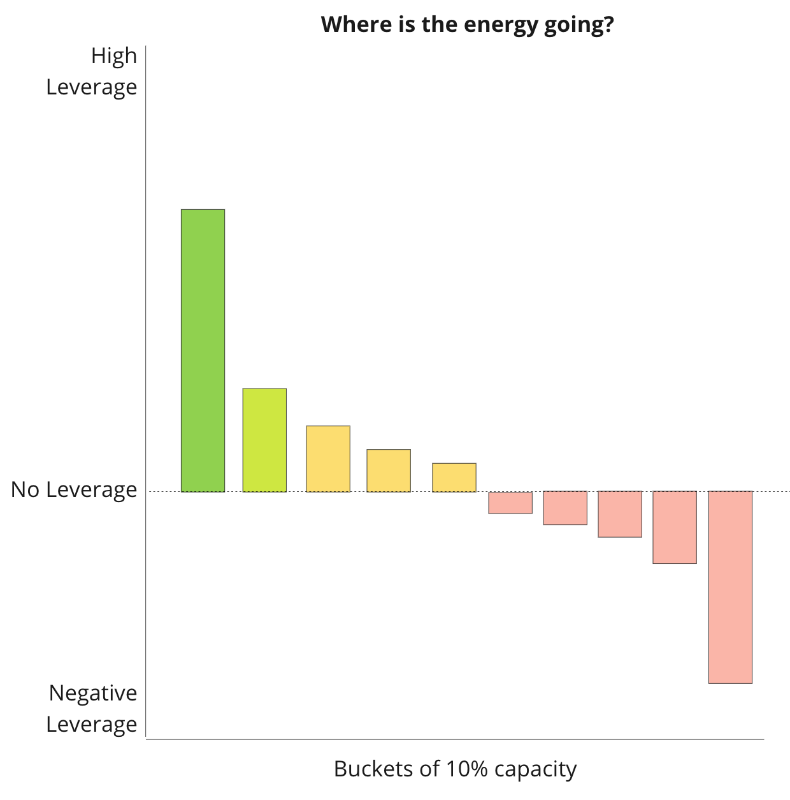
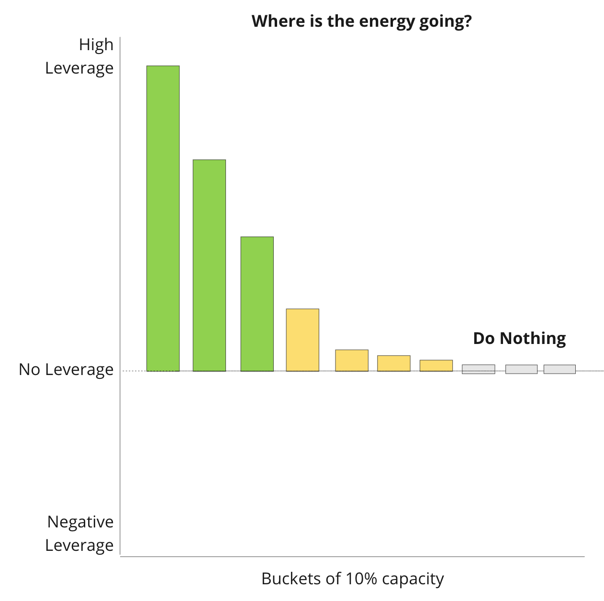

How do you repair a sinking ship that is sailing full steam ahead?

>
>
> We’ll dedicate 10% of our time to pay off the debt!
>
>

Unfortunately, this rarely works. Why? It is barely enough time to patch the holes and bail the water, let alone repair the damaged hull—more cracks form. More water rushes in. Realistically, it is +10% time (110% time), which burns people out.

>
>
> We’ll hire someone new to fix it while we do our best to keep moving elsewhere!
>
>

This approach works when damage is isolated to one part of the ship. If the damage involves connected systems that span the boat, you’ll probably fail with this approach.

>
>
> We’ll make a list of problems and solve them in priority order!
>
>

This has more potential but tends to be “10% time” combined with “person X fixes the problem” in disguise. Why? The expectation is that a small number of people will focus on solving *the problem* (10% time). And when problems are connected, trying to fix one pushes the issue elsewhere. You have to be ready for a long-haul effort.

>
>
> Slow the boat down!
>
>

Let’s not kid ourselves; the boat is already going pretty slow. It’s not nearly at top speed (even if it is full steam ahead). Going *even slower* could seriously damage the business. Getting to shore/port may be the only way to save the crew.

>
>
> We need more efficient processes! More process rigor!
>
>

Not encouraging. There’s a good chance that the forces rendering the old processes inefficient will make the new processes inefficient. A sinking ship does not need mild repairs. 

>
>
> We’ll build a new ship, and then sail that ship alongside this ship (which is funding the building of the new ship), and then—just as the boat is about to go under—we’ll all jump to the new ship!
>
>

Doable. Risky. Timing is everything.

>
>
> Acquire smaller ships, and use them to float/salvage/push the mothership!
>
>

Motherships create more drag than expected. The promise of economies of scale has a pesky habit of not materializing.

So what do you do?

Companies in this predicament often:

1. Continue to do and support no/low-leverage things. A good chunk of the “business as usual” stuff is not contributing to forward movement.

2. Do *negative-leverage* things that actively cause more harm. Fire drills are a great example. They rarely have the desired effect and drain morale.

Your best chance of success is to change your leverage curve. 

Most companies in this situation look like this:

A significant % of the team’s energy is going to no/low/negative leverage things. The negative leverage stuff immediately cancels out the high leverage stuff. As heretical as it sounds, you could probably stop doing half of your work. It looks more like this:

Finally, shift incentives across the board to support “making as much progress on repairing the boat while maintaining the minimally acceptable forward momentum.” 

Note the difference?

The “North Star” is about the repair. Yes, there’s a constraint—continued progress—but the focus shifts from trying to go as fast as possible (and repairing as you go) to improving as quickly as possible (while keeping forward movement). 

Is this hard?

YES! Admitting that much of your work isn’t having any impact is very difficult. Shooting for “minimally viable” survival speed feels scary. But in my experience, it is the only way to repair a sinking ship that needs to stay in motion.