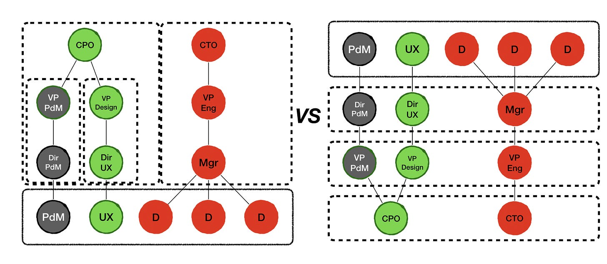

Say we have a team with a product manager, a designer, and four developers. The product manager reports to a product director. The designer reports to a design director (who reports to the product director's boss, the CPO). And the developers report to an engineering manager, who reports into a CTO (eventually).

Who is accountable for the success and health of this team?

(Right) The product director, design director, and engineering manager are accountable for the team's health and success. They know and trust each other. In a pinch, they can step in and do the work.

(Left) But in other orgs, those managers are distant, too busy to collaborate, and adversarial. They lack meaningful structures and rituals for continuous improvement. The teams pour their heart out in retrospectives. The managers have the occasional 1:1. When things go wrong, it is always the other department's fault. By the time conflicts are "escalated", the CTO and CPO -- who may not get along as it is -- are too far removed from the problem to help.

Savvy managers in this situation don't let it get that far. Given all this potential for conflict, the managers proxy trust with individual, manager-assigned backlogs, handoffs, and rigid roles and responsibilities; in a sense, turning the team into three functional teams, instead of one cohesive team. And while that model is easier to "manage", and accountability easier to define, outcomes will suffer.

The key point here is that having "cross-functional teams" is all well and good. But these teams are a mirror of the managers they report into (which mirrors the incentives in place). If the managers cannot collaborate, the team will have trouble collaborating. If department incentives clash, this will impact the team. If "engineering has a chip on its shoulder for going slow" and "product thinks they run the show" ... then that will permeate the org.

This all probably seems like common sense. **But I'm amazed by how many organizations have cross-functional teams in structure only**. Especially companies trying to “transform” by only changing how front-line teams operate. Outside “the teams”, no one is really working together.

A hallmark of many of the successful orgs I speak with is a fractal structure whereby senior leaders and middle management mirror the composition and expectations/skills/incentives of the front-line teams. So instead of "caring for their own", the various functional managers care for the collective problem-solving team unit. The goal is to make *the teams* (sustainably) successful.

And not just with words and encouragement. With aligned incentives as well. Because if not, you may get a team that goes through the motions, but it is really three teams.

---

[Paul Tevis (a great coach/facilitator available for hire)](https://twitter.com/vigemus?s=20) responded to a recent thread about this with:

>
>
> If teams are expected to be cross-functional, their managers need to be be, too. (I have theories about why this doesn't happen.) In most of the situations I've observed, it's a failure of what Daryl Connor calls "sustaining sponsorship."   
>   
> Top-level managers fail to establish clear expectations for and get commitment from their reports to cross-functional collaboration. Those next-level managers in turn don't carry that expectation-and-commitment down to their reports. This is true of many things, of course, and not just cross-functional collaboration.  
>   
> For me it underscores the importance of (say) the VP of Product and the VP of Engineering jointly addressing all of their reports to establish the expectation of collaboration and ensuring that those people establish the same expectation with their reports.
>
>

David Dame, Global Head & Vice President, Enterprise Agile at Scotiabank, makes this interesting observation:

>
>
> This has been my observation also. The C-suite is cross-functional with complete oversight. The team is cross-functional with limited sight outside the teams. The middle management continues to be functional. Can we make the mid cross-functional?
>
>