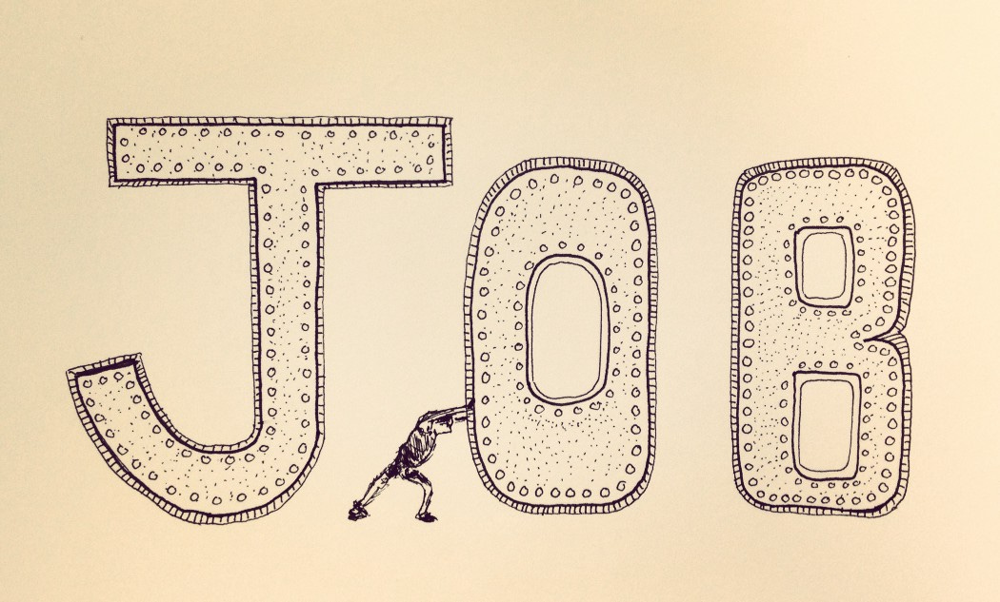

*I’m doing a [free LinkedIn Live with my friend Arpit Choudhury](https://www.linkedin.com/video/event/urn:li:ugcPost:6966118211947810816/) on Demystifying the Behavioral Data Stack on Wed, Aug 31, 2022, 9:00 AM (Pacific). [Join us!](https://www.linkedin.com/video/event/urn:li:ugcPost:6966118211947810816/)*

---

“It is ALL about incentives!”

“We need to incentivize the right behavior!”

Sound familiar? Here’s the problem.

Yes, incentives are powerful. But efforts to incentivize people frequently backfire. You end up battling 2nd and 3rd order effects. Team members rarely respond the same way. It is tenuous and potential harmful.

When I chat with leaders, and they mention incentives, I always ask about disincentives.

They talk about wanting to incentivize more collaboration, and meanwhile, there’s barely a free moment on anyone’s calendar. They talk about wanting to incentivize more experimentation. Meanwhile, there are dozens of disincentivizes to experiment (e.g., no help with experiment design, hard deadlines).

It’s like focusing on rewarding someone for doing a workout vs. making it easier for them to get out the door in the morning. One approach focuses on rewards. The other approach focuses on creating space and making it easy.

I’m sure this sounds trivial. But it amazes me how many leaders believe that the flaw is in the reward structure, not the environment and support structure.

Good things can happen when you make it easier to do good things.

*Homework assignment: Consider something you’ve thought about incentivizing people to do. Now make a list of the disincentives that are getting in their way.*