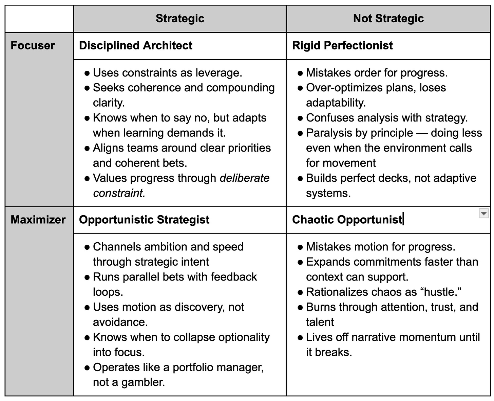

In conversation after conversation, I hear:

“My company needs to focus…”

“Our strategy is not a strategy….”

“We try to do too much…”

“Our leaders are always pushing us to do more at once…”

“We keep chasing short-term outcomes…”

“Our WIP is too high…”

But here is something everyone needs to understand.

You can’t counter these problems with *logic*.

Many leaders (and successful entrepreneurs) are what I call “maximizers”. The quotes above come from “focusers”. Maximizers and focusers have a hard time understanding each other. It has nothing to do with skill, since I know highly skilled (and strategic) maximizers AND focusers.

**Maximizers** are biased to speed, optionality, breadth, momentum, opportunism, parallel bets, hype, luck exposure, momentum, “Why not both?”, “Better to move fast than wait for perfect”. Maximizers want to see concrete examples before they’ll make tradeoffs. They anchor decisions in the tangible. “Stop making things so complicated.” “Stop overthinking.”

**Focusers** are biased to focus, coherence, depth, meaningful constraints, doing less for more, sequential experiments, intentionality, sustainability, “What matters most?”, compounding clarity. Focusers are comfortable with abstraction. A clear constraint or principle is enough to guide them. “Stop mistaking chaos for progress.” “Stop overdoing.”

**Maximizers get annoyed and triggered by focusers:**

>
>
> They say we spread ourselves too thin. Maybe. But stretch goals, A-player hiring, high tempo…those are how you bend the curve. It’s not about chasing shiny objects; it’s about creating the conditions where luck finds you.
>
>

>
>
> Focusers love plans that make sense in hindsight. But strategy isn’t a retrospective art. It’s about keeping momentum, having multiple shots on goal, and adjusting mid-flight.
>
>

**Focusers get annoyed and triggered by maximizers:**

>
>
> Their approach works great until the noise catches up…until teams are doing twelve things half-heartedly and nobody can tell what’s actually moving the needle. Then it’s all fire drills and post-hoc rationalizations.
>
>
>
> They believe ambition alone can bend reality, that with enough motion and belief, you can brute-force outcomes. And to be fair, sometimes it works. But more often, it burns through the very talent and trust that make those outcomes possible.
>
>

Layering In Strategy

----------

Let me add a twist here. I mentioned before that both focusers and maximizers can be strategic. This adds to the confusion.

Conflicts

----------

There is all sorts of tension between these (albeit artificial) archetypes:

**Disciplined Architect ↔ Chaotic Opportunist**

* The Disciplined Architect sees the Chaotic Opportunist as reckless: “You’re torching optionality and trust for short-term optics.”

* The Chaotic Opportunist sees the Disciplined Architect as bureaucratic: “You’re slowing us down, overthinking, killing momentum.”

**Opportunistic Strategist ↔ Rigid Perfectionist**

* The Opportunistic Strategist thrives on adapting mid-flight; to them, the Rigid Perfectionist feels doctrinaire: “You’re allergic to improvisation.”

* The Rigid Perfectionist sees the Opportunistic Strategist as undisciplined: “You call it agility, but it’s just reactivity with good branding.”

**Disciplined Architect ↔ Rigid Perfectionist**

* The Disciplined Architect values clarity but also adaptation: “Principles are tools, not prisons.”

* The Rigid Perfectionist believes any deviation is decay: “If we start bending rules, the whole system unravels.”

**Chaotic Opportunist ↔ Rigid Perfectionist**

* The Rigid Perfectionist responds to chaos by doubling down on control: “We need tighter rules and clearer gates.”

* The Chaotic Opportunist rebels: “You’re suffocating innovation; I’ll just go around you.”

Healthy Tension

----------

The healthiest organizations don’t try to eliminate any of the four archetypes. They see the good in each of them and dampen the risks.

The Disciplined Architect and the Opportunistic Strategist form the core alliance. The Disciplined Architect anchors the organization in coherence, structure, and compounding clarity. The Opportunistic Strategist keeps the system adaptive, keeping the spark of ambition and responsiveness.

Around them orbit the other two archetypes, each carrying volatile but valuable energy.

The Chaotic Opportunist brings raw momentum, discovery, and creative disorder. This energy exposes hidden options and challenges stale assumptions. But you need a counterbalance. Left unchecked, the Chaotic Opportunist destabilizes the system, but when buffered by the Disciplined Architect and the Opportunistic Strategist, that energy becomes a renewable source of innovation.

The Rigid Perfectionist, by contrast, defends standards, rituals, and institutional memory. The Rigid Perfectionist serves as the immune system that prevents reckless reinvention, though in excess, they can stifle change.

In Closing

----------

Take everything I’ve written here with a grain of salt. You can’t put people in buckets like this. We all probably have our maximizer and focuser instincts. We shift through our careers. You have to consider all sorts of contextual factors.

But especially to the perpetually misunderstood Disciplined Architects who read this newsletter:

Remember, you can’t counter with logic.

There are hidden benefits and risks in all of these motions.

Seek to understand.