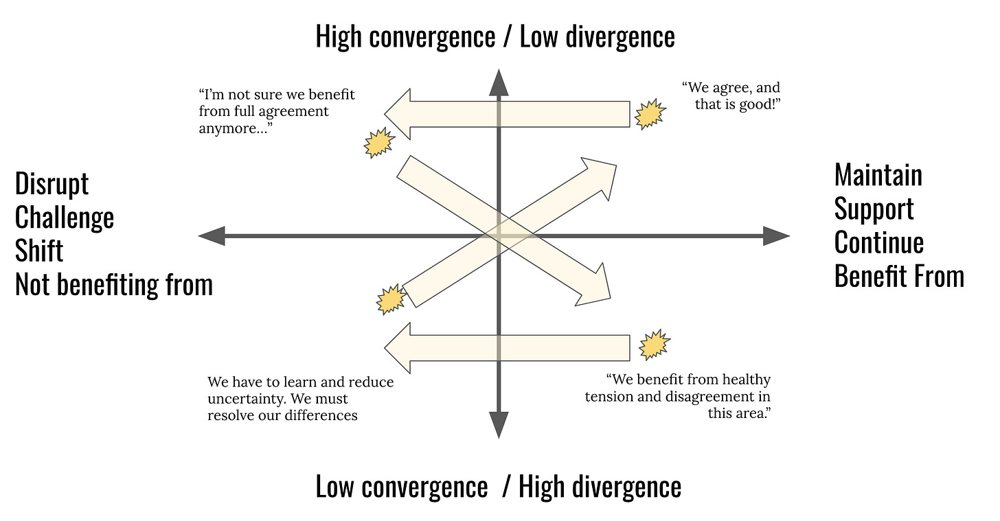
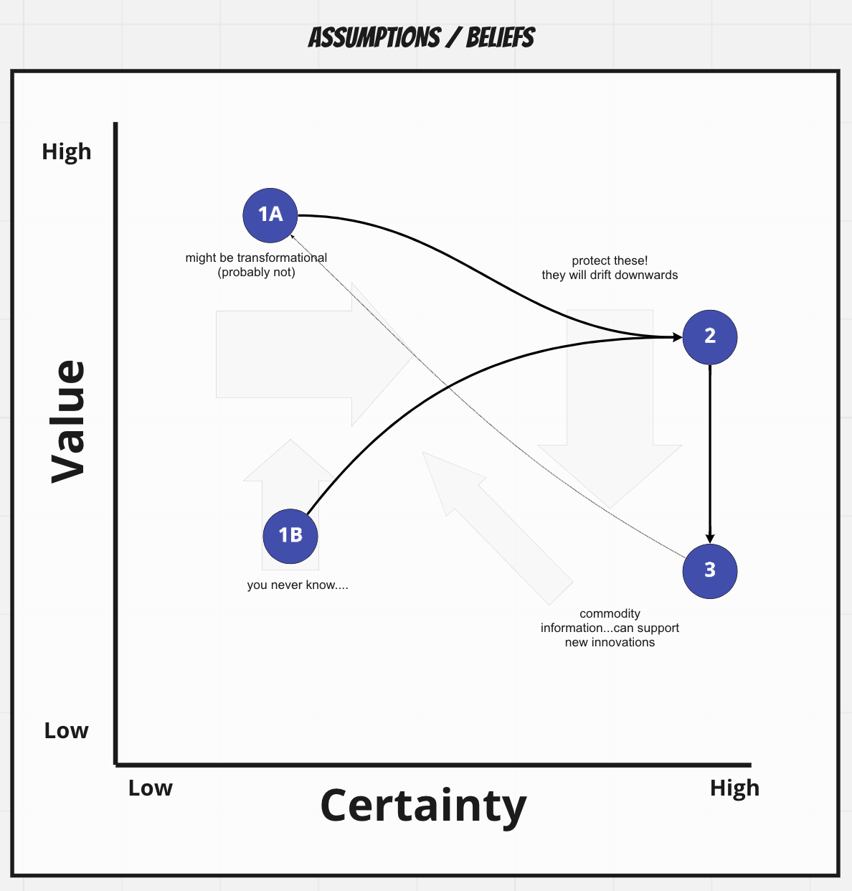
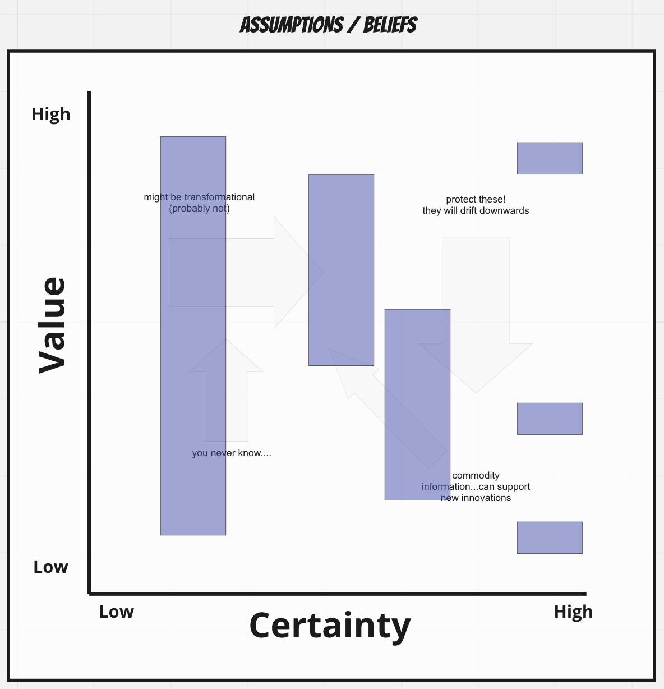

*Before continuing, I wanted to congratulate Cyd Harrell on the release of [A Civic Technologist's Practice Guide](https://www.amazon.com/Civic-Technologists-Practice-Guide/dp/1735286508). It is a great book for folks interested in working in—or currently working in—the public sector.*

In product, we make all sorts of assumptions. We have beliefs about

* why people buy (or don't buy) our product

* what causes people to give us more (or less) money

* the size of the market now, and in the near/long term

* differentiation, the competition, and technology trends

* expected shifts in consumer habits

* timing, timing, timing

* why people work at our company

* styles of management and styles of leadership

* quality, technical debt, architecture,

* and more (much more)

Not everyone in your company will have the same beliefs. They may vary in interesting and unexpected ways. Together they form a belief system sorts, and that system guides our decisions. **Conformity/alignment of beliefs is not always desirable. Rather, we strive for coherence**—**understanding the various perspectives, and adapting/refining as we go**. Agreeing to disagree, pursuing options in parallel, and/or not caring for now, is sometimes the most powerful things we can do.

We’re in a constant cycle of agreement, challenging that agreement, promoting diverse perspectives, realizing we need a bit more alignment, and then supporting agreement.

There are other predictable patterns.

Startups sometimes start with big, uncertain assumptions. "If x,y, and z works...and that's a big if…we'll be unstoppable!" *See 1A below*.

Or they start with smaller, less grandiose ideas that turn out much more valuable than they expected. "We were tinkering with X, it seemed kind of simple and the time, but things just snowballed from there!" *See 1B below*.

Either way, over time they increase certainty. If they play their cards right, there's a period of time before competitors catch up and learn what they know (2). When the information is rare, it could take a while for people to catch up. But they do catch up in almost all cases (3) and the information becomes a commodity of sorts.

It ends up looking a bit like this:

**Of course this is the happy path.**

Many 1As drop like stones.

Many 1Bs go immediately right (low value).

Many 2s don’t stay in the upper right for long.

And sometimes 3s and 2s go “backwards” and drift left based on new circumstances.

The purpose of this post was to present this simple model and to encourage you to brainstorm and place beliefs with your team. In product we often talk about our “riskiest assumptions”, but we don’t really get into the details. Why? Why now? Is it risky becomes we are uncertain about it? Or because it is extremely important/valuable?

A related way to think of this chart is like this:

…in the sense that low certainty beliefs could be low value or very high value. We don’t know. And as we increase certainty, that range of potential value drops. This is a bit of a mind-bender, but it is a helpful frame.

Give both a try.

* Brainstorm a bunch of beliefs and assumptions. Don’t limit yourself.

* What are you most uncertain about?

* Where would decreasing uncertainty produce a lot of value?

* What are you highly certain about? How valuable is it?

* Where must you work to protect your high value, certain information?

* How can you leverage “commodity” information to spawn less certain, but potentially valuable ideas

The goal is not perfect agreement. Rather…coherence.

Apologies. This post was a bit scattered, but hopefully some of the ideas resonated.

\--------

Some upcoming conferences:

**Sep 22:** [The Conf' Outdoor Edition (Fertile City - Paris) ](https://laconf.schoolofpo.com/)

**Sep 24:** [La Product Conf Madrid - Virtual](https://laproductconf.com/lpc-madrid-2020/)

**Oct 13-15:** [DevOps Enterprise Summit Las Vegas - Virtual](https://events.itrevolution.com/virtual/)

**Oct 14-16:** [Amplify (Virtual)](https://amplify.amplitude.com/?utm_campaign=amplify2020&utm_medium=organic_email&utm_source=personal_email&utm_term=cutler)

**Oct 29-30:** [Agile-Lean International 2020](https://www.agileleanireland.org/)