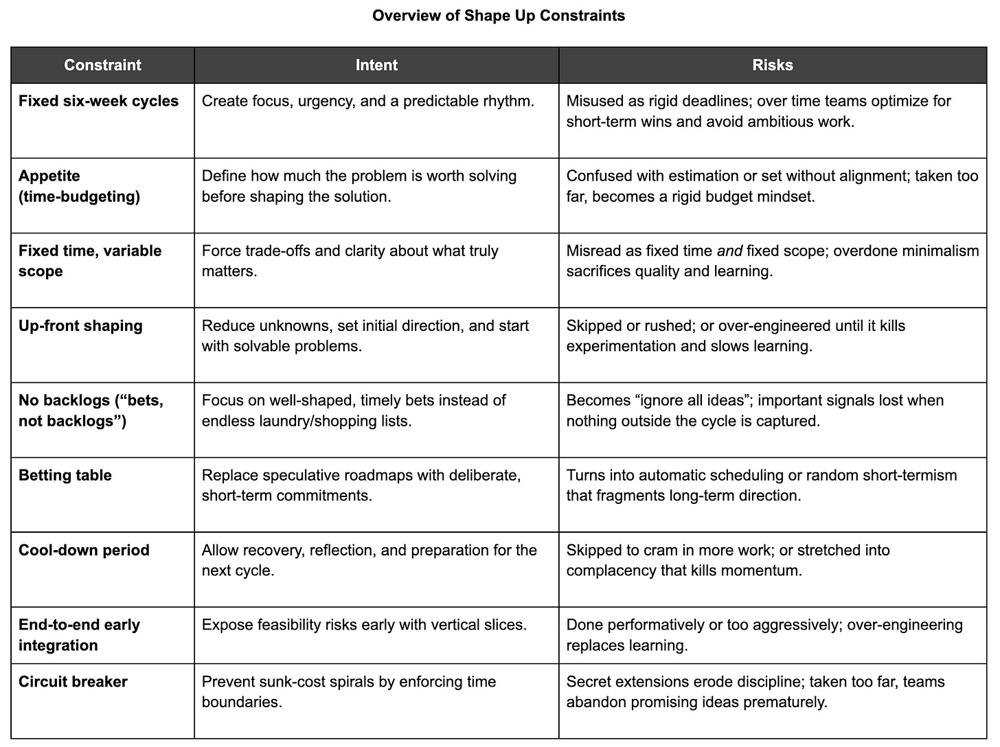

After reviewing dozens (hundreds?) of operating systems in depth, I’m becoming increasingly convinced that the thoughtful design and deployment of constraints is a superpower. Constraints come in all shapes and sizes. Their effectiveness is highly contextual, and even the “right” ideas frequently bump up against reality. But it is possible to be better or worse at using them. It is a skill.

In this post, I’m going to use Basecamp’s Shape Up as an exploration of constraints and end with some tips on how to apply them in your own context.

I’m also trying something new with this post. I’d like to invite people to [an open discussion and AMA on Thursday, November 13⋅8:00 – 9:00am (Pacific)](https://zoom.us/meeting/register/CT_KHoEPQr-LGSA1fhjW5Q). That way we can keep the conversation going. I’d love to see you there.

[Join the conversation](https://zoom.us/meeting/register/CT_KHoEPQr-LGSA1fhjW5Q)

Two Companies. Same Constraint. Different Outcomes

----------

I once worked as a consultant for a company that was obsessed with measuring “say/do” ratios. They made heavy use of deadlines. Instead of being a catalyst for focus, creativity, and seeking high leverage, deadlines brought out the worst in the team:

1. Delivering things to customers that missed the mark (but that “hit deadlines”)

2. Burnout. Team members went into hero mode as the norm, and this eventually caught up to them

3. Sand bagging. Teams became so worried about hitting deadlines that they padded all their work to the extreme.

4. Say/Do related to deadlines infiltrated the performance management system in an outsized way, making it hard to shift to more outcome-focused framings

5. A cycle whereby it became harder and harder to achieve deadlines, because deadlines (combined with other cultural factors) were making it harder and harder to do anything predictably

I also worked with a company that used deadlines extensively, but in a completely different way.

The deadlines weren’t performative or punitive. They were designed as a creative forcing function and as a coordination mechanism across interdependent teams. Instead of being about “say/do ratios”, the deadlines acted as a boundary for focus, investment, and risk. Leaders modeled this behavior. When something slipped, they asked what we learned and what should change next time, not who was late.

Same constraint. Two very different outcomes.

What determines whether a constraint enables progress or creates drag?

A Framework Constraint Case Study (Shape Up)

----------

Frameworks are filled with (hopefully enabling) constraints. Basecamp’s Shape Up is a great case study because it is [clearly described](https://basecamp.com/shapeup), and the book is freely available. While I occasionally recommend Shape Up, my focus here is on using the framework to explore the idea of internally applied constraints. The real value of the book is how well the author (Ryan Singer) clarifies intent.

**The Shape Up Constraints**

Here is a selection of constraints baked into the framework. For each constraint, I try to capture the intent and some potential risks (including the risk of overdoing the constraint).

1. Fixed six-week cycles

2. Appetite (time-budgeting instead of estimating)

3. Fixed time, variable scope

4. Up-front shaping

5. No backlogs (”bets, not backlogs”)

6. Betting table

7. Cool-down period

8. End-to-end early integration

9. Circuit breaker

While you read the examples, keep these questions in mind:

1. What kinds of behaviors might this constraint encourage?

2. What types of behaviors might it suppress or discourage?

3. How might it need to be counterbalanced to stay healthy over time?

4. In what problems or contexts might this approach work well? Doesn’t work well?

The **fixed six-week cycles** are meant to create focus, foster urgency, and set a predictable rhythm. Teams are forced to make trade-offs and prioritize essentials. The risk is that teams lose sight of the cycle as a creative boundary and treat it as a rigid deadline. If taken to the extreme, teams may optimize only for short-term deliverables, avoid ambitious work that can’t fit neatly into six weeks, and prematurely kill ideas that could have created more long-term value.

>
>
> Six weeks is long enough to finish something meaningful and still short enough to see the end from the beginning
>
>

**Appetite (time-budgeting instead of estimating)** forces the shapers to decide how much the problem is worth before shaping the solution. It shifts the focus from “how long will this take?” to “what’s worth six weeks of effort,” aligning ambition with risk appetite. The risk is that Appetite gets confused with an estimate, or appetites are set without real stakeholder alignment. If taken too far, teams may treat appetites as inflexible budgets. They end up shaping and judging everything strictly by time rather than by the value or opportunity at stake.

>
>
> We focus less on estimates and more on our Appetite. Instead of asking ‘how much time will it take?’, we ask: ‘How much time do we want to spend? How much is this idea worth?’
>
>

**Fixed time, variable scope** encourages scope trade-offs and creative problem-solving. It forces clarity about must-haves versus nice-to-haves. The risk is that it will be treated as a fixed time and fixed scope. When over-embraced, teams may over-optimize for minimalism, cutting too deeply or celebrating the smallest possible delivery even when a bit more work would significantly improve quality or impact.

**Up-front shaping** reduces unknowns before committing. It turns rough ideas into something more tangible so that teams start with solvable problems. The risk is that people skip or rush the shaping, or that shaping involves too much solutioning. At the other extreme, shaping can become bureaucratic and over-engineered. Well-meaning efforts become so exhaustive and risk-averse that they suppress experimentation and slow learning.

>
>
> Projects are defined at the right level of abstraction: concrete enough that the teams know what to do, yet abstract enough that they have room to work out the interesting details themselves.
>
>

**No backlogs (”bets, not backlogs”)** prevent the accumulation of low-quality ideas. They ensure focus on well-shaped, current bets and eliminate backlog bloat and the false sense of progress that comes with endless lists. The risk is that this becomes “ignore all ideas,” with no lightweight way to capture promising but unshaped work. If taken too far, the organization may lose sight of valuable insights or early signals because nothing outside the current cycle is ever documented.

>
>
> The time spent constantly reviewing, grooming and organizing old ideas prevents everyone from moving forward on the timely projects that really matter right now.
>
>

The **betting table** creates cycle-by-cycle commitment. It replaces the rigidity of a roadmap with deliberate short-term bets, providing a clear moment for commitment and reset. It aligns leadership and makers around what truly matters next. The risk is that roadmaps creep back in and betting becomes automatic. If taken to the extreme, the process can swing the other way. Every cycle becomes a fresh bet detached from long-term direction, fragmenting strategy into disconnected bursts of work.

>
>
> There’s no ‘grooming’ or backlog to organize. Just a few good options to consider.
>
>

The **cool-down period** allows recovery and creates time for bug fixes, reflection, and shaping for the next cycle. It supports continuous improvement and sustainability. The risk is that it may be omitted or compressed to accommodate more work. If over-embraced, cool-downs can drift into complacency. Teams lose momentum and the sense of rhythm that the cycles are meant to provide.

**End-to-end early integration** (”breadboard” or “vertical slice”) helps teams discover feasibility risks early and forces integration before polishing. The risk is that nothing is truly integrated early, and the team performs this step superficially. When taken too far, teams can over-engineer architecture or rush to connect everything prematurely, optimizing for integration completeness rather than learning value.

>
>
> They should aim to make something tangible and demo-able early (in the first week or so). That requires integrating vertically on one small piece of the project instead of chipping away at the horizontal layers.
>
>

Finally, the **circuit breaker**—dropping work instead of extending it by default—prevents sunk costs from spiraling out of control and enforces respect for time boundaries. It makes trade-offs explicit: ship, reshape, or stop. The risk is that managers secretly extend or roll work forward to “finish it.” Taken to the extreme, though, teams might treat every dropped project as a badge of discipline, abandoning promising ideas that simply needed a bit more iteration or follow-up to succeed.

>
>
> Teams have to ship the work within the amount of time that we bet. If they don’t finish, by default the project doesn’t get an extension… We intentionally create a risk that the project—as pitched—won’t happen.
>
>

What These Constraints Have in Common

----------

What do you notice when you look at these constraints as a set? What do they have in common?

In all cases, you have some combination of the following:

* Clarity and simplicity. On one hand, you have an easy-to-understand “rule” or forcing function. No real nuance. Easy to explain. This makes it easy for someone to start playing the game initially.

* Tension and depth. On the other hand, you have a level of tension, opposing ideas, or balancing forces. You can’t just waltz through the constraint and go about your daily work. #1 makes it easy to start, and #2 makes it deep. These constraints carry a richness that even experienced teams must consider.

* Full-loop integration. Most involve a kind of closed loop, bringing together threads of code, design, risk mitigation, or coordination. You’ve unknotted the knot, done some things, and now you’re re-tying it. The learning completes the loop.

* Active engagement. These are not turn-off-your-brain process hoops. They require awareness and judgment. With each one, you can imagine a company sleepwalking through the ritual and missing the point. They ask something of the team: engagement, discernment, and curiosity.

* Cultural adaptation. There’s just enough customization to make these distinctly Basecamp. In reality, none of these constraints are entirely new. What’s new is how Basecamp put its twist on them, a twist that helps teams make them their own without losing the underlying principle.

The Interplay (and Context)

----------

There is more to Shape Up than this list of constraints, but hopefully you can see how they reinforce and counterbalance one another. Each constraint shapes behavior differently, and its power comes from the interplay between them. Taken in isolation, without the nuanced culture, norms, and intent that surround them, you would be left with a set of hollow rules.

Examples of how these constraints complement each other

* The Betting Table and the Circuit Breaker work as a pair. The Betting Table formalizes the company’s investment choices for the next cycle. The Circuit Breaker ensures that those commitments do not silently expand or drag on forever.

* No Backlogs interacts with Appetite to reinforce focus. By avoiding endless lists of “someday” ideas, the team must make real trade-offs in the present moment, based on how much time or risk they are willing to invest.

* Up-Front Shaping and End-to-End Early Integration balance each other. Up-Front Shaping ensures that work starts from a well-understood problem, while End-to-End Early Integration keeps the process grounded in reality and reveals risks before it’s too late. One encourages definition, the other discovery.

* Cool-Down Periods and Fixed Cycles maintain rhythm and recovery. The Fixed Cycle creates predictable pulses of work. The Cool-Down Period prevents burnout and gives space for reflection before the next pulse begins.

Like all effective constraints, they are highly contextual. What works in one environment may backfire in another.

Ryan Singer, the author of Shape Up, has stated in multiple interviews that the method evolved gradually over years of trial and refinement at Basecamp. It was not designed in a vacuum, and it did not land fully formed. Nor will it remain static. Shape Up is best understood as a living OS that evolved to fit a particular company, in a specific time, with a certain set of people and constraints.

It just happens to be a great lesson in the thoughtful application of constraints. Ask yourself, “How could I apply the principles behind these constraints to my workplace?”

Ask, “How might the principles apply?”

*Note: An interesting thing to explore is the difference between Shape Up and your run-of-the-mill agile framework. A key insight is that it’s impossible to add nuance and depth to a framework without anchoring it in a specific context. Imagine if Scrum said “you have to have a betting table” or “you must run six-week cycles.” Those details would immediately be copied, stripped of meaning, and applied out of context. This is the beauty of contextual constraints. They work precisely because they are tuned to the environment that shaped them.*

What It Takes to Make Constraints Work

----------

Most teams don’t fail because they lack constraints. They fail because they don’t know how to use them. The difference between a helpful constraint and a harmful one often comes down to how it’s introduced, understood, and maintained over time. Constraints aren’t magic. They’re agreements, habits, and cultural patterns that need care. They shape behavior only when people see the intent behind them and choose to engage with that intent.

The following principles capture what it actually takes to make constraints work in practice.

**Co-design the constraint with the people who will live with it.**

Involve the team in shaping and refining the constraint before it’s introduced. When people help design the boundaries, they understand the intent, see the trade-offs, and are more likely to uphold it. Co-design transforms top-down mandates into shared experiments.

**Select the right constraint for the moment.**

Start by matching the constraint to the opportunity and context.

Ask what behavior you want to encourage and whether this specific constraint has a decent probability of doing that in your current context (or at least help you learn about your context). Good selection means understanding why you’re adding the constraint, not just copying one that worked elsewhere.

**Anticipate how it will play out over time.**

Before introducing a constraint, consider the potential second- and third-order effects it may create. You cannot predict everything, but you can surface possible consequences. Discuss the behaviors that might strengthen or distort the intent, and consider whether you are prepared for those outcomes. Thoughtful anticipation often prevents painful surprises later.

**Implement with intent and discipline.**

Constraints only create value when used as designed. Make the purpose visible, give it time to take effect, and resist the urge to water it down or abandon it when it gets uncomfortable. Treat it like a practice that needs reinforcement, not a checkbox to tick. However, also be willing to set an expiration date for the experiment and agree to revisit it at a future point. Don’t treat things as too precious.

**Ensure constraints reinforce rather than conflict.**

Check the system as a whole. Each constraint should support the others rather than create friction. Well-designed timeboxes, for example, should align with how priorities are established, how feedback loops operate, and how progress is evaluated. The goal is coherence, not a pile of individually clever mechanisms.

**Nudge culture to support the constraint.**

Even the best-designed constraint will fail if the surrounding culture cannot accommodate it. Leaders must protect the intent, model the behavior, and foster a sense of psychological safety to mitigate the discomfort that comes with change. When a team’s habits, incentives, or identity are at odds with the constraint, address those issues first.

---

Hope you enjoyed this. Feel free to join the chat!

I’m also trying something new with this post. I’d like to invite people to [an open discussion and AMA on Thursday, November 13⋅8:00 – 9:00am (Pacific)](https://zoom.us/meeting/register/CT_KHoEPQr-LGSA1fhjW5Q). That way we can keep the conversation going. I’d love to see you there.

[Join the conversation](https://zoom.us/meeting/register/CT_KHoEPQr-LGSA1fhjW5Q)

----------