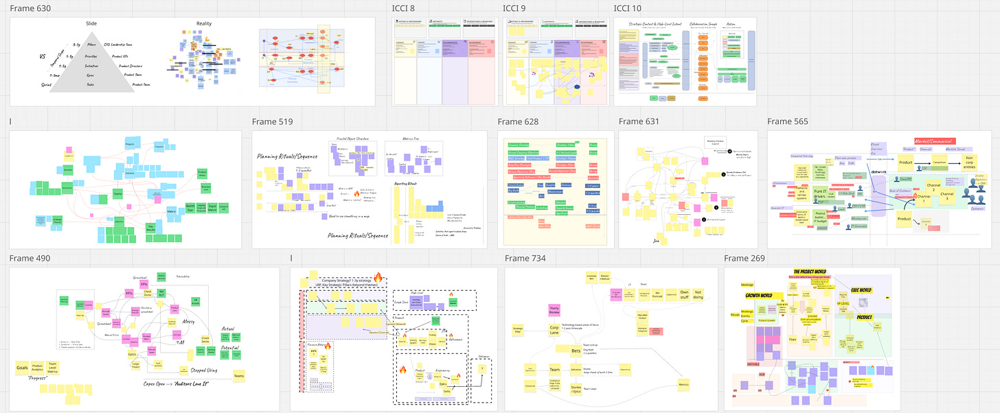
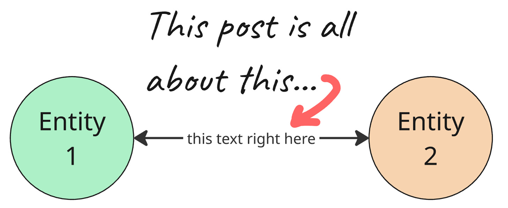
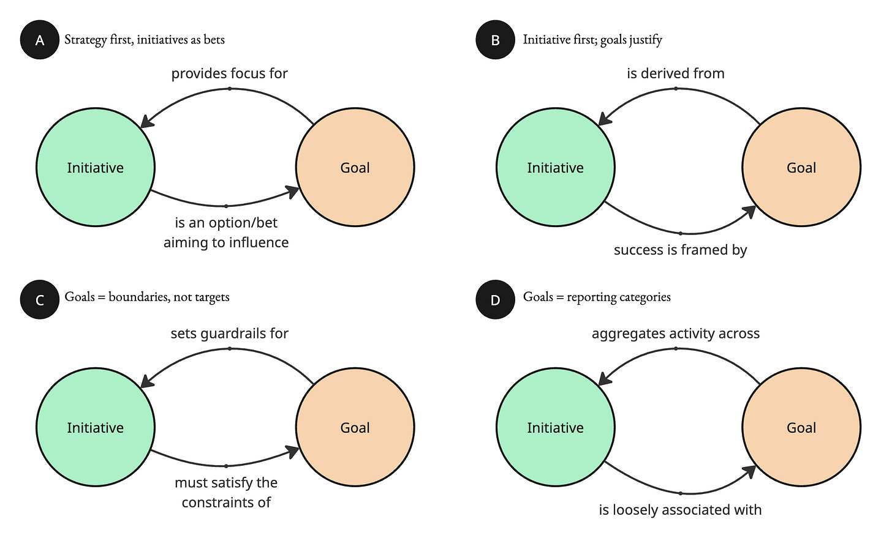
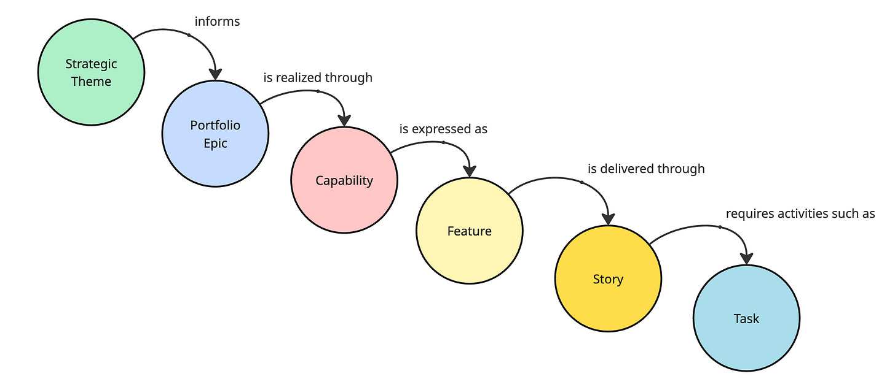
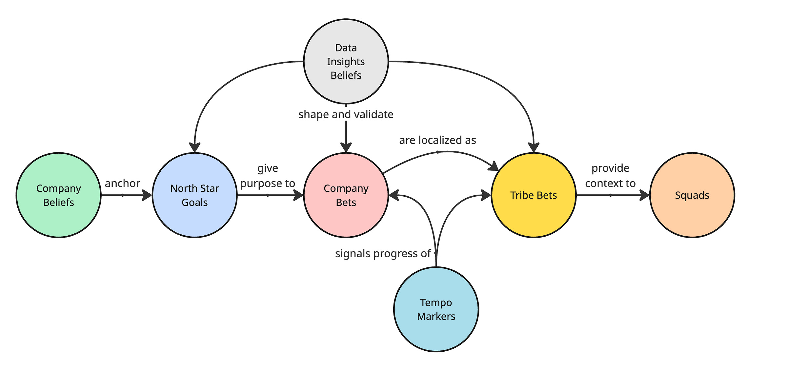
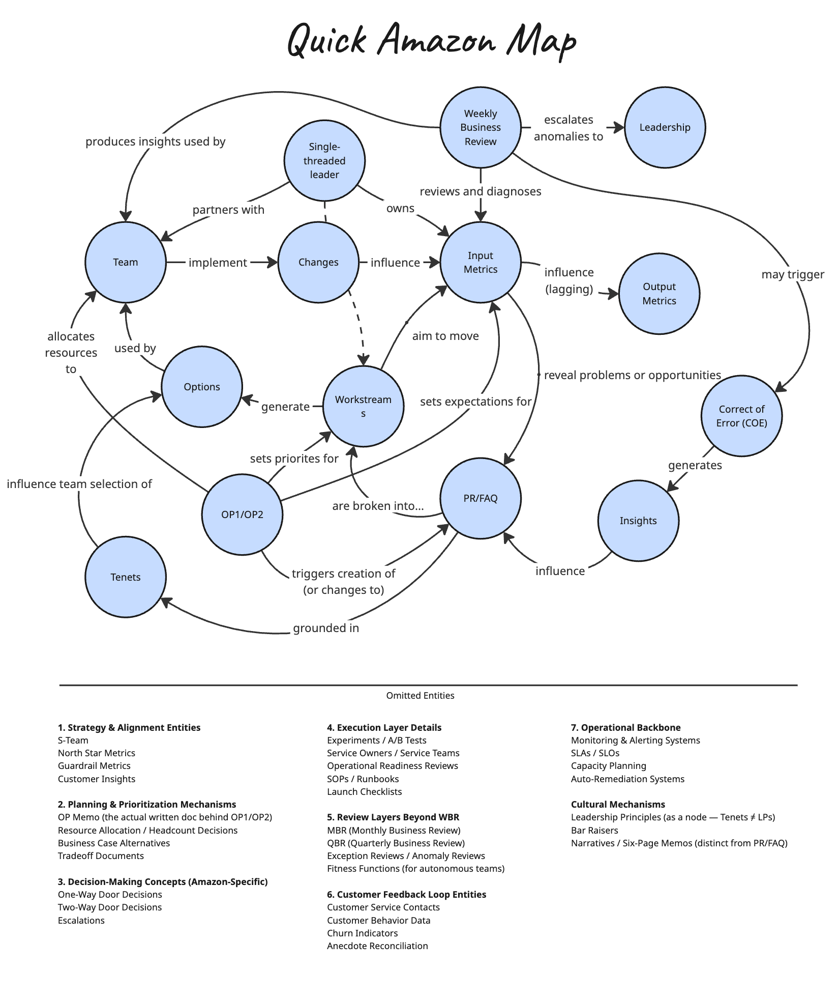
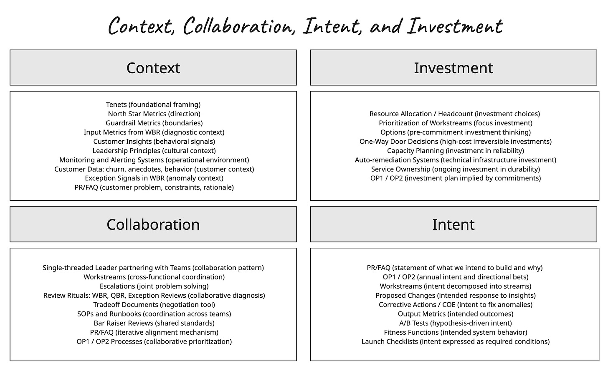
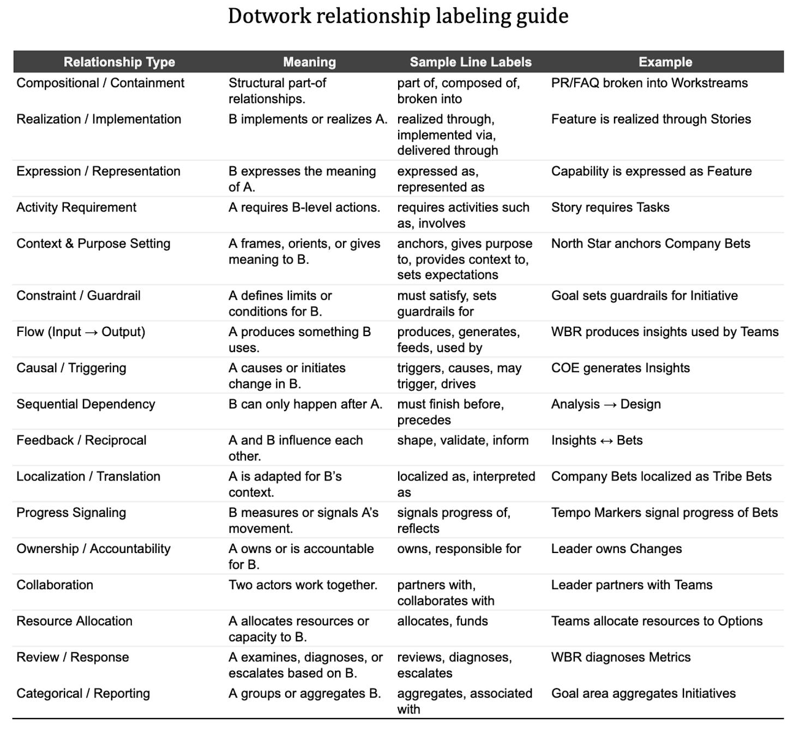

At work, I end up mapping out a lot of company operating systems. And it wasn’t until yesterday that something finally clicked. It feels so simple, and probably dumb, that maybe I am crazy writing a post about it. But I’m going to.

The basic idea is this. So much becomes clear when you actually label the relationships between things. It’s something I do every day, and I do it very naturally. But it is not something everyone does naturally.

The goal of this post is to persuade you to map out how you operate as a concept map, semantic network, or lightweight ontology where the edges carry meaning.

We fall back on a small set of options (e.g., hierarchies and containment models) when company operating systems are much more diverse. This drift is fine when you’re on a small team. But it can have disastrous effects when scaled across a company.

Onwards!

Goals & Initiatives (4 Variations)

----------

Over the past week, I’ve encountered at least four very different mental models of the relationship between goals and initiatives. These seem to be the leading contenders.

How do they differ?

Model A treats goals as the strategic anchor and initiatives as bets aimed at influencing them. Model B flips this, with initiatives chosen first and goals later derived to justify and frame their success. Model C uses goals as constraints or guardrails that initiatives must satisfy but not necessarily aim for. Model D treats goals as loose reporting categories that simply aggregate activity without directing or shaping the initiatives themselves.

**Key thing to notice: each model assumes a completely different type of relationship, and small shifts in that relationship change how strategy and execution actually work.**

“Strategy to Execution”

----------

Consider these two variations of a “strategy-to-execution” model. What might we infer about the companies using these respective models?

Why does one model call out capabilities and features, while the other uses the term “bets,” applies that concept fractally, and explicitly includes data, insights, and beliefs? What assumptions are these models making? What is the primary role of frontline teams in each case? And which model is more accommodating of cross-team and cross-group dependencies?

*(Note: I’m only labeling these in one direction for simplicity. Assume comparable reverse labels.)*

#### Diagram 1

 ####

#### Diagram 2

 ####

When you compare the two strategy-to-execution models, the biggest differences aren’t the shapes of the diagrams but the assumptions they encode about how organizations work. It’s the objects AND the relationships: the nouns AND the verbs.

The first model assumes a world in which strategy can be decomposed into stable layers, causality is mostly linear, and frontline teams primarily implement well-defined intent. The second assumes a world of constant uncertainty, where strategy emerges from learning loops, bets express hypotheses rather than commitments, and teams interpret, localize, and contribute to the strategy rather than just execute it.

The first model calls out capabilities and features because it sees progress as breaking work into modular parts; the second highlights beliefs, insights, and bets because it sees progress as iterating toward understanding. My hunch is that the predictable one is *better* at dealing with large, cross-cutting projects, at the expense of creativity. But the bet-based one is better at avoiding those altogether. Another fair assumption: in one example, technology IS the business. It is “the product.” In the other example, technology enables “the business” (there is a technology/business divide). Which is which? You be the judge.

In short, each model reveals a distinct worldview about how clarity is created, how learning happens, and what teams exist to do.

**Key thing to notice: the difference is not just “layers.” It is whether you believe progress comes from breaking work down or from iterating, localizing, and refining bets.**

More Objects And Relationships

----------

To cook up another example, I spent ten minutes sketching a rough ontology of Amazon’s operating system. Don’t worry about completeness — it’s nowhere near complete. What I want you to pay attention to is the *texture* of the relationships. As you look at the diagram, try to observe the “edge” (relationship) labels:

*(Note: I gave up on colors here, given the number of object types)*

This probably is not how Amazon would diagram its operating system, and I am sure parts of my sketch are off. But notice the contrast. In most companies, the structure is basically “projects → deliverables → stories.” In this sketch, the power comes from the variety of relationships, how decisions flow, how signals travel, and how teams learn. It is a network. Notice how many of the edges describe mechanisms, not containers: diagnosing, escalating, grounding, influencing, revealing, setting expectations, generating insights.

And the objects themselves are not just convenient layers in a single hierarchy. They are a mix of rituals, artifacts, practices, concepts, formal mechanisms, and actual people. Not a simple tree with “team → ELT” on the left, and “1 to 3 weeks → 5 years” on the right, but a messy, interconnected system that looks more like how work really happens.

We can group them into my [four-graph framework](https://cutlefish.substack.com/p/tbm-361-context-collaboration-intent):

**Key thing to notice: this is not a hierarchy but a mechanism-rich network. The edges carry meaning, feedback, and intent that no simple “project → deliverable → story” tree can represent.**

“Scaling Agile”

----------

Shifting gears to an apparent non-sequitur…but I’ll tie things together in a second.

Way back in the aughts of 2008 to 2010, people started pondering what it might mean to “scale Agile.” There were decent ideas at the time about how a team might work in more agile ways. But at the “business level,” it was all programs and projects, budget codes, portfolio governance, and capitalization. What to do, especially when people craved the cool comfort of a clean-looking roll-up?

Smart people looked at the problem and tried something very logical (and not at all unreasonable).

* OK. Teams come and go, and people shift around, and leadership feels nervous when everything seems too fluid. What if we created a long-lived grouping of teams that would always plan together, deliver together, and commit together? Something stable enough that executives could see a clear line from strategy to execution. We could call it a train, and each train would carry a predictable flow of work every quarter.

* Teams release small increments, but the business wants coordinated releases. So what if the train itself became the release unit? Instead of ten teams releasing ten different things, the train could release a single unified increment and give leadership a clear story of progress.

* Teams run effective standups, so what if we created a standup for all the teams at once? A kind of super standup where representatives from every group could surface risks and dependencies in one place.

* Hmmm. A Product Owner works well for a single team, so what if we introduced a similar role for ten or twelve teams at a time? Like Product Management? That could speak for the broader value stream and keep everything aligned. A Scrum Master helps one team improve, so what if we had a Release Train Engineer who could help twenty teams improve? They could coordinate ceremonies, remove cross-team blockers, and keep the train moving.

* Teams use backlogs to shape near-term work, so what if we introduced program backlogs and portfolio backlogs that could represent bigger flows of value? Executives could look at it and immediately understand what was in the backlog.

* Teams sometimes need help aligning with business priorities. What if we added roles for Business Owners who could attend planning events, decide on commitments, and ensure investment alignment?

There has been much digital ink spilled around SAFe, but I want you to put yourself in a time machine and go back and be very honest with yourself. Do any of these ideas sound weird in context?

Assuming there were a lot of dependencies and the ghosts of IT funding past were haunting the halls near the HP LaserJet 9050, would any of this sound too far-fetched or too strange?

I do not think so, and the evidence is that many of these ideas were emerging organically in companies, in isolation, and independently. The conclusions were pragmatic and followed a simple heuristic: if something works locally, does it make sense to try it at the next higher level, or the level above that?

Here’s that logic in action:

*If a story has tasks, and an epic has stories, then maybe a feature could have epics, and a program could have features. And if a program has features, perhaps a portfolio could have programs!*

*If two people on a team can smooth out a dependency with a quick chat, then maybe five teams can smooth out their dependencies with a slightly longer chat. And if five teams can do it, then surely ten teams can too. Just invite a representative from each group. Maybe add a spreadsheet. Maybe add some color-coding. Maybe add a facilitator.*

*If a simple kanban board helps a single team see its work, then maybe a bigger board can help multiple teams see theirs. And if the board allows them to catch bottlenecks locally, perhaps a portfolio board can catch bottlenecks globally. Just scale the columns. Scale the stickies. Scale the conversation.*

*If OKRs help a small team focus, then maybe OKRs can help an entire organization focus. And if one team can align its objectives with another, then surely every team can align with leadership. Just start at the top: executives define their OKRs, directors derive theirs from that, managers derive theirs from the directors, and teams derive theirs from the managers—a tidy, elegant staircase of alignment.*

The problem is that the logic runs into some harsh realities of scale dynamics. Some things are relatively “scale-free”. Other things aren’t.

1. **Work Hierarchies**. The problem with scaling the story-to-epic idea to feature-to-program models is that stories are not the same type of thing as multi-quarter, outcome-focused containers like programs. A burndown of stories *might* make sense for an epic, but that doesn’t mean a burndown of *epics* makes sense for reducing risk or looking to impact a set of input metrics. The dynamics around high-dependency projects are very different from the dynamics around independent, iterative, outcome-focused work in an uncertain domain.

2. **Rituals**. An informal dependency chat inside a team is very different from a large-scale dependency conversation. At the team scale, people share context and can make quick agreements. At a large scale, with many teams and shifting priorities, the prep work alone can consume enormous amounts of time. Participants often converge too early simply to make the meeting manageable. The shape of the conversation changes completely, even though the surface ritual appears similar.

3. **Visualizations**. A team-level kanban board can be a catalyst for continuous improvement, but higher-level boards behave differently. A team board visualizes real work with a shared understanding of what the columns mean. A portfolio board often visualizes very different shapes of work, such as initiatives, themes, and long-horizon efforts. Once prioritization politics enter the picture, the board can become a flashpoint. I have had engineering leaders tear down a portfolio board because they believed it distracted teams and surfaced uncomfortable comparisons. What supports improvement at one level can trigger threat responses at another.

4. **Goal Hierarchies**. Team-based OKRs work well because they stay close to the work. Team-agnostic OKRs can also help align frontline teams. But once you build a large cascade, you have a big context telephone game. Leadership expresses direction. Directors reinterpret it. Managers reshape it. Teams then try to make sense of it. Instead of alignment, you get a stack of OKRs that sound consistent but reflect different priorities at each layer. The bigger the cascade, the more its meaning drifts.

This is not a new observation. Christina Wodtke has an excellent piece on why cascading OKRs often fail to do what people expect. In “[Cascading OKRs at Scale](https://cwodtke.medium.com/cascading-okrs-at-scale-5b1335812a32),” she points out that the structure looks tidy in a slide deck but “does not scale at all” once it passes through several layers of an organization. The farther an OKR travels, the more its meaning drifts, and what should be a focus and learning tool becomes a long translation exercise. I wrote a popular piece on this as well, titled “[Why Goal Cascades are Harmful (and What to Do Instead)](https://cutlefish.substack.com/p/tbm-4151-why-goal-cascades-are-harmful)“.

Her argument mirrors the broader theme here. Surface patterns may look fractal, but the underlying dynamics shift dramatically as you add distance, politics, and interpretation.

**Key thing to notice: some team practices exhibit almost scale-free behavior, but most do not. Once you add distance, politics, translation, and differing concepts, the pattern breaks.**

(Note: If you want to explore this further, [Scale by Geoffrey West](https://a.co/d/fqNwpKO) is a great place to start. West shows that some things scale sublinearly and become more efficient as they grow, while others scale superlinearly and become more costly, fragile, or political. Knowing which dynamics you are dealing with is critical. Another useful treatment is [Flyvbjerg’s discussion of modularity in How Big Things Get Done](https://a.co/d/fwkspJa). His core point is that modularity is powerful, but only when the units are genuinely modular, which is not the case for many of the assumptions described above.)

Closing The Loop

----------

We started this piece with a basic comparison of four mental models for the relationship between Initiatives and Goals. Then we explored two “strategy to execution” models: one more containment-oriented, and one built on richer relationships.

After that, I went all out (for 10 minutes) and mapped how Amazon works to show how rich the relationships and objects are, and how often they defy the usual pattern of “X is the sum of its children Y, which is the sum of its children Z.” Next, we took a detour into “scaling agile” as an accessible way to illustrate how we often assume certain practices can be scaled simply by repeating patterns at different levels, even though real organizational dynamics get in the way.

The purpose of this piece was to challenge you to look at how things are related, not just where they sit in a hierarchy. To step beyond basic trees and start sketching simple ontologies, concept maps, relationship graphs, and semantic models (pick your term) to explore how your company operates.

It is tempting to say that none of this really matters. That *everyone* understands that certain models are lossy. But I’d like you to turn your attention to the following. Consider how many companies:

1. Only formally acknowledge two types of work: 1) work that originates with a business case, far up in the org, or 2) business as usual (BAU) work.

2. Use terms like “initiative” to mean very different things, with very different relationships to outcomes, goals, insights, etc.

3. Try to describe the whole operating system on neat, tidy slides, with stages, gates, and phases, and some loops thrown in for good measure.

4. Insist that the clean hierarchy of X is actually how things work, and then expect a clean roll-up.

And don’t get me started on tools. How many tools assume that the sole task is a containment-type roll-up, with work happening at the bottom and roll-ups happening cleanly, level by level?

Real OSes are beautiful messes!

With Dotwork, we see a striking pattern. When people model their operating system with open-ended entities and relationship labels, they create, on average, 15 to 25 entity types, which naturally spread across our four graph framework: Intent, Collaboration, Context, and Investment. Only about 30 percent of the relationships they create are simple “part of” links. The rest reflect richer dynamics, such as influence, grounding, flow, ownership, and expectation-setting. In other words, when you give people expressive modeling primitives, they do not build hierarchies. They map out real operating systems as a network or network of networks.

So! Get modeling!

Here’s a guide to common relationship types:

