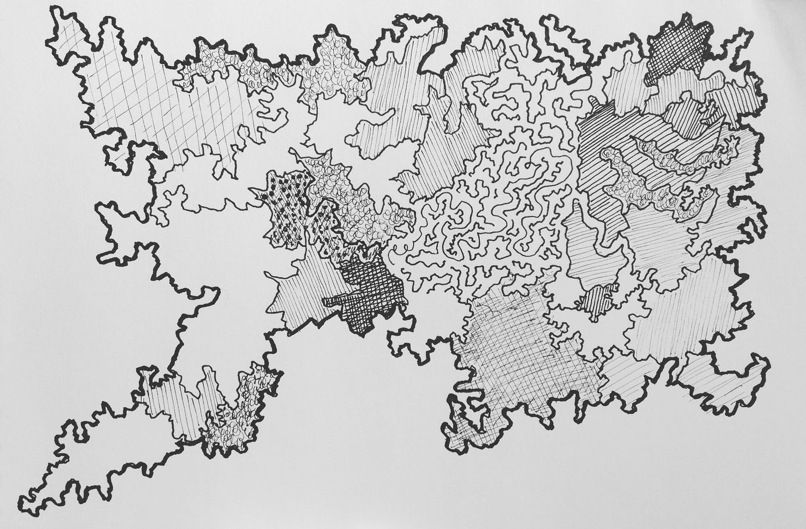

I like fill-in-the-blanks. Here are a couple I have been using recently in workshops and activities. What I like about these prompts is that they encourage people to consider polarities and tensions. There are no easy answers, but they might help trigger some helpful conversations. I have other prompts up at [Teamprompts](https://teamprompts.com/#/).

---

How do we *preserve* \_\_\_\_\_\_\_\_\_\_\_\_\_\_\_ while *at the same time* \_\_\_\_\_\_\_\_\_\_\_\_\_\_\_\_ ?

How do we *enable* \_\_\_\_\_\_\_\_\_\_\_\_\_\_\_ without adversely impacting our ability to \_\_\_\_\_\_\_\_\_\_\_\_\_\_\_?

How do we enable some teams to \_\_\_\_\_\_\_\_\_\_\_\_\_\_\_ without adversely impacting other teams and their ability to \_\_\_\_\_\_\_\_\_\_\_\_\_\_\_ ?

How do we enable \_\_\_\_\_\_\_\_\_\_\_\_\_\_\_ more broadly, while at the same time preserving \_\_\_\_\_\_\_\_\_\_\_\_\_\_\_ ?

The pendulum has swung a bit too far in the direction of us \_\_\_\_\_\_\_\_\_\_\_\_\_\_\_. How do we course-correct without losing \_\_\_\_\_\_\_\_\_\_\_\_\_\_\_?

How do we develop a new ability to \_\_\_\_\_\_\_\_\_\_\_\_\_\_\_ , while most of the inertia is focused on \_\_\_\_\_\_\_\_\_\_\_\_\_\_\_ ?

How do we mute/diminish our tendency to \_\_\_\_\_\_\_\_\_\_\_\_\_\_\_ , without losing \_\_\_\_\_\_\_\_\_\_\_\_\_\_\_?

How do we explore the uncertainty related to \_\_\_\_\_\_\_\_\_\_\_\_\_\_\_ , while making progress on more certain opportunities like \_\_\_\_\_\_\_\_\_\_\_\_\_\_\_ ?

How do we increase the likelihood of \_\_\_\_\_\_\_\_\_\_\_\_\_\_\_ , given our tendency to \_\_\_\_\_\_\_\_\_\_\_\_\_\_\_ ?

Currently, we feel most constrained by \_\_\_\_\_\_\_\_\_\_\_\_\_\_\_ . Is there a way to remove that constraint such that \_\_\_\_\_\_\_\_\_\_\_\_\_\_\_ continues, but we are able to start \_\_\_\_\_\_\_\_\_\_\_\_\_\_\_ ?

We’ve managed to get \_\_\_\_\_\_\_\_\_\_\_\_\_\_\_ working on a small scale and in pockets. We are interested in trying this more globally, but we are concerned that \_\_\_\_\_\_\_\_\_\_\_\_\_\_\_ .

We appear to be over-optimizing when it comes to \_\_\_\_\_\_\_\_\_\_\_\_\_\_\_ , which is creating difficulty when it comes to \_\_\_\_\_\_\_\_\_\_\_\_\_\_\_ .

