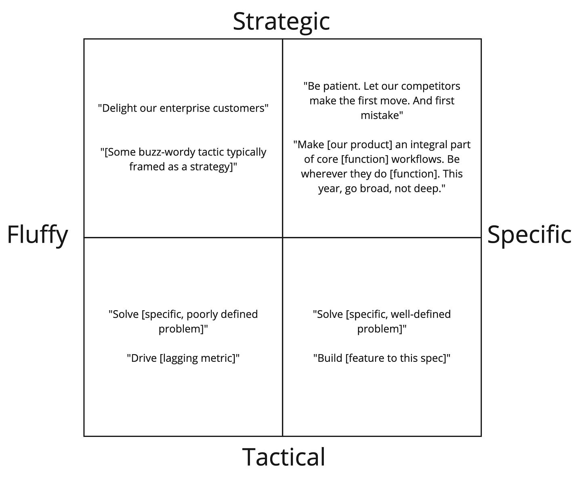

A product leader friend explained to me recently that they were struggling with framing objectives for their team. Paraphrasing their question:

>
>
> I'm trying to give the teams room for creativity. I'm trying to leave things open-ended, so they own their strategy. But I'm not sure it is clicking. They are sort of ambivalent about it all—especially the newer PMs. They *seem* to get it but share their roadmaps, and it feels all over the place.
>
>

Here was my take after checking out some of the objectives.

---

Passionate problem solvers have a tough time with fluffy language. Candidly, the objectives you shared are fluffy and ambiguous. 

The difference between customer profile X and customer profile Y may not matter to someone starting their career. But for someone experienced, it could dictate two wildly different strategies. Does that mean they want prescriptive projects? Absolutely not. Narrow, easy to solve problems? No! Every detail spelled out? No! They want specific, well-thought-out objectives and guiding principles.

Why are the PMs ambivalent? 

Passionate problem solvers ALSO know to pick their battles. Arguing with you is a distraction to them. For new people, it feels risky. So when given fluffy goals, they immediately translate them to specific goals in their mind. If you're lucky, they'll ask some qualifying questions, but unless the ambiguity threatens their job (or ability to do their job), they will not push the topic. At some point, they'll show you their roadmap, you'll have a discussion, and everything will be (hopefully) fine. By that point, those slides from annual planning will be but a memory. 

In your case, it wasn't fine. The more tenured PMs have more implicit context. As a startup, it was super easy for everyone to be on the same page. So the reason *their* roadmaps look great is that they have more context, not because they are better product managers. The new PMs don’t have that.

Is it an actual problem? Can you wait until they get up to speed?

It is a problem because they look to you for context and clarity. Other departments also see your objectives and probably get confused. There are ways to phrase very high-level goals and principles in specific and non-fluffy ways. Imagine a 2x2:

These aren't great examples, but you get the idea. Many would argue that something like **"Be patient. Let our competitors make the first move. And the first mistake"** is fluffy. But it isn't. It is evocative. It invites questions. It takes a stand.

**"Make [our product] an integral part of core [function] workflows. Be wherever they do [function]. This year, go broad, not deep."** describes without dictating. It is opinionated. It has a not \_\_\_\_ clause. 

Neither of these statements would exist on an island. They are meant to guide the team, and create a foundation upon which they’ll create their own language, goals, measures, etc.

**"Delight enterprise customers"** is a nothing-burger. Why? What does delight even mean when it comes to a B2B product? If "delight" were a company founding principle, it would be one thing. But it probably isn't. 

If you want to make sure to retain a set of enterprise customers, then just call the kettle black. Say “retain $###,###,### in business, that’s your challenge!”

Moving a lagging metric is fluffy. Sure, it is measurable. But it doesn’t really explain any context or thinking. Numbers don’t automatically equal specific.

The key is that you need to create these things WITH your team. They are the ultimate test.

* Invite them into shaping the language

* Make it safe to say, "that's too fluffy!" 

* See if it is specific enough to inspire coherent actions.

* List out some potential tactics. If you have too many, you haven't provided enough focus. Too view, you're being too specific.

* Remove buzzwords like the plague.

* Test to see if they inspire good questions!

* Test to see if experienced problem solvers can take these objectives and create their objectives. 

Above all, put yourself back in the shoes of being a PM. A newly joined PM. Would these work for you? A non-response or an ambivalent response is not a good sign. You want your team to be curious, excited, questioning, and present—not working despite your efforts.