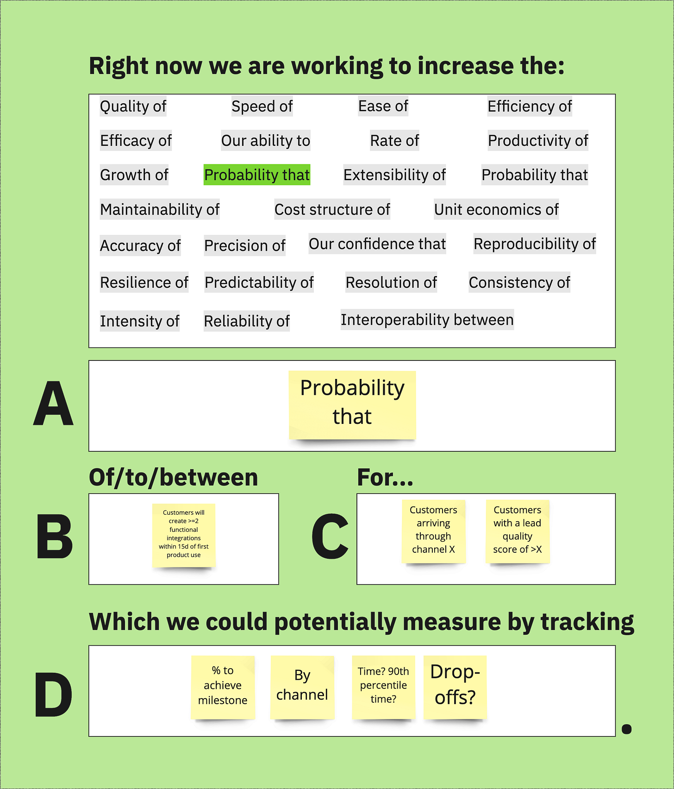
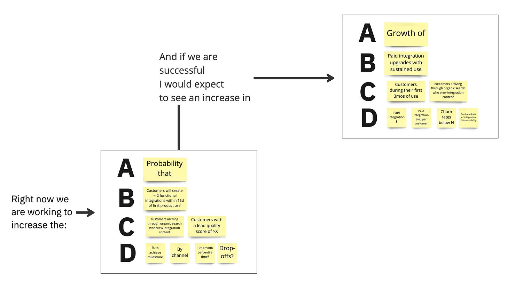

*Join me tomorrow/today (October 13th) for [a chat about drivers, constraints, and floats](https://info.amplitude.com/2022-10-13-Make-Bets-Count-John-Cutler-Registration). I’ll be talking about this activity (among other things) to help teams get specific about drivers. If you can’t make it, sign up and I’ll send you a recording. [Here’s a sneak peak of Miro board](https://miro.com/app/board/uXjVPSwP-Po=/?share_link_id=492272172611).*

---

How do you help teams focus on WHAT they are measuring instead of fixating on HOW they will measure it? Here’s a decent activity that helps teams put it all together.

The prompt:

### Right now we are working to improve the **\_\_\_\_\_\_A\_\_\_\_\_\_\_\_** \_\_\_\_\_\_B\_\_\_\_\_\_\_\_ for \_\_\_\_\_\_C\_\_\_\_\_\_\_ which we could potentially measure by tracking \_\_\_\_\_D\_\_\_\_\_\_\_.

 ###

The template with an example looks like this:

Super basic. Note how there’s no room to say: “we’re building X”. That’s by design.

Here’s how it works.

A and B—Variable

----------

Together, A and B specify the variable:

For example:

>
>
> Right now, we are working to improve the **(A)** probability that **(B)** customers will create \>=2 functional integrations within 15d of the first product use.
>
>

For A, I ask people to pick from a selection of noun/preposition pairs. The pair is connected to a variable (B), and describes disposition of, state of, quality of, etc. The trick here is that I *force* people to get specific by giving them lots of options (25):

* Speed of

* Quality of

* Ease of

* Efficiency of

* Efficacy of

* Our ability to

* Rate of

* Productivity of

* Growth of

* Probability that

* Extensibility of

* Probability that

* Maintainability of

* Cost structure of

* Unit economics of

* Our confidence that

* Reproducibility of

* Accuracy of

* Precision of

* Resilience of

* Predictability of

* Resolution of

* Consistency of

* Interoperability between

* Reliability of

I’m sure I am missing some, but this is a good start.

C—For Who

----------

In an ideal world, we would describe the FOR WHO. This step isn’t required in all situations but is extremely valuable. 

For example:

>
>
> Right now, we are working to improve the **(A)** probability that **(B)** customers will create \>=2 functional integrations within 15d of the first product use for **(C)** customers arriving through organic search who view integration content.
>
>

D—Measurement

----------

Next, we brainstorm some potential ways to measure our impact on the variable.

For example:

>
>
> Right now, we are working to improve the **(A)** probability that **(B)** customers will create \>=2 functional integrations within 15d of the first product use for **(C)** customers arriving through organic search who view integration content. We could potentially measure this tracking: 
>
>
>
> * % that achieve the milestone
>   
>   
> * By channel
>   
>   
> * Look at drop-offs in the journey
>   
>   
> * Time, distribution of time
>   
>   
>
>

That’s about it for the basic version of the activity.

Once you get comfortable with the prompt, you can extend it to “walk the tree” from the leaves (your initiatives) to the roots. This is more advanced, but this visual should give you an idea of how this might work.

Let me know what you think!

*Join me tomorrow/today (October 13th) for [a chat about drivers, constraints, and floats](https://info.amplitude.com/2022-10-13-Make-Bets-Count-John-Cutler-Registration). I’ll be talking about this activity (among other things) to help teams get specific about drivers. If you can’t make it, sign up and I’ll send you a recording. [Here’s a sneak peak of Miro board](https://miro.com/app/board/uXjVPSwP-Po=/?share_link_id=492272172611).[ard](https://miro.com/app/board/uXjVPSwP-Po=/?share_link_id=492272172611).*