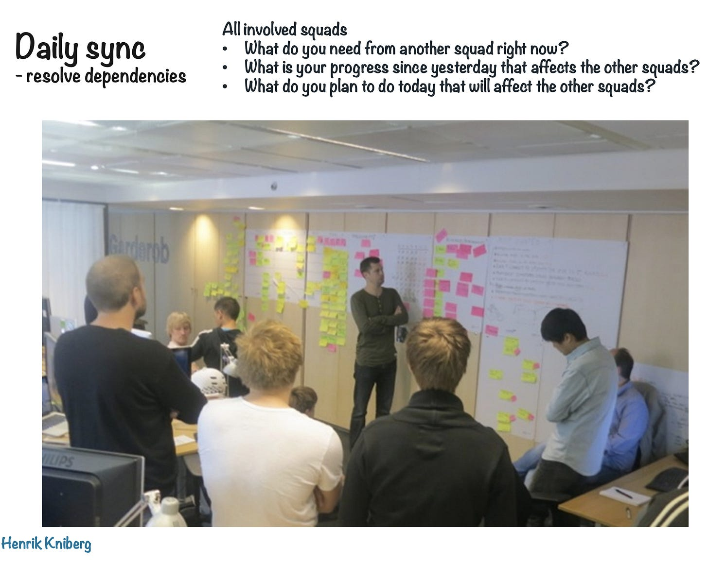
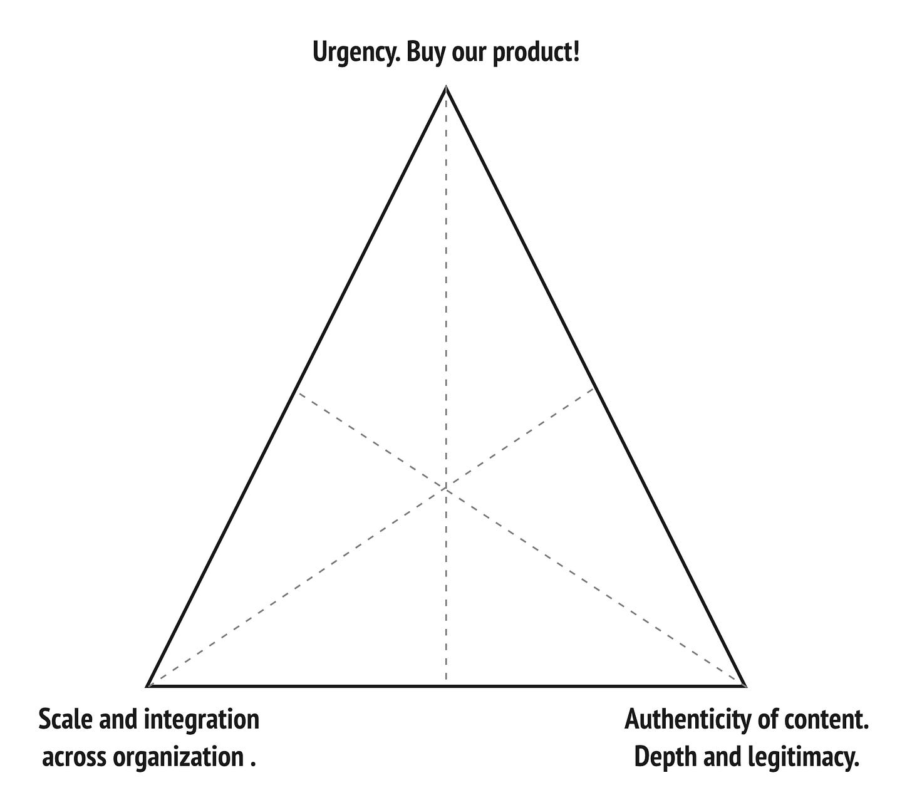
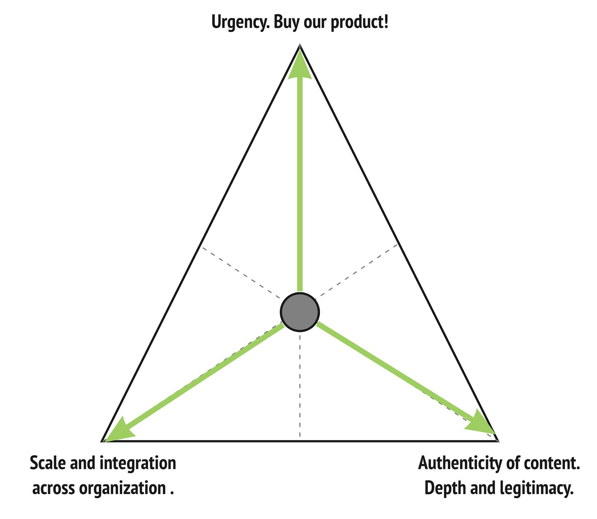
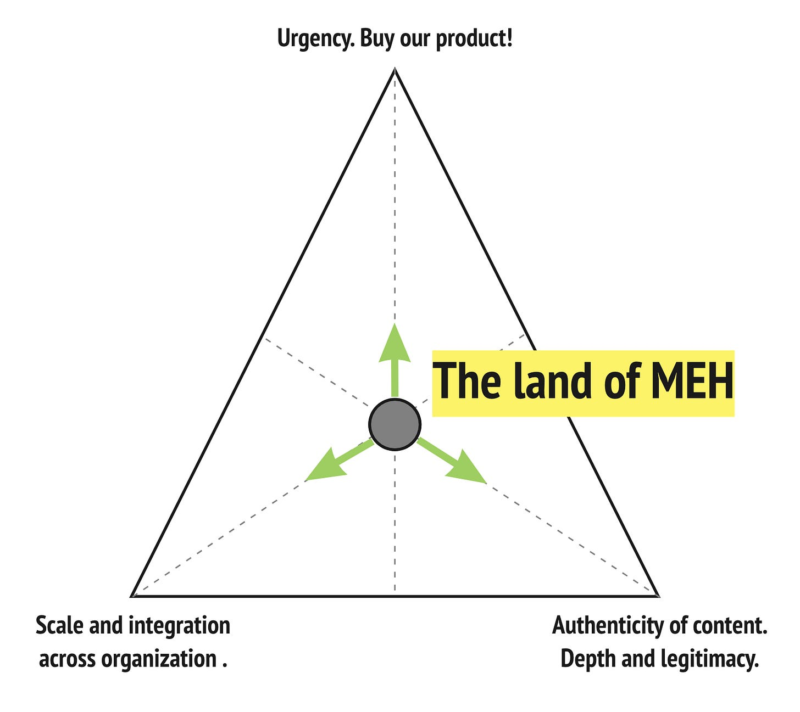
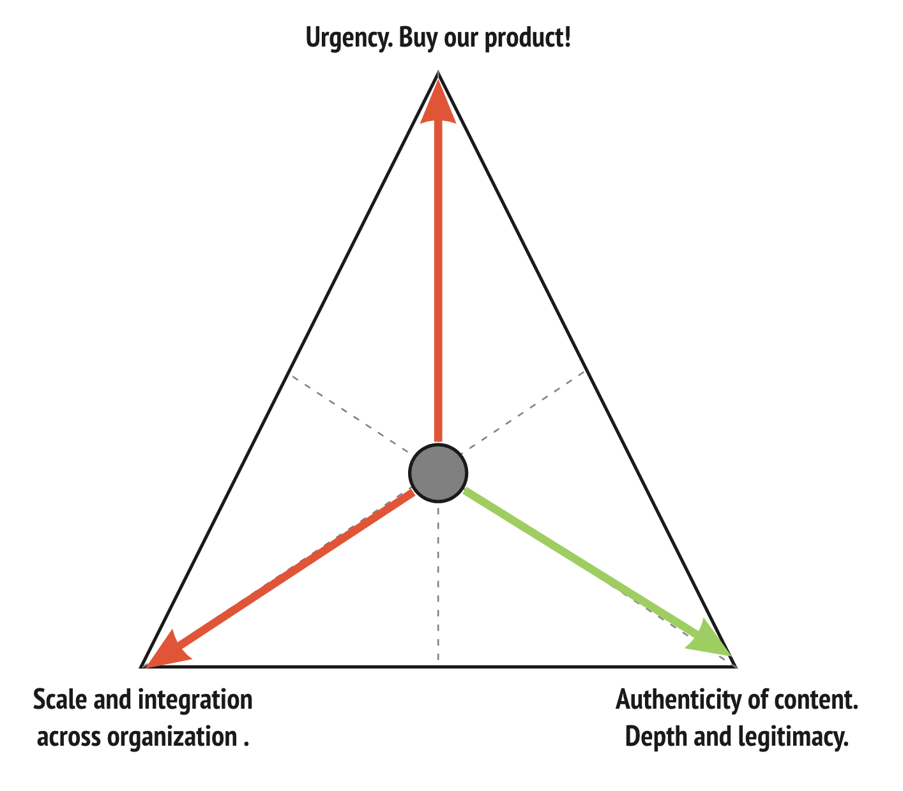
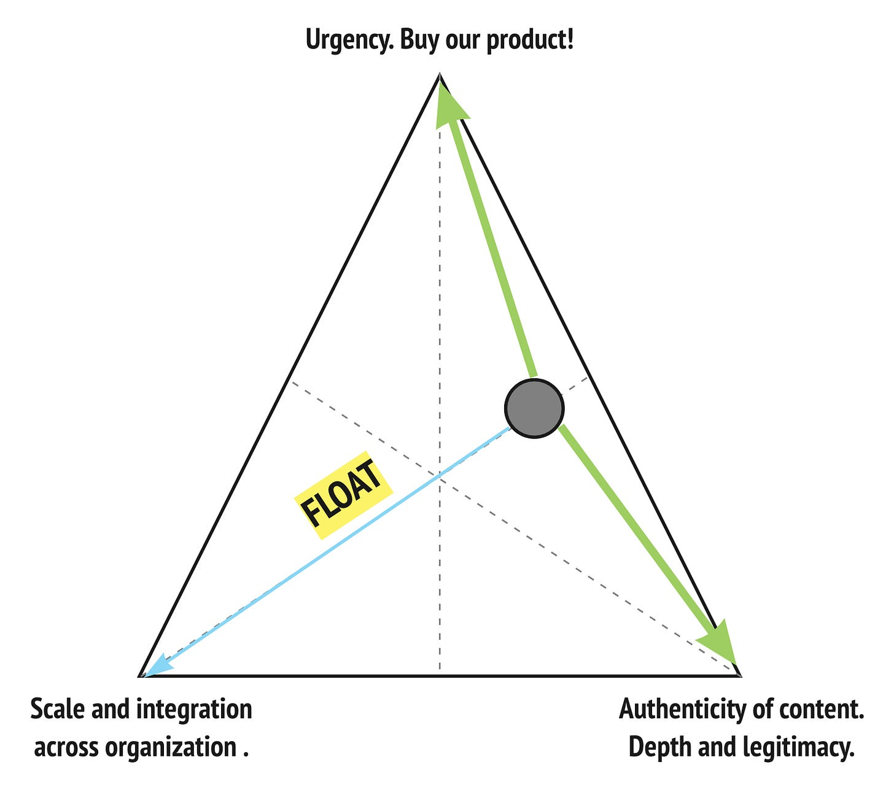
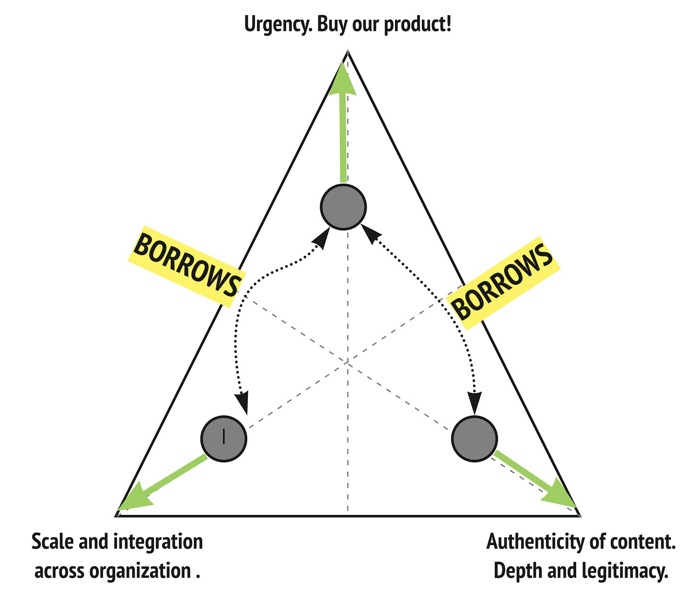
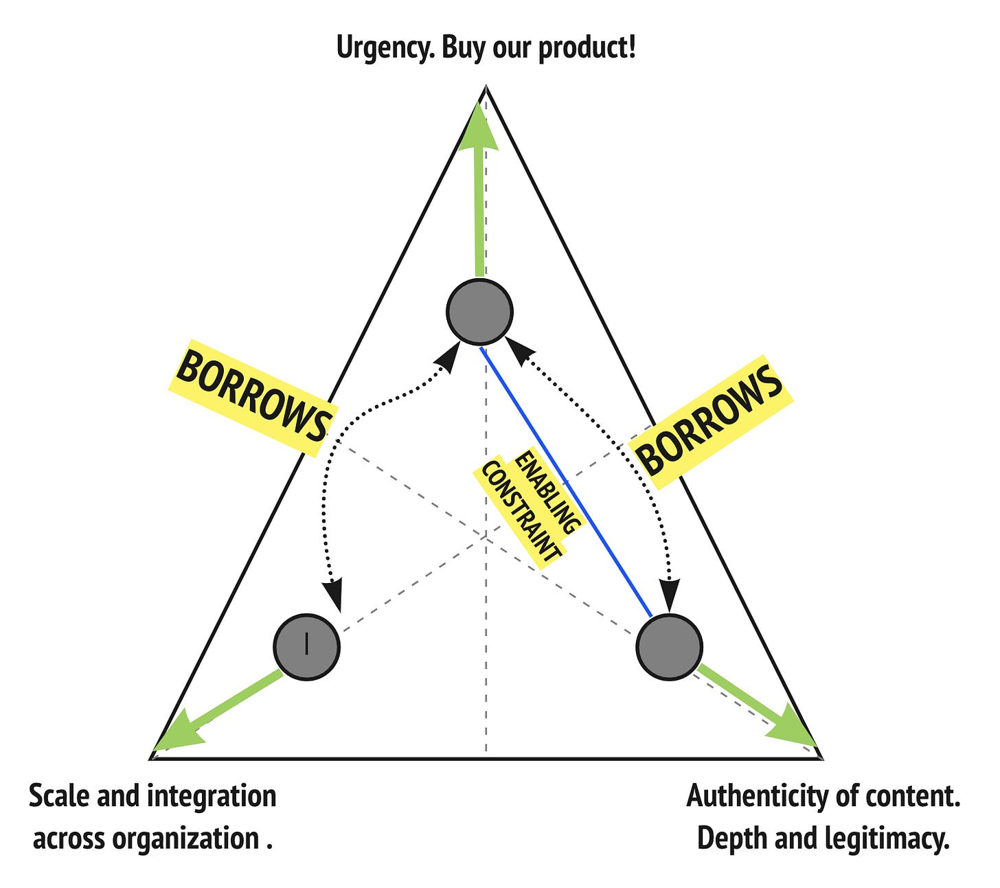
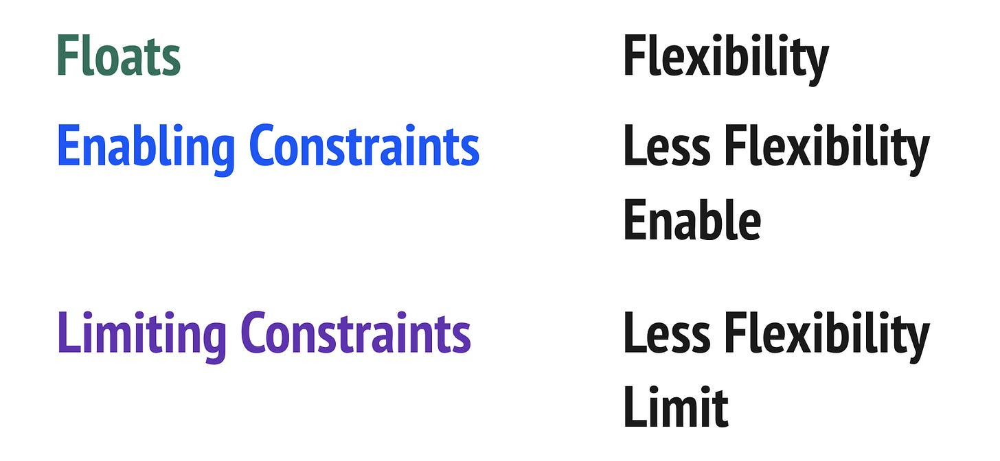

*Just kidding with the title. There are no secrets or magic potions. Doing the hard work below helps improve the probability of a better outcome though.*

First a quick overview of [Drivers, Constraints, and Floats](https://cutlefish.substack.com/p/tbm-1953-drivers-constraints-and).

* **Drivers** are our goal—what we hope to optimize for

* **Constraints** limit and constrain the effort

* **Floats** are areas of flexibility

I originally encountered the idea in Johanna Rothman’s book [Manage It! (2007)](https://www.amazon.com/dp/B075G2B3KY/ref=dp-kindle-redirect?_encoding=UTF8&btkr=1).

Recently I have started adding the idea of [Enabling Constraints](https://lizkeogh.com/2019/12/09/constraints-and-cynefin/) to the mix. Why? Teams often find too many floats to be paralyzing. Especially in conditions of uncertainty and complexity. They choose to create **Enabling Constraints** to help them make progress. Enabling Constraints enable, and Limiting Constraints limit.

This leaves us with:

As the number of **Drivers** and **Limiting Constraints** increase, the chance of failure increases. And as the number of **Floats** increases, so does the need to counterbalance the flexibility with **Enabling Constraints**. With great effort and coordination, highly constrained projects *can* succeed. But it is *very* difficult. To succeed, you’ll need “all hands on deck”, and to make this the only priority (e.g. daily stand-ups with everyone).

This image from Henrik Knibergs [Spotify – the unproject culture](https://blog.crisp.se/wp-content/uploads/2014/03/unproject.pdf) shows what a daily standup for a big project with lots of dependencies might look like:

Rothman wrote this in her book—and it has held 100% for me since 2008—that more than two drivers, and more than two constraints = failure. Or, to succeed under those conditions, it will cause all other things to take a backseat. Another symptom of too many drivers and too many constraints is success theater. Nothing really works, so the org pretends everything works.

Identifying **Drivers**, **Limiting Constraints,** **Floats**, and **Enabling Constraints** is a product super-skill. Increasing focus and reducing constraints is a sure-fire way to increase the probability of success. Trying to optimize for everything increases the chance of failure.

Let me explain this with a simple example from Amplitude, my day job. This is a universal challenge, and not unique to my company.

As a product evangelist, my goal is to grow awareness for the company, and to communicate what we do in an authentic, resonant, and legitimate way. Other parts of the company focus on selling our product, which involves creating a sense of urgency. And other parts of the company focus on scaling out our GTM teams and supplying them with straightforward frameworks to do their job well.

We can visualize those **Drivers** like this:

Looking at this diagram, it might be tempting for me to try to “thread the needle” and optimize for urgency, enablement, and authenticity. **Drivers: Urgency, Authenticity, and Scale/Enablement.**

Sounds reasonable, but I know that if I try to optimize for all three, that my “product” (as evangelist) will suffer. There’s a 90% chance I’ll fail.

Why? It is very hard to produce content that inspires urgency, is authentic, and also can serve our internal team. I’ve tried! It is VERY HARD. Ok, so that will not work.

What if we shift some of the Drivers to Limiting Constraints?

>
>
> John, I agree that we should focus on authentic content. Just make sure that Spenser (our CEO) can repackage it for the internal annual GTM kickoff event. And that we can include it in a campaign to increase urgency!
>
>

Well, that doesn’t help much. **Limiting Constraints** are limiting. I would do the job differently if I knew that it needed to be repackaged internally for a talk AND to create urgency. If my goal was to make Spenser’s kick-off talk a smashing success for an internal audience, I would do MANY things differently.

What would a better option be? I could focus on authentic content that also drives a sense of urgency for our product. That is a challenge, but a bit more doable. In that case I move enablement to float status.

What would further increase my chance of success? We know that ignoring urgency and enablement would likely end in long-term failure. So I could create an agreement with another team at Amplitude that I would focus solely on authenticity, and then they could focus on urgency. And yet another team could take our content, and package it for internal scale.

That adds a constraint that I must communicate my work to that other team, but that constraint is manageable. In fact, I might even call it an Enabling Constraint. By forcing myself to do that, I enable other teams and reduce my chance of failure in the long term.

I could also force myself to co-present or co-facilitate with someone from our enablement team. By integrating my work, I reduce the risk that it falls completely flat.

**The difference between floats and enabling constraints is subtle, but it boils down to one adding flexibility, and the other being intentional narrowing. Limiting vs. Enabling is less subtle: one enables, one limits.**

The biggest mistake I see product teams make is trying to play “3 dimensional chess” with initiatives. Once you see it, you can’t unsee it. They slip into trying to hyper-optimize for so many factors without adding areas of flexibility and artfully using enabling constraints.

So, to increase your chance of success:

* Reduce the number of Drivers

* Reduce the number of Limiting Constraints

* Detail your areas of flexibility (Floats)

* Artfully use Enabling Constraints to make progress