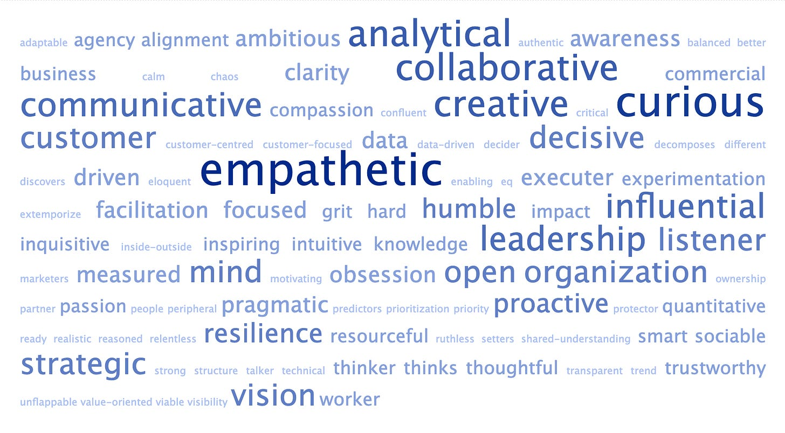

A little Twitter experiment on the words we use to describe product management. Feel free to [add some](https://twitter.com/johncutlefish/status/1614409880793935873?s=20&t=YWXYthroxJbdm3iSi7qhVA)!

In this break between gigs (I'm joining Toast in a week, more on the shift [here](https://www.linkedin.com/feed/update/urn:li:activity:7018297549342064641?updateEntityUrn=urn%3Ali%3Afs_feedUpdate%3A%28V2%2Curn%3Ali%3Aactivity%3A7018297549342064641%29)), I have thought a great deal about how product management is taught and how we describe "great" product management.

This post is, on the surface, about words.

But really, it is about context and shared understanding.

My central thesis is as follows:

1. Like any discipline, product management has trouble talking about abstract ideas.

2. Our definitions of good product management (and product managers) are incomplete without cultural context. No matter how hard we try to define more abstract ideas, they will only be complete with context.

3. The net effect of #1 and #2 is accidental gatekeeping and challenges with diversity.

Sense, Agency, and Hustle

----------

I asked a friend to list traits of great product managers, and they rattled off some common ones: customer empathy, high agency, and hustle. 

The challenge with ideas like "customer empathy", "high agency", and "hustle" is that they can be hard to decipher. Are we talking about:

1. One or more **skills** improvable through experience, research, and practice? Are these skills more discrete, concrete, and quantifiable (often called "hard skills"), or something less easy to define and pin down but no less important?

2. A set of inherent personality **traits** or characteristics?

3. A **capability** or **competency**—a combination of skills, knowledge, traits, environment, and attributes? 

4. A **style**—the way someone goes about their work? A cultural bias of the organization?

Phrases like *product sense* and *product mindset* are equally slippery for this reason. Are these placeholders and shorthand for something else? Outs or inputs? Capabilities or skills? Can they be learned? Through years of experience and trial and error, a 6hr certification course, or something in between?

Countless posts, and brilliant people, have tried to define product sense (e.g., [here](https://www.intercom.com/blog/product-judgment/), [here](https://austinyang.co/what-product-sense-is-and-isnt/), [here](https://www.lennysnewsletter.com/p/product-sense), and [here](https://blog.tryexponent.com/improve-your-product-sense/)). But I have to admit I'm even more confused. They include:

>
>
> (1) accurately predict what your customers need, want and value, and (2) design and ship the right solution for them
>
>
>
> His or her ability to do the following things when limited information is given: 1) Map out key problems with reasonable hypotheses, 2) Design high-level solutions with sound rationales, 3) Understand the potential pros and cons of each solution, 4) Know what questions to ask next.
>
>
>
> Product sense is the skill of consistently being able to craft products (or make changes to existing products) that have the intended impact on their users. Product sense relies on (1) empathy to discover meaningful user needs and (2) creativity to come up with solutions that effectively address those needs.
>
>
>
> The ability to make correct decisions even when faced with considerable ambiguity. This should be at multiple levels: at a "what products should we build" level, but also at a fairly granular level with regards to user interactions and interfaces, and everything in between.
>
>

I'm seeing a collection of knowledge, skills, traits, tactics, behaviors, capabilities, and competencies—but no real consensus. The high-level theme *seems* to be decision-making under conditions of uncertainty. There also appears to be an ambivalence to (and overlap with) various core design competencies, though there might be some debate there.

It, whatever it is, seems essential, though, and it makes sense why product people would want to point this out. There's perceived value in defining it (even if that results in competing definitions).

Disciplines—especially collaborative disciplines—tend to struggle with "soft" and more abstract skills. They can be a source of professional identity and pride—an effort to point out things that are less easy to define but critical for success. Or they can be a form of implicit or explicit gatekeeping—you either have "it" or you don't, and no, I can't explain "it"; you have to work a decade to understand "it". Or both.

Is product sense a necessary label? Or accidental gatekeeping?

I’m not sure…

Either way, the whole thing is impenetrable to outsiders.

Words and Context

----------

It can also be tough to untangle intent from surrounding worldviews, belief systems, biases, and "culture". Take a phrase like "directness". What's not to like about directness? Well, imagine if you work in a company that translates directness to mean being aggressively outspoken and unconcerned with tact or "being kind". You value effective communication as much as the next person but don't appreciate tactless directness. You'll have trouble thriving in that environment.

Consider the words people often use to describe product managers:

*Ownership, high agency, strong leadership, visionary, drive, autonomous, full responsibility, skin in the game, ruthless, charismatic, don't complain, always find a way, high agency, uncompromising, resourceful, obsessive customer focus, independent, opinionated, "founders"*

None are inherently good or bad (many sound appealing and positive). The challenge is that these descriptors can all be inadvertently (or consciously) imbued with cultural bias. 

For example*, ownership* is perceived very differently in a communitarian company compared to a strongly individualistic and competitive company. A company that suggests people "don't complain" might be highly pragmatic and resourceful, OR it might be an incredibly psychologically unsafe, paternalistic, and oppressive place. *High agency* might involve trampling over people OR up-leveling those around you with care, concern, and optimistic pragmatism.

With that in mind, consider a couple—admittedly out of context—phrases from[ an Intercom product management career ladder](https://blog.intercomassets.com/blog/wp-content/uploads/2019/05/Intercom-PM-job-ladder-Logo.pdf):

* No excuses.

* Accountable and positive in all conditions.

* Doesn't apportion blame to others.

* Decisive and assertive

* Is not consensus-driven. Strong opinions (mostly) weakly held

* Doesn't procrastinate or over-analyze

* Doggedly drives others to make decisions quickly too

"Is not consensus-driven" tells us *a bit* about the culture there, but the rest of the stuff requires much more context to make sense of (say, if you were considering a job there). Who knows? This is no knock on Intercom—this leveling doc does a better job than most when it comes to giving you a sense of their expectations.

My context = The Context.

----------

To make things more complicated, people generally struggle with untangling their belief systems and biases from their description of a job well done. 

Person A doesn't think, "oh, I have a preference for a more team-oriented view of ownership," and Person B doesn't think, "I have a preference for a more individualistic view of ownership." They think, "*ownership* because ownership is ownership, right?"

No CEOs say: 

>
>
> Our culture is hardcore libertarian and objectivist, with a strong bias for traditional masculine traits and an unwavering belief in meritocracy. Success is a function of having the absolute most competent people on board and their ability to withstand chaos.
>
>

...even if that description is accurate! I don't even think it is because they are afraid to say that out loud. Instead, it just feels "right and normal" to them. "That's the only way to do things right!?"

So not only does context (worldviews, belief systems, etc.) matter, but so does our level of awareness about our context and ourselves.

Impact

----------

Combining these factors can lead to situations like the following these four real-life situations:

*Glue work in engineering was under-valued because we tied comp to masculine/rockstar traits which led to toxic teams*.

*There was a huge bias for highly assertive, speed-biased leaders. It was a real struggle for the more thoughtful and empathetic types. It led to a very specific interpretation of the career ladder in performance reviews, for example. On paper, the career ladder was great. In practice, it definitely suffered from "progression for people like me" kind of thinking. Very difficult to challenge or unpack.*

*I have no idea whether I can actually become a great product manager. I read advice, and I can't tell whether that is the only way, or just the author's way. The way they paint the role is antithetical to the type of product manager I believe I want to be.*

*I'm just worn down by the constant need to "spar", debate, dominate every discussion, and outdo each other. It is a slugfest. There has to be a better way.*

What is going on here? Lack of coherence, words not matching actions, and implicit, unaddressed biases. We may be missing out on some very qualified product managers.

Observations

----------

I'm probably losing some people at this point, but please try to stick with me.

My key observation is as follows:

1. The cultural milieu in Silicon Valley (more specifically, two dozen or so companies and the various startups they have spawned) strongly influences how people describe product management and product managers. The outsized influence of the region, in turn, strongly influences how product management is defined worldwide. **Importantly, this is not a value judgment of that perspective—instead, I'm pointing out how prevalent and influential it is.**

2. In *general*, the SV description is more individualistic, driving, opinionated, "results focused", direct, uncompromising, confident, and grounded in beliefs about meritocracy, stoicism, "strong leaders", etc. While these things work in context, they are not the only way to approach product.

3. We must be aware of how our belief systems impact our work descriptions. It can be hard to decouple *our way* from a way-agnostic outcome. Often, *our way* equals the *only way.*

4. The language we use to describe good product management can confuse newcomers. It can take a lot of work to unpack.

5. Labeling soft skills can be both 1) an effort to label essential aspects of a discipline that frequently get overlooked and diminished and 2) an unintentional form of gatekeeping.

So what? Why does this matter?

**First,** to make product management an accessible career option and improve diversity in the profession, it is important to be conscientious about the words we use to describe product effectiveness and be self-aware of our cultural/personal biases.

I’ve had to address this. Yes, n=1 I self-identify with a more communitarian, facilitatory, team-oriented version of product management, but I know this is not the only way, and is certainly not feasible everywhere.

**Second**, define the what (and why), not the how, whenever possible. Are we talking about skills, capabilities, or competencies? What are they? Or are we talking about personality traits? If so, is Trait X the only way to achieve the outcome? Are these traits or beliefs?

**Third**, this post isn't meant to diminish differences in company cultures. Two coherent cultures can achieve similar results in very different ways, and "culture fit" is a real (but tenuous and fraught) concept. But we can't describe culture with shorthand jargon, and we must use stories to decode the jargon. Leaders also need to consider their worldviews and beliefs and ask whether the culture they have in *their* mind is the culture they want.

I hope this was an interesting foray into words and context. I will be working on all three of these points in 2023—both in my “day job” and in my external writing.