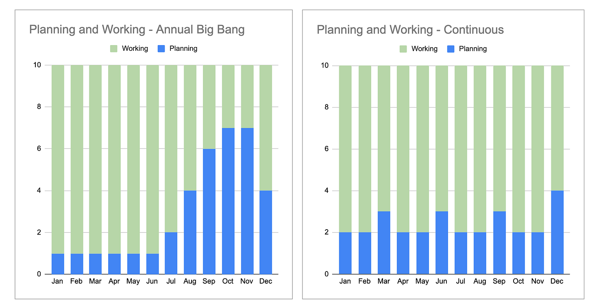

*I had a lot of fun doing [this podcast with Melissa Perri](https://produxlabs.com/product-thinking-blog/episode-40-john-cutler). We chat about patterns across product teams, as well as how to make sure you’re moving forward in your career. Check it out.*

Tis the season for annual planning.

I had a realization recently.

From a theoretical standpoint, a team can avoid the overhead and waste of annual planning. It isn’t difficult. How? To quote Jez Humble, “If it hurts, do it more frequently, and bring the pain forward.” You must plan, align, and calibrate more frequently. Teams that do this 1) limit planning inventory, 2) resist premature convergence, 3) research at the right time, 4) reduce sunk-cost bias, and 5) stay more strategically aligned.

That’s the theory. It is possible. But “reality” gets in the way.

**Annual planning is a classic wicked problem.** The harder it is, the less people want to do it! When outcomes suffer there’s an increased need/desire to “get it right”. The more people get caught in the cycle, the less available they are (and interested they are) for strategy outside the cycle. The busier people are, the deeper they get into the weeds. The more things diverge, the more effort required to converge. When people converge at the same time, there's more motivation to wait until that time. The more people feel pressured for a big plan, the more likely that plan will fail.

Here’s just a quick list of some of the variables at play. These are all answers to the question “why can’t we do more continuous planning?” Note when reading these how they play into each other.

---

So why can’t we do more continuous planning? Why is annual planning the best/worst option?

----------

Note how these responses feed into each other.

**Too much time in execution mode.**

>
>
> I’ve been heads down in execution mode for a long time now. I haven’t had time to do research, strategize, refine our vision, and ponder the future.
>
>

**Difficult to get feedback from peers.**

>
>
> Other people are so busy! I’d love to get their feedback, but they are heads down as well. It might be easier to address this when we’re all pulling together our strategies.
>
>

**Long feedback loops / output centricity.**

>
>
> We focused on output for much of the year. Shipping lots of new things. It didn’t sink in that the work wasn’t hitting the mark until some time had passed.
>
>

**Big promises. Big batches.**

>
>
> We are still working through the strategy for LAST year. Because I only had one shot, I pitched lots of things. I haven’t had a need to refresh the strategy.
>
>

**Perspectives on strategy have diverged.**

>
>
> There are lots of different perspectives on our strategy beyond the immediate horizon. We haven’t really had time to converge. Maybe by converging all together we can get there.
>
>

**Difficult to get feedback from senior leaders. Limited availability.**

>
>
> I have one shot a year to get in front of the CEO, so I have to make it count.
>
>

**Timing of other strategy cycles (e.g. annual corporate strategy).**

>
>
> I’m hesitant to lock a new strategy down before I get the top down strategy! And that only happens once a year. It is wait and see, until we get their direction
>
>

**Process is painful. Level of scrutiny is not desirable.**

>
>
> I hate this level of scrutiny. It is like a shot or going to the dentist. I want to do it once, get it over with, and then stay away from the dentist for as long as possible.
>
>

**Annual budgeting cycle for new investments.**

>
>
> For big hiring asks -- like to spin up a new team to tackle a new challenge -- we’re pretty constrained to the annual budget. We have some leeway quarter to quarter but not much. The executive team presents the big asks to the board, and that tends to get bundled up with other big asks.
>
>

**Synchronizing with company events.**

>
>
> The big sales and marketing kickoffs are at the start of the year. They want to know what we are doing, so they can plan!"
>
>

**Planning for shared teams / specialist teams.**

>
>
> Our shared teams are overloaded. Everyone needs their help. They need to understand all the asks for the year, so that they can plan on whether to expand and hire.
>
>

---

This all begs the question…. How could we slowly chip away at the problems that “hold” a less-optimal ritual in place. What might we try?

As an interesting thought experiment, consider what taking two full weeks off from “business as usual” each quarter might offer a team. Impossible? Inefficient?

I’m not so sure.

I’d argue that 8 weeks spread across the year would EASILY out-perform a big final quarter push of planning annually.