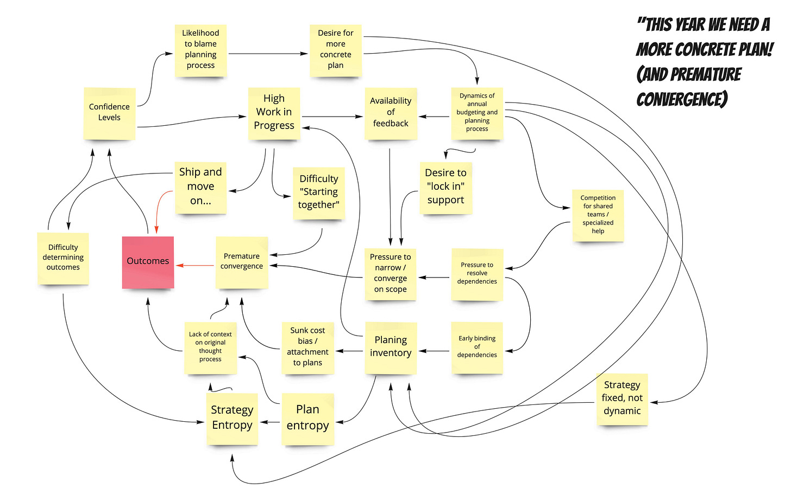

*Before we jump in…some potentially interesting bits of content:*

* *A [4,000 word post-in-progress on Bets, Success metrics, and Roadmapping](https://docs.google.com/document/d/e/2PACX-1vQ0vERe4LLpS8s2jzJKDPixrT-Q2Gr6AJZR4MRXFFCQUXSGuCptR9YDYjPTA2Ct0tAUBwCBmYsqUH_M/pub)*

* *An [on-demand video on North Star Framework and Inputs/Flywheels](https://info.amplitude.com/north-star-inputs-flywheels) (\~1hr)*

* *An [on-demand video on North Star Framework and OKRs](https://info.amplitude.com/growth-series-north-star-202108) (\~1hr)*

*The videos involve providing your email, but on the bright side, my day-job supports me doing this fun and interesting work…even when it is only loosely connected to analytics.*

---

What is premature convergence?

----------

Premature convergence is when a team decides on a direction and/or tactic *too early*. The team limits optionality before the "optimal" moment. Converging too quickly ends up negatively impacting outcomes.

I love to use non-work examples.

I have a friend who plans out every second of their vacation — not just things that require reservations. There’s no optionality. Whenever I catch up with him and his wife, I hear the same story (from his wife) about how rushed everything was, how there was no serendipity, and how they wish they could “go back again, but this time not in tourist mode.” For whatever reason, he falls into this trap over and over.

Why does it happen in product?

Lots of possible reasons...some obvious, and some not so obvious:

* To get approval and funding for an initiative, you must describe in detail what you are planning to build.

* A pitch culture. People are rewarded for pitching their ideas, and once they "win" there's no turning back. Sunk cost bias kicks in

* Dependencies! There's a shared team of specialists in high demand. To secure their help, it is important to converge on a detailed specification in advance

* For other teams to converge on *their* plans, it is necessary for you to converge on *your* plans.

* Incentives around "exact estimates" (e.g. engineers are rewarded for “hitting their estimates”). The team is hesitant to embark on something less concrete

* Uncertainty is uncomfortable. Deciding on a direction in advance can put people at ease.

* The team is overconfident. They don't consider that their initial ideas may not be the best ideas. Or the team lacks experience. They lack the "spidey sense" for when they are narrowing options too quickly.

* People are too busy to do messier divergent work

* The team is under a lot of pressure to get started right away. Their last effort took a while. There's little appetite for questions and divergence. Delays in delivery of current work, makes everyone nervous and pushes requests for a "solid plan"

* To keep teams "topped up with work", a smaller, less diverse group of people locks down plans and hands those plans off for "delivery"

* Incentives! "We get credit for shipping stuff, not for taking our time to make sure we are shipping the right stuff!"

* GREAT IDEAS! An inspiring idea gets the team excited. They want to jump in right away. It can be hard to say "ok, that was pretty good, but let's step back and consider other options."

I tried to collect some of these ideas in this graphic.

Something I explore in this diagram is how impacted outcomes can actually be a catalyst for premature convergence! Which negatively impacts outcomes! It is a wicked loop.

To put it mildly, there are lots of reasons why we slip into premature convergence. Some are more related to organizations, and how they are structure and work. Some are more personal (we do the same things in our personal lives). To make things even harder, it can be difficult to know you are falling into the trap in the moment! Some situations are flat-out obvious. But other situations are very nuanced, and only obvious in retrospect.

"But wait, isn't it better than analysis paralysis? Isn't premature convergence a healthy kind of bias for action?"

There's an interesting relationship between premature convergence and a "bias for action". We don't want to spin our wheels endlessly, so a bias for action is a reasonable instinct. But a bias for action is a bit different than premature convergence. We may have a bias to act, experiment, and test our assumptions. But that does not mean we are *limiting* our options. In fact, by acting quickly and decisively, we may be leaving room to pursue MORE options and learn faster. A team with a bias for action might act, but then throw away what they built and go back to the drawing board.

A bias for action also doesn't mean we lock down plans way in advance (that would be a bias to plan in advance, lol).

So what can you do about this?

1. If the "cost" of premature convergence is not obvious—through regular review of past decisions—then to most people there's no downside! So start doing regular decision reviews to calibrate.

2. Carve out time and space to start efforts together. One of the big culprits is the urge to keep people busy typing/designing. Clearing the decks is a great enabling constraint.

3. Make a habit of listing multiple options for everything. Say you find your team is slipping into settling on an idea too early. Brainstorm the "parent" opportunity for which that would be a good idea, and then brainstorm alternate ideas.

4. If the need to coordinate dependencies is driving your decisions to "lock down" efforts, be laser focused on whether the certainty is worth the impacted outcomes. Keeping these shared teams highly utilized is an obsession many organizations need to break.

5. Watch out for ideas that "take hold" and generate their own inertia. We've all seen these. Everyone talks about them like they are a done deal, but no one has actually expressed Why.

6. Time-box discovery! If the team is afraid that that they'll spin their wheels forever, put an expiration date on that divergence.

Why does premature convergence happen at your company?

What are the signs and signals?

What do you do about it?