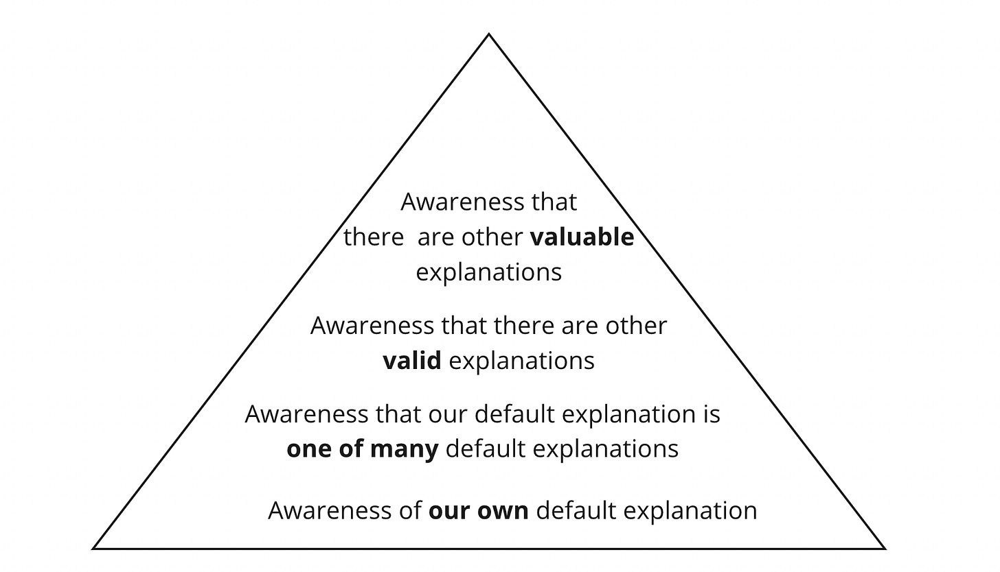

How can you work more effectively with diverse individuals and teams as a product leader? We all tend to have our "go-to" explanations when things go wrong at work.  

A couple of examples:

>
>
> You can usually boil things down to leadership issues. That and grit and perseverance.  
>   
> Remember what Demming said. The system causes 94% of performance variations, not the workers!  
>   
> Most people don't take things seriously enough. They are not detail-oriented.  
>   
> If we could just clarify roles and responsibilities and have a single clear owner, things would be much easier.  
>   
> A players hire A players; B players hire C. players, and C players hire D players!
>
>

I am by no means an expert in worldviews, belief systems, etc. But our brains *seem* to have default explanations at the ready. And those explanations do an essential job. 

Here is a poignant example from a recent chat:

>
>
> I'm aware of the impact of privilege and luck. I am aware that there are limits to the idea of a meritocracy. But as an underrepresented person in tech and a recent immigrant to the United States, I NEED to believe that something is within my control—that if you try hard enough, progress is possible despite the situation.
>
>

There is a lot going on in that quote: self-awareness, acknowledging the “job” of the default response, and giving credibility to alternate explanations. Which brings us to the next layer…

In addition to defaults, people have 

* Varying degrees of awareness of those defaults

* Varying degrees of conviction that their defaults are *universal*

* Varying degrees of conviction that their defaults are *optimal*

Isn't this just self-awareness? No. Some people are *very* self-aware—they have plumbed the depths of their being and motivations—yet also believe their defaults apply to everyone ("everyone is wired like I am wired"). 

**High self-awareness. High conviction their beliefs are universal**.

For example:

>
>
> Well, you know, people stay at a company because of their manager and their salary. That's it. That's why I stay at companies. That's why everyone stays at companies.
>
>

Meanwhile, other people accept that their defaults are NOT universal but believe that their defaults ARE better ("everyone is wired differently, but my defaults are the best if you want to succeed"). 

**High self-awareness. Low conviction their beliefs are universal. High conviction their beliefs are optimal.**

For example:

>
>
> Demanding excellence from yourself and others can also be extremely difficult. Not everyone cares like you care. Excellence is not a priority for them. So you must remember that the people you work with may not be as driven as you. You have to meet them at their level.
>
>

No doubt, this person is self-aware. They sense their own need for "excellence" and can probably trace it back to something in their upbringing and environment. They know they are demanding. They sense that they can't expect other people to respond the way they respond. They show a willingness to adapt their style. But the subtext here is that excellence is only possible when people care as they care. When *excellence-in-the-form-they-understand* is not present, it means excellence is not a priority.

An alternate take here might look something like:

>
>
> I have a strong need to see excellence as an output of discipline and individual accountability. I realize, however, that others seek excellence in other ways including collaboration, and care for the overall ‘system’. I know I’m triggered when I don’t recognize their drive and dedication. I’m making an effort to challenge my default explanation, but also honor my vision for the team.
>
>

See the difference? Why is this important?

Yes, some leaders are very successful despite 1) lacking self-awareness about their defaults, 2) believing whatever defaults they have are universal (or not), and 3) believing their defaults represent the absolute best/right way. This is especially true in mono-cultures, where believing X or Y is a prerequisite for employment.

But ultimately, all of us have an opportunity to be better at our jobs by:

1. Becoming aware of our defaults and where they come from

2. Being curious about other people's defaults

3. Challenging our defaults. Looking for alternate, plausible explanations

4. Challenging our defaults as the only way to achieve specific results

You can imagine this as a pyramid of sorts:

What is your default? Do you see it as universal? As universally right?

What is your next big step along your journey of self-awareness?