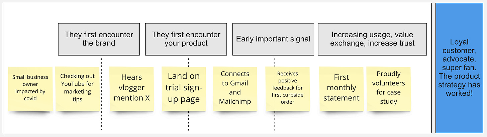
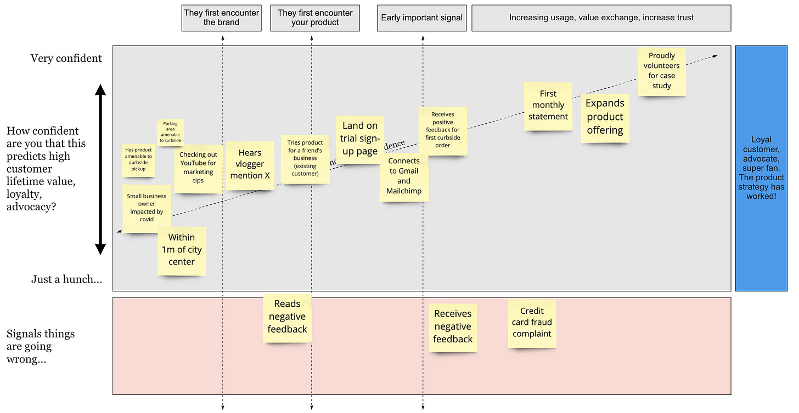
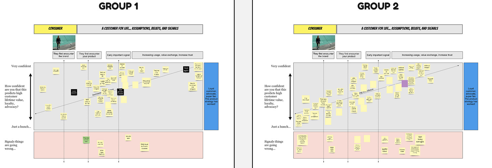

In this brief post I am going to share an activity that helps surface assumptions about the signals that predict customer loyalty. I’ve found it to be an interesting twist on a very common artifact (a customer journey map).

The activity involves (surprise, surprise) [placing sticky notes on a chart/diagram](https://miro.com/app/board/o9J_lcwWRYw=/).

The x-axis in the diagram represents the customer journey. We show three important milestones:

* Customer first encounters the brand

* Customer first encounters your product

* An early important signal

We use these milestones as a guide when placing *observable signals and attributes*. Here is a one dimensional version of the canvas:

We begin the journey *before* the customer/user first encounters the brand. We end the journey with a loyal customer advocate. In the real world there is no "end", but we let that slide for this activity.

Simple enough. Nothing special here.

Now we get into the fun part. We layer in the y-axis. The y-axis shows confidence that the signal/attribute predicts high customer lifetime value — the lofty goal in blue on the right. As we expect (and hope), our confidence level increases as we go from left to right. I use a diagonal line to remind people of this effect.

Here’s the 1d example about with the new axis:

We use the red section (the negative y-value section) to put signals that things are going wrong. With larger groups, I split the team into sub-teams. You can see here that teams seem to enjoy the exercise and it elicits a good # of signals.

So what does this do for us? How does it help us?

This activity helps us figure out what to measure. Sure, these signals (and their relationship to advocacy and high LTV) are assumptions. But that’s a decent place to start. Teams typically have a difficult time talking about uncertainty. We’re expected to have all the answers. But making our intuitions visible is at least something we can test and refine.

In an ideal world you measure these signals, analyze relationships, look at correlations, and dig into causation. Over time you increase confidence as you learn. In just thirty minutes, you can surface most of the important events you need to instrument in your product — even if you don’t know all of your questions in advance.

If you give this a try with your team, please reach out to let me know how it went.