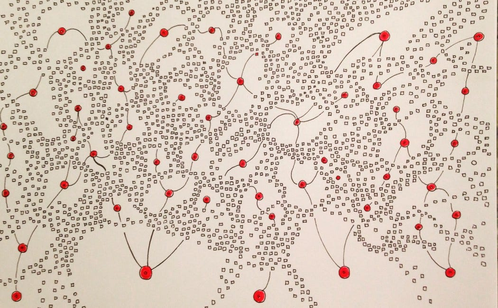

As some of you know, I work at a company called [Amplitude](https://amplitude.com/). Amplitude (the product) is a digital optimization system. That doesn't mean anything to anyone yet. Translation: We help teams figure out where to place their bets. And then help them figure out the impact of those bets on things that matter (e.g. customer loyalty). It is scalable instrumentation, a specialized database, analytics, experimentation, and recommendations. Rolled into one.

My job puts me in touch with lots of teams. I'm closing in \~300 for 2021. With that context, I wanted to share an observation about "using data". Our product helps, but customers who don't pay attention to this run into issues as well.

**It has to be easy.**

==========

If it isn't easy, people will move on. The drumbeat of "business as usual" is that powerful. We all say impact is important. But hell hath no fury like the feature factory (even at the companies that brag about being "data informed" in their blogposts).

It can't take days. It can't involve bothering someone. It can't mean waiting for another team to instrument your feature or transform your data. Or a [Tool] expert to bless your efforts.

It can't rely on a centralized gate or review board. Collaboration has to be easy. Getting feedback from skilled analysts has to be easy. Exploring new questions has to be easy. Finding the right events has to be easy. Instrumentation has to be easy. Type safety and testing needs to be easy. No clunky tracking spreadsheets. Consistent naming has to be easy. Running experiments has to be easy. Getting meaningful data has to be easy.

Easy, easy, easy.

From curiosity to insights to action with as little friction as possible.

[I did earlier this year with Shreyas Doshi](https://amplitude.com/blog/shreyas-doshi-product-lessons), and he noted that many dashboards go un-viewed:

>
>
> *We’ve spent all this effort creating this dashboard. Hardly anybody is looking at it.*
>
>

The data I've seen backs this up. He had to create personal hacks to keep eyes on the data:

>
>
> *One of the things that’s pinned is my main metrics dashboard. So it’s there. I don’t have to open a new tab, or type in any URL, it’s just there. Another thing I’ve noticed is people love email metrics. Why? Because it removes friction, right? It just shows up.*
>
>

A big misconception is that it is engineering time that makes it "hard". That is incorrect. Capturing everything sans context/properties to "avoid bugging developers" isn't the solution. Adding code to track events is trivial. What makes it hard is all the bloated rituals that surround the tracking of events. When you incorporate instrumentation as a normal part of how you work, it becomes second nature.

Someone explained recently that at their company, only the [Big Name Analytics Tool] "Expert" could plan out instrumentation. Noooo!

Another big misconception is that the team needs to agree on each and ever question beforehand. That's incorrect. Representative questions and a good instinct for the nouns, verbs, adjectives, and adverbs you're dealing with goes a long way. A small number of events unlocks the long-tail of insights.

All the stuff pales in comparison to the real blockers:

* Needing to know SQL

* Over-booked calendars

* No time set aside for discussing progress and pairing

* Reinventing the wheel for basic insights

* Dashboard entropy ("wait, is this still valid?")

* Distrusting the data. Lack of confidence

* Async collaboration is challenging

* Not using emails and notifications

* No onboarding (assisted or self-service)

* No documentation

* No representative work to build off of

* No rituals to revisit

* No time to actually THINK

So what can you do? To start:

Make things easier.

* Schedule a weekly collaboration session. Make that a habit

* Start including telemetry as a normal part of every story. Don’t worry too much about perfect questions. Strive for situational awareness

* Create reminders and notifications (emails, etc.)

* Whenever possible, integrate "the data" (e.g. weekly syncs, stand-ups, all-hands)

* Schedule some regular data-gardening sessions to keep things manageable

**It has to be easy.**

==========