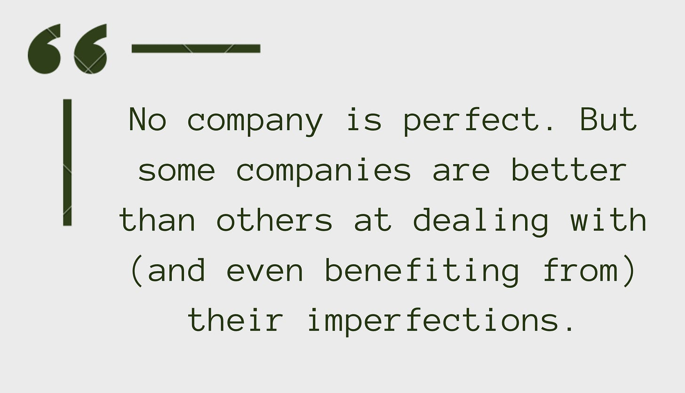

“Are all companies messed up?”

Let’s explore that question.

I have found the words "chronic" and "acute" to be helpful when thinking about the health of a company, and the relative messed-up-edness of companies. Like any words used to describe organisms or ecosystems, there are drawbacks (most notably taking the comparisons too far), but there is value here.

**Acute**

----------

Acute challenges are sudden, short-term issues that require immediate attention. They can be painful or disruptive, but we can resolve them quickly if we take the right steps. Acute challenges can also provide growth opportunities.

Examples:

* Sudden drop in sales

* Loss of key customer

* Unexpected competition

* Market fluctuation

* Global pandemic

* Loss of a key team member

Imagine a person coming home after work and telling a friend about acute issues.

>
>
> We have a couple of fires burning at the moment. Things are intense and even a little chaotic, but I can already see a path forward. We might grow stronger because we learn something about ourselves and our market here. I can't say I'd want to experience this every day, but I have hope.
>
>

**Chronic**

----------

Chronic challenges are long-term issues that have developed over time and are difficult to address or fix. They are often deep-seated and require sustained effort to overcome.

* Difficulty innovating

* Low trust

* Environment unfriendly to experimentation

* Ineffective or rigid leadership

* Wicked loops of various sorts

* High turnover with a web of contributing factors

Imagine a person coming home to their partner and describing a chronic challenge. 

>
>
> It's like a tangled ball of yarn, with each strand representing a different aspect of the problem. No matter how hard I try to unravel it, I can't seem to get anywhere. It's a Rubik's Cube with a million colors and no instructions. It's overwhelming. I'm starting to feel like I'm in over my head.
>
>

**A Healthy Ecosystem**

----------

In a healthy ecosystem, there is a balance between chronic and acute issues. The ecosystem deals with acute issues, such as storms or droughts, without being overwhelmed. The ecosystem addresses chronic issues, such as disease or pests, before they do too much damage.

This creates a virtuous loop where addressing chronic issues makes it easier to deal with acute issues and vice versa. Over time, this can help the ecosystem become stronger and more resilient.

Importantly, those acute stressors can't be catastrophic; otherwise, there's a risk the ecosystem will collapse. The hormetic zone is a concept in biology that is relevant here. High-level, the hormetic zone is the "dose" level of a stressor that produces a positive adaptation. Outside that zone, there is either no benefit or collapse.

**Taking Care of Yourself**

----------

Why is this all important? First, on the personal level:

Dealing with chronic issues at work can leave you feeling frustrated, overwhelmed, and burnt out. It's a never-ending cycle of stress and pressure. Chronic issues erode your confidence and self-esteem, leaving you feeling defeated and powerless.

Before you know it, you've internalized the acute issues as your issues. Many people I chat with who are tangled in chronic challenges say something like:

>
>
> Well, I know it is messed up, but if I was better at my job—like [insert famous leader here like Satya Nadella] I would be able to make progress here.
>
>

And that is a dangerous line of thinking. To single out Nadella here for a moment, yes, Microsoft had some chronic challenges (and acute challenges), but it also had TONS of strengths. CEOs also have TONS of leverage—they have the formal power to move money around, fire "untouchable" executives, and kick off virtuous loops.

While leading through challenging conditions is a leadership skill, there are limits. Remember that! You need to take care of yourself.

**"All Companies are Messed Up!"**

----------

Next, on a company level:

Given the macroeconomic environment, slipping into a "survival mode" makes sense. An alternative is to see this as an opportunity to address the chronic issues that will make it hard to survive while in survival mode. You can ultimately come out of this much stronger if you "pay down" some chronic issues.

That may seem like the last thing on your mind, but I would argue that true productivity (better outcomes and lower costs) requires addressing the chronic issues instead of the "paper cuts" and "sprained ankles". 

To close...

People often talk about ALL companies being "messed up" or "chaotic". That is not true. What IS true is that all companies face acute stressors AND some chronic issues. But the proportion varies significantly between organizations. The ability to address chronic issues (and acute issues) ALSO varies. 

**No company is perfect. But some companies are better than others at dealing with (and even benefiting from) their imperfections.**