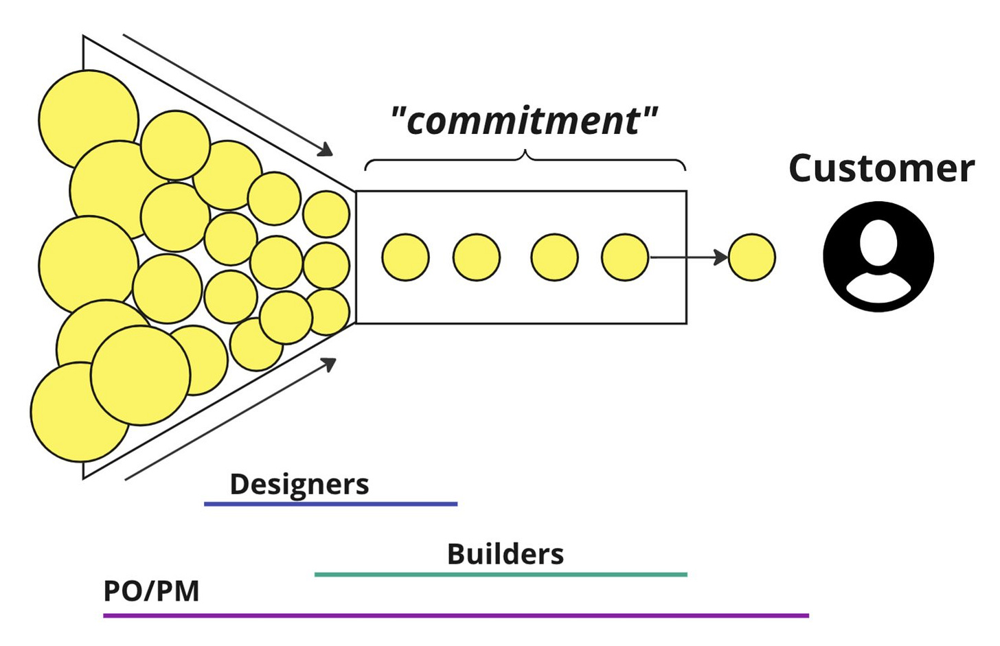

I was [a guest on Lenny’s Podcast](https://www.lennyspodcast.com/what-differentiates-the-highest-performing-product-teams-john-cutler-amplitude-the-beautiful-mess/) which was so much fun. Check out the episode!

This post will explore three popular models for product teams.

* Sprint, Story, and Backlog-Centric

* Team and Mission-Centric

* Engineer-Centric (with Rockstar PMs)

Sprint, Story, and Backlog-Centric

----------

***This model manifests in the following beliefs:***

* Designers *should* spend most of their time designing. Developers *should* spend most of their time building.

* Developers are a precious/scarce commodity and must only take on *well-vetted and validated* work.

* The product manager should insulate developers from the chaos upstream. That way, developers can focus.

* Developers are at their most valuable when they are writing code. Designers are most valuable when creating prototypes, mockups, etc. Product Managers prove their worth by saying No often and only agreeing to do the most valuable work.

* Unless the designer gets upstream—earlier in the assembly line—they will not have the time and space to do good work.

* Work flows one way. It gets "delivered" to customers.

* Developers set a sustainable pace. The PM applies "back pressure", and the team is responsible for "committing" to a reasonable amount of work each sprint. If they keep those commitments, they build trust, which then, in turn, keeps people off their backs.

* Developers ultimately aren't responsible for the impact of the work they undertake. Their responsibility is to "build the right thing right".

* Designers are responsible for the "right design" (not the right thing).

**Potential Pros:** Sustainable development, a process for decomposing tasks, steady flow. Processes in place add regularity and predictability. Helpful in a business that has a limited number of teams and has to apply back pressure.

**Potential Cons:** Negative impact on product outcomes. Customer proxies. Taking "bigger swings" and tackling more nebulous efforts can be difficult. Learned helplessness on the part of teams. They need to build product chops.

Team and Mission-Centric

----------

***This model manifests in the following beliefs:***

* Having an outsized impact as a product team often involves tackling nebulous, poorly understood things and finding a way forward (together).

* More time typing and "mousing" does not necessarily equal better outcomes. Being a designer or a developer involves more than using Figma and coding.

* Healthy cross-functional teams are a precious/scarce commodity; therefore, they should focus their energy on high-leverage things.

* The way to resolve the chaos upstream is through strategic alignment, coherent goals, and shared models.

* Direct contact with customers is one of the highest-leverage things a developer, designer, or product manager can do. It up-levels all other work.

* There are times when designers AND developers will get value from more exploratory, focused "upstream" work. The team can figure out how and when to make this happen.

* There will be ebbs and flows in terms of *pace*. Similarly, the team will go through different motions like convergence, emergence, and divergence. It's not just one gear.

* Instead of working passing *through* the team, where developers turn ideas into code and features, the team is moving *forward* towards a goal. 

**Potential Pros:** Great for tackling nebulous opportunities and achieving outcomes together

**Potential Cons**: Teamwork is challenging. It requires stable teams, and it may appear unproductive. It may be difficult to retain some designers and developers who prefer working alone. Extra meetings could seem superfluous in a startup. Hard to do performance reviews when the team is the unit of leverage.

Engineer-Centric (with “Rockstar” PMs)

----------

**This model manifests in the following beliefs:**

* Developers function best when on "maker schedule" not "managers schedule." Meetings are costly and largely a waste of time. Managers are responsible for limiting meetings, limiting disruptions, and letting developers work.

* "Give an engineer a challenging project and get out of their way!" A strong belief is that individual engineers can do incredible things if left alone.

* Developer success is about delivering increasingly complex projects and initiatives (with some attention on actual impact)—strong incentives to pick "ideal projects" that serve as proof points for expertise and career progression.

* "Talented engineers work best when working alone! Only weak engineers have to pair." Strong individualistic vibe to work.

* Designers should develop fully featured designs because engineers "are busy!" Yet, in many cases, there is a core belief that designers are valuable (primarily for their "product design savvy").

* Product managers have to "sell" engineers on the value of their proposed work. They can't tell engineers what to do. Product managers prove their worth by being highly analytical, highly organized, great presenters, reigning in ego-driven executives, and having *strong convictions*.

**Potential Pros:** High focus on engineering productivity and empowerment. Under certain conditions, empowered engineers can have outsized impacts.

**Potential Cons:** Lack of teamwork. Siloed initiatives. Handoffs impact outcomes. Distance from customers. Promotion-driven development.

Is one “the best”. No.

Am I personally biased toward the team-based model? Yes!

Can companies do perfectly fine with the others? Many do.

They are also vast over-generalizations.

The world is complex and can't be boiled down into three models. There are plenty of companies with all three models in play concurrently. Each model has advantages and arose from a specific problem and environment.

Above all, it is important to examine your own beliefs!