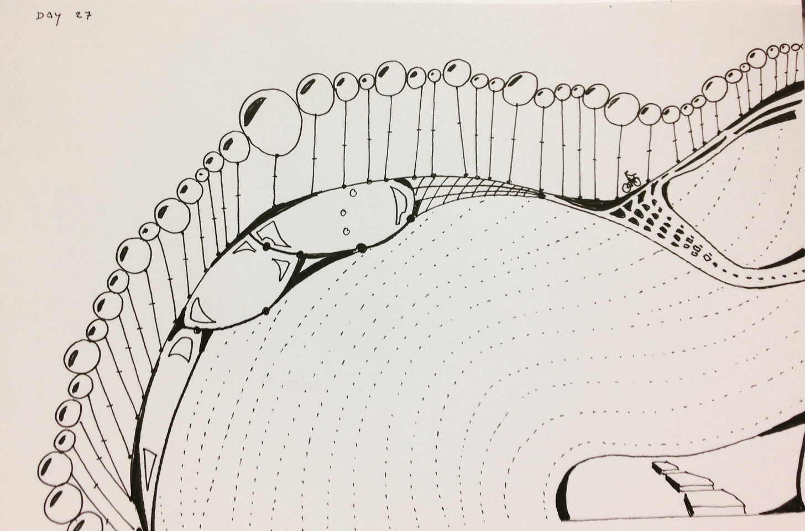

Many of you have been chipping away for years in your respective organizations. Doing the hard work. The necessary work. Running experiments. Building relationships. Trying to empower people. Day after day, month after month, and year after year. And nothing. No progress.

I know from experience that this can be draining. For many people—and I fell into this myself —it is a recipe for burnout. We put in the work, and expect an immediate response. When there’s no immediate feedback, or things slip backwards, we get demoralized. We blame our organization for what we see as a resistance to change. And ignore the inconvenient truth that the org changes just fine...it's just not the change we want (or we were not invited).

But what I have observed is that often our work is, in some way “stored up.” It is potential energy stored, ready for release, like a battery, or water in a dam. During the pandemic, I have heard many stories like this:

>
>
> No one seemed to listen to us. And this went on for months and months. Until the pandemic, at which point it was as if something clicked. The pandemic was the catalyst. A terrible situation, but it was the trigger. I could take it personally and ask ‘why didn’t they listen to us for all that time’. But part of me is just excited to see this come to fruition.
>
>

The lesson, for me, is that we can’t predict when our change efforts will transfer energy. The catalyst is often something uncomfortable, political, or threatening. In other words, what we are experiencing now. But that is what it might take to unlock the energy we’ve invested.

Improvement is rarely continuous. It lurches along in fits and starts.

Which brings us to the idea of sustainability. Clinging to the daily, weekly, or even monthly ups and downs is a losing game, a recipe for burn-out. But by investing our efforts in the regular flow of ideas and experiments—laying the foundation, and doing so sustainably—we’ll be prepared when we encounter that catalyst.

The take-away? Things often don’t happen in a linear way. You can’t rely on the system responding immediately or predictably. But we can focus on what we can practice in the here and now and store up that energy.

The right moment will come around.  

2020 TBM (all 53 posts) can be found [here](https://johnpcutler.github.io/tbm2020/).

