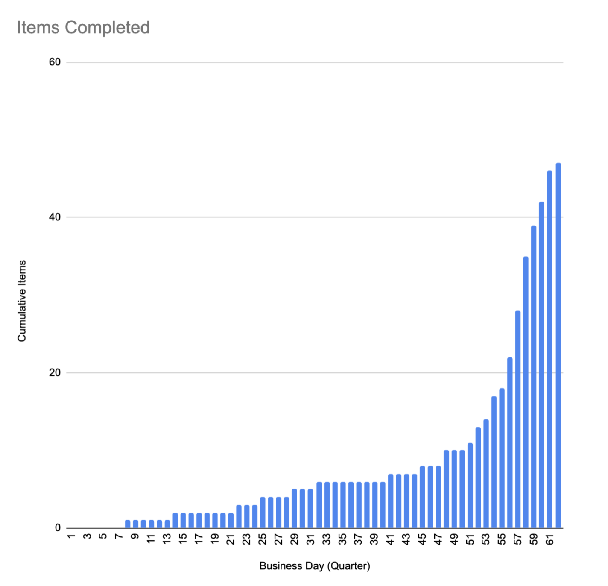
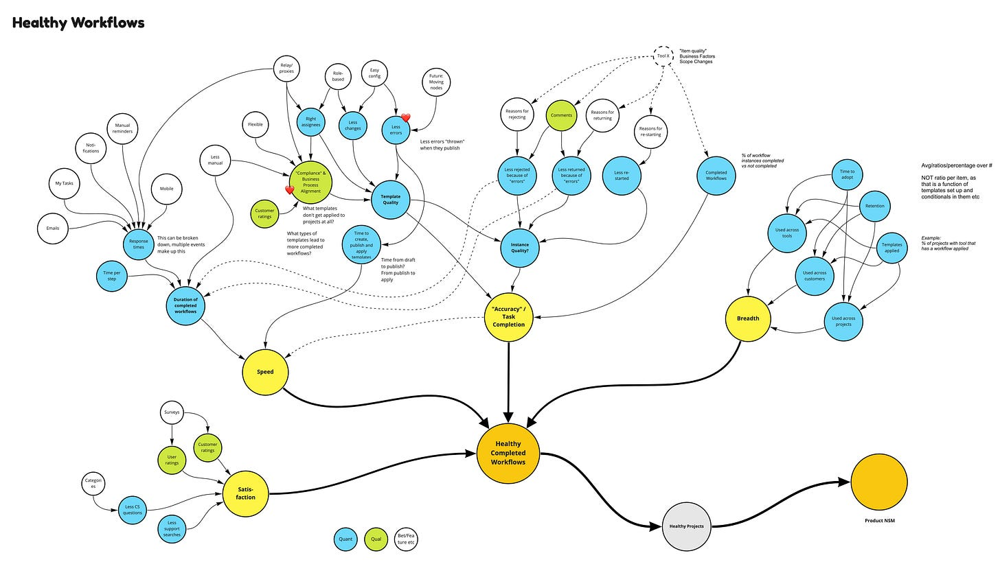
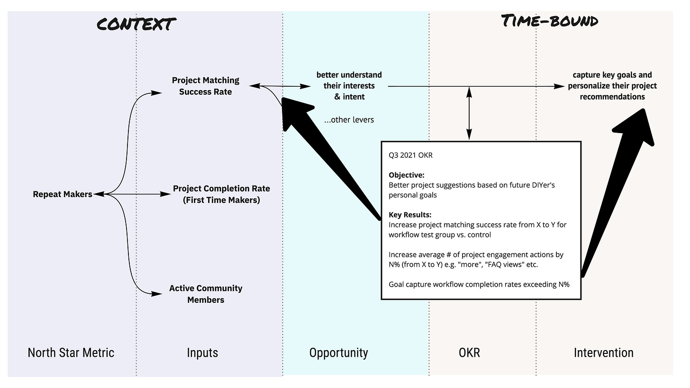
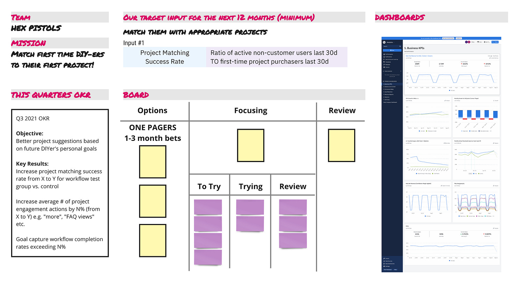
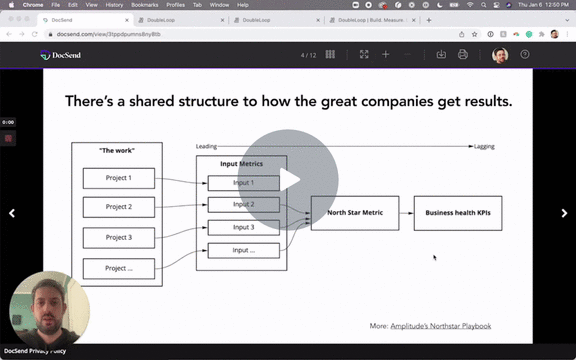

Many teams start with a list of opportunities, features, problems, or ideas. And ***then*** tack on success metrics, initiative KPIS, OKRs, or whatever to *each thing*.

Work —\> Goal

This causes problems. Measurement is rushed, goal-setting is rushed, and there’s a whiplash effect as the team bounces between objectives.

Quarters look like this…

All the work gets wrapped up with only days left in the quarter. **No wonder things feel crazy EOQ.** All to repeat the insanity in subsequent quarters.

Despite the effort to empower teams, nothing feels stable. The norm is “ship and forget” (with some token metrics thrown onto a dashboard no one ever looks at…as you launch into the NEXT quarter). It’s like a riding a quarterly mechanical bull. You will get thrown off.

What’s the alternative?

**First, clarify your team’s vision and mission.** Can you carve out a 12-18 month area of focus that can remain stable? Maybe a central persona you want to make awesome at their job? A stable input? A key lever? Yes, great teams can make progress over days and weeks. But great things in product take a lot of [thinking big and working small](https://cutlefish.substack.com/p/tbm-452-think-big-work-small-part#:~:text=Some%20companies%20define%20big%2C%20and,reduces%20risk%20and%20accentuates%20progress.).

Think big. Always experiment and work small.

Wait? Agile? Yeah, but…orgs somehow equate Agile to institutionalized freneticism under the premise that everything is uncertain and volatile, and may implode next week. In return, we get disjoined experiences and teams running widget factories. Unfortunately, this is a reality for lots of centralized IT teams that have to “build all the things” for everyone. They are optimizing for yes-saying and responsiveness, not progress on core missions.

Hopefully you can carve out some room. If you’re in feature factory mode…shoot for even 6 months. And if things do go crazy-mode on your business, you can pivot.

Persistent Model

Then, you should consider a [persistent model](https://cutlefish.substack.com/p/tbm-2553-persistent-models-vs-point). Here is an anonymized version of a real-world "driver tree” for a complex templating/automation system. Note how it doesn’t get down to the opportunity level until you get to the white circles:

What does this give you? It is highly unlikely this tree is going to change. You can start considering “minimally viable measurements” for each of the layers of this. For more info on the age-old practice of tree making, see [here](https://cutlefish.substack.com/p/tbm-452-an-actionable-post-with-examples) or read about the [North Star Framework](https://amplitude.com/north-star) (one example of a tree).

You’ve made the big leap! When it comes time to set goals, figure out success metrics, or set OKRs, well…the hard work has already been done. You might need to figure out a layer of leading indicators that are feature-specific, but you are well on your way.

Note how this OKR references the persistent Input (Project Matching Success Rate, in the Context area) AND the bet (a flow to capture key goals in the Time-Bound area):

This is well balanced. The OKR wasn’t reinventing the wheel. Next quarter will *not* be a rate race as the Hex Pistols continue their mission of matching first time DIY-ers to their first project ([see here for a 30m talk on this image](https://info.amplitude.com/growth-series-north-star-202108) and other OKR topics).

To summarize. Instead of starting with a roadmap and tacking on measures…

Start with powerful ideas and a model.

Then target your work to influence parts of the model.

Rinse and repeat.

A neat startup trying to make this way of working accessible is [Double Loop](https://doubleloop.app/). Here’s Daniel Schmidt, one of the founders, talking about the rationale behind their approach. Full disclosure, I liked Daniel’s vision so much I invested in the company.

[DoubleLoop demo (January 2022) - Watch Video](https://www.loom.com/share/1d17b1eff11942129ad5e541f75d65d9)

