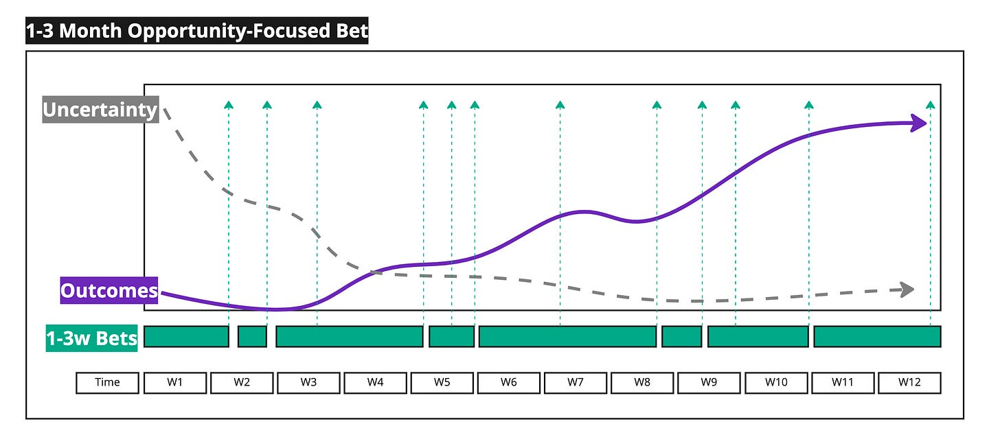

I made this [single page cheat sheet](https://docs.google.com/document/d/1wDqFvVktoHdYGVl3l88Y8PxtM33Gy183I5CRZcWH9NA/edit?usp=sharing) covering bets, models, measures, goals, etc. It may be a helpful companion to [Bets, Success Metrics, and Roadmapping](https://docs.google.com/document/d/1XRx4p8cvA7r8RujYQhqFyTBSFAY7L9XJw_sifivRIaY/edit#heading=h.3nd440apx18i).

---

Consider two teams tackling work in two different ways.

**TEAM A**

----------

1. The team reduces uncertainty *before* generating outcomes, perhaps by doing research with customers (interviews, testing rough prototypes).

2. The team has significantly reduced uncertainty by week 3/4. Yes, uncertainty remains, but it is more manageable.

3. There is a lag in outcomes, and things don’t pick up until week five. It is not always smooth sailing—note the dip in weeks 7-8. But then we have another lift!

4. At a certain point, outcomes level off. They’ll probably move on to the next bet. But imagine they made progress, and it didn’t level off? They might want to keep going.

5. The short 1-3 week bets are nested in a single 1-3 month opportunity-focused bet. They are “shipping” regularly.

TEAM B

----------

1. After twelve weeks, the team has made some progress on reducing uncertainty—but not much.

2. The team has no outcomes until week 11. And no real lift after that.

3. The team does not deliver incrementally. Instead of 1-3w bets, they have a single 1-3 month bet and some wrap-up work nested in a 1-3 month bet.

**Why is this important?**

----------

**Trust**

Team A will build/retain enough trust across the organization to have an outcome/opportunity-focused roadmap, and team B will need help creating that trust. Of course, Team B may be working that way precisely because the organization is a feature factory and incentivizes big-batch prescriptive projects—thus creating a vicious loop (“commit to what you will build”, “ok”, “failure!”).

**Bet shapes and estimates**

Both teams are working on a chunk of work spanning 1-3 months. However, there is huge difference between estimating “work” (when will it be done), and estimating “time to make significant progress and reduce uncertainty”. Say, for a moment, that Team B worked faster. It got twice as much work done. But its ability to generate outcomes remained the same. Team A would still win out.