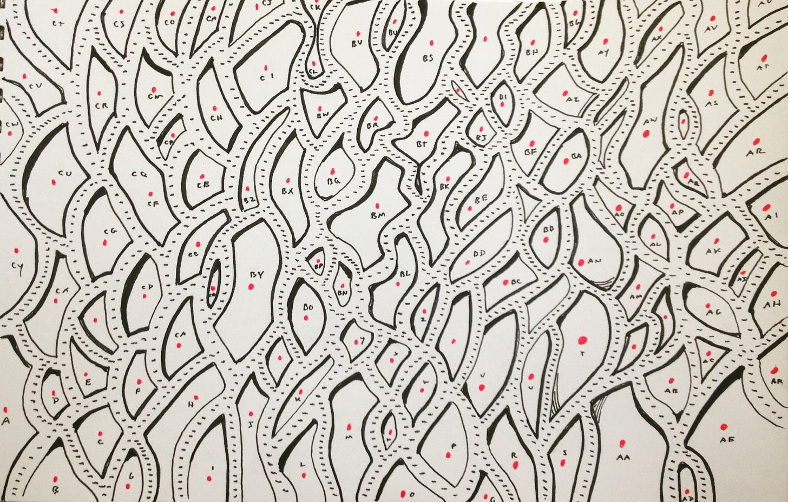

Imagine we're mulling over some improvements to a workflow in an B2B SaaS product. We have some questions:

1. What is the best way to present workflow options A,B, and C?

2. What is the right copy to describe these options?

3. Are workflow options A, B, and C the right options? Hold on!

4. Will adding options to the workflow have any effect whatsoever on campaign efficacy? Is there a chance that they (the options) will actually reinforce anti-patterns?

5. Some high ARR customers are requesting these workflow options. But is there something we're not seeing? Is there a way to change the game completely such that this workflow would be unnecessary?

6. There are six similar workflow across the app. Is there an opportunity here to optimize how we show workflow options? Is consistency even important?

7. Is our approach to executing workflow logic sound? Is there an opportunity to do some refactoring? How will we store this information? Do we needed a history of field value changes?

8. What are these campaign managers *actually* trying to achieve here? Can we lump all campaign managers in one boat?

9. What does quality mean for us here?

Note how these questions address different *opportunities* and areas of *risk*. Some seem to underpin the whole effort and scream "answer me first!" Some question the effort itself. Some are important, but we can safely delay answering the question. Some seem easy to answer, while others feel more difficult to answer. Even the less-than-clear questions are signals that we need to do more exploration.

(Tip: Try a quick activity with your team. Brainstorm questions relevant to your current effort or an up-next effort)

For each question we try to provide a bit more context. Sometimes we can answer questions with 100% certainty. Even then, answering those questions inspires a bunch of more difficult questions. So it is important to consider what chipping away at these questions might do for us. To do that, we add more detail for each question:

* Reducing uncertainty here will allow us to \_\_\_\_\_\_\_\_\_\_ .

* The value of reducing uncertainty here (being less wrong) is \_\_\_\_\_\_\_\_\_\_. The cost of being wrong is \_\_\_\_\_\_\_\_\_\_.

* Progress towards reducing uncertainty here will look like \_\_\_\_\_\_\_\_\_\_. Our goal would be to be able to \_\_\_\_\_\_\_\_\_\_.

You get the idea. Try it. How does this help?

First, as a team we are able to sequence the questions. Which questions should we address first? Why? What research do we already have? Is it enough? Maybe we have a super important question with tons of uncertainty. Maybe a tiny bit of progress could be very valuable. This is an important conversation to have. Since we can only tackle so much at once, it also helps us focus our efforts.

With a sequenced list you can create a board to track these, limit research-in-progress, and expand on tactics. Which leads us to…

Second, it lets us converge on what we must learn *first*, before getting caught up in debates about *how* to learn. This is very important. It is easy to get caught in a battle of approaches to research or "testing" (e.g. "we should just run an an A/B test there" vs. "we can figure that out with some good qualitative research"). When we focus on that battle, we tend to forget The Why. Is this even the most important thing to focus on? What does progress look like in terms of reducing uncertainty? Once The Why is squared away, it leaves room for professionals to make the call in terms of the best way to make progress.

Teams often don't work this way. Instead, it is about pitching the answer and/or communicating certainty. Or getting caught in analysis paralysis trying to be certain about all the things. Or fighting to "do research" without any clear sense of how those research efforts fit into the bigger picture.

So...start with the learning backlog.

If the word backlog freaks you out… it’s OK to call it a **to-learn list.**

Maybe do this as part of a kickoff.

---

Tidbits:

* [Mapping Alignment by Chris McDermott ](https://medium.com/@chrisvmcd/mapping-alignment-b333e4fe0eda)

* [Our Path to Mobbing by Ian Firkin](https://www.hidigital.solutions/blog/our-path-to-mobbing/)

* [Jessica Kerr chats with Matthew Skelton and Manuel Pais about Team Topologies](https://www.arresteddevops.com/team-topologies/)

* [IxDA Oslo Nº 130 :: Jeff Sussna :: Beyond the Designer as Auteur](https://vimeo.com/326447998)

* In May I’ll be [at UX London](https://2020.uxlondon.com/schedule) doing a talk and teaching a workshop with my coworker Jenny Chang (May 27-29)

* In early March I will be in Paris at [La Conf’ (March 11)](https://laconf.schoolofpo.com/) and a [Product Happy Hour on March 10th at Station F](https://events.amplitude.com/happyhourparis)

