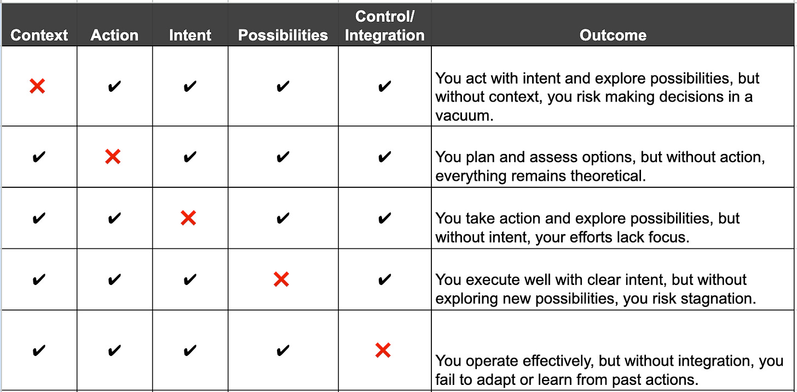
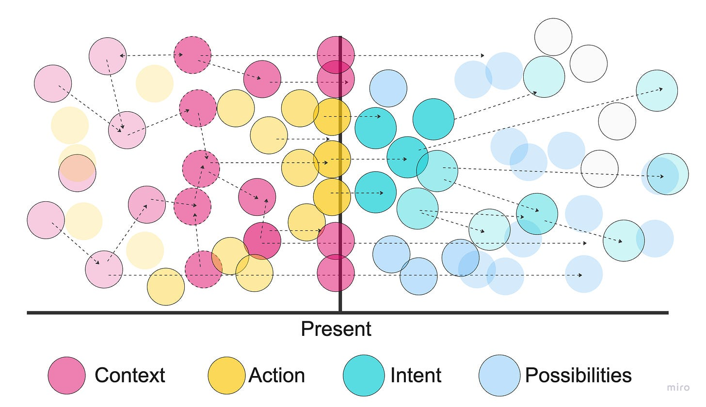
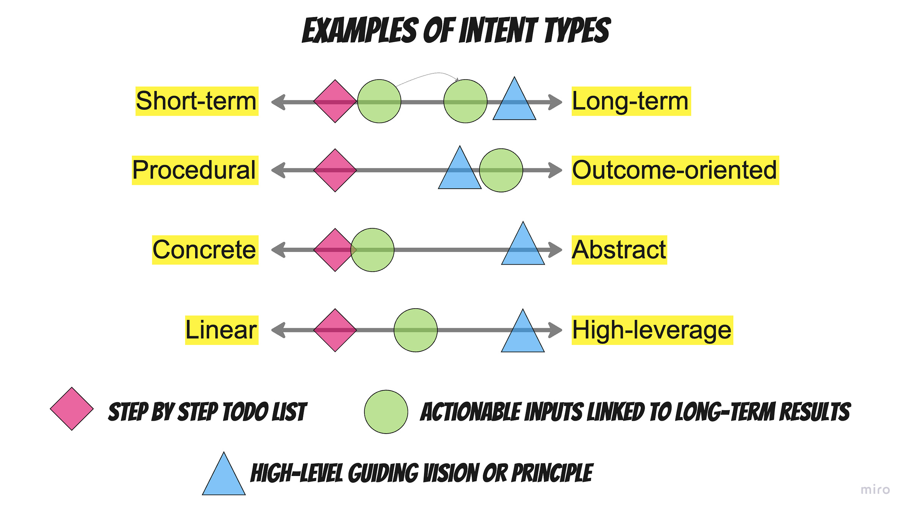
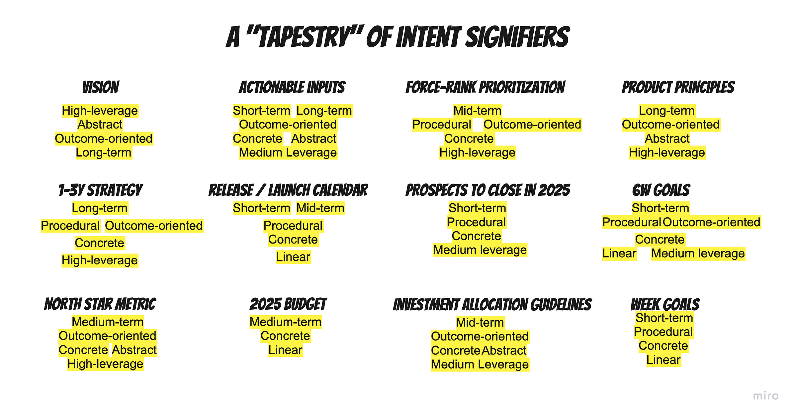
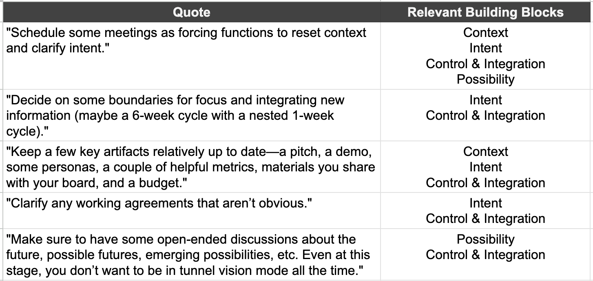
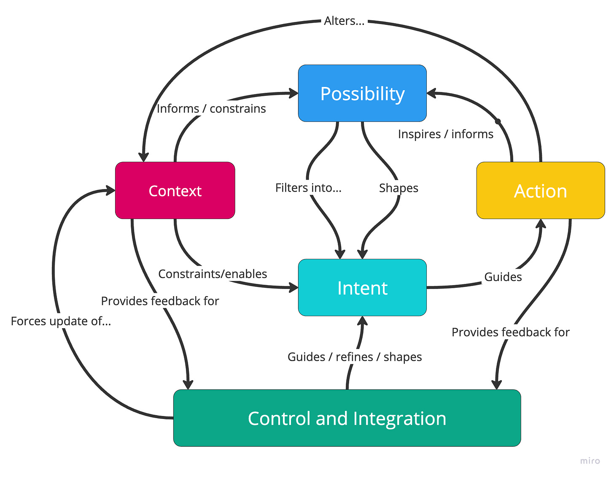

This post describes some core principles for designing the right mix of rituals, artifacts, frameworks, and cycles for your team or organization. I want to provide some language that goes beyond the standard pyramids and broad language like "strategy, execution, and action."

I will not tell you anything new—you probably know this stuff intuitively—but hopefully, the framing will help you put words to intuitions.

A Simple Example

----------

To set the stage, we will start with a simple example of an "operating system."

On Sunday nights at 10 PM, I set my intent for the week. I refer to my longer-term goals for the year and check my various lists of projects, appointments, todos, and habit trackers. I check in with how I'm feeling and check the weather. With all of that fresh, I list out my goals, milestones, tasks, and appointments for the week in a notebook and go to sleep.

Throughout the week, my intent meets reality. I do things, act, and cross things off my list. Things slip in some areas while I seize unexpected opportunities in others. Some checkboxes go unchecked. Sometimes, my intent matches my actions, and sometimes, they are different: I went to the store to buy X but walked out with Y. Because I've developed habits in certain areas, many of my actions are on "autopilot." But others require a lot of intentionality and attention.

On Sunday nights at 930PM, I review what happened that week. How coherent were my actions and intentions? What did I learn? Have my intentions changed? Should I explore new options? Should I stop some things and start others? Should I change course?

Rinse and repeat, with slightly longer sessions every six weeks (3hr), even longer sessions every half-year (1d), and two or three-day check-ins each year.

The Building Blocks

----------

In this simplified example, we find the four core building blocks of an operating system:

* **Possibility**. Potential futures, emerging opportunities, and unexplored ideas. I entertained new possibilities before and after setting my weekly goals. I reflected on the prior week to identify new trends.

* **Intent**: Choices, priorities, or commitments to act in a certain direction. On Sunday night, I captured various intentions, such as todos, goals, etc., and referred to my long-term goals.

* **Action**. Trackable, binary, real-world execution of work. What I "did" (regardless of whether it matched my intent at the start of the week).

* **Context**. Realities, constraints, or conditions that shape decisions. I checked the weather, checked my progress on goals, reflected on past actions, etc.

And one building block for tying it all together (regularly.

* **Control and Integration.** Systems that align possibility, intent, action, and context over time.

The building blocks are intrinsically linked to each other.

It isn't so much a "loop" as it is a tapestry, network, or mesh. For example, you can have clear Intent, but your team makes decisions in a vacuum if you don't have Context. You can also be biased toward Action, but if you don't entertain new futures and scenarios (Possibilities), your team only optimizes the present and never explores better alternatives.

Using this simple "drop one" model, where is your company experiencing pain now?

These ideas will be familiar to you if you are a Heidegger fan. Our building blocks—context, action, intent, and possibilities—mirror his concept of being as fundamentally temporal, always navigating between where we have been (context), where we are (action), and where we are projecting ourselves (intent and possibility). We don't just exist in time; we actively shape it through our choices and interactions with each other (and the result of the world).

Image:

But before we get too philosophical or ahead of ourselves, let's examine one of the puzzle's lesser-understood parts: intent.

Intent and Intent Type Mix

----------

Intent is fascinating. That project plan, goal, contract, meeting invite, todo list, product principle, strategic pillar, and force-ranked prioritized list feels real. But these things are just signifiers. It's all in the future.

We can describe intent using four dimensions:

**Short-term to Long-Term**

Does the intent describe something that will materialize in the short term, or does it describe something that is either far off or very stable?

**Procedural vs. Outcome-Oriented**

Does the intent describe *how* to do the thing or some sort of future state minus the how?

**Concrete vs. Abstract**

Does the intent describe something concrete and binary or something more conceptual and open to interpretation?

**Linear vs. High-Leverage**

Does the intent have the potential to "lift all ships," or is it more localized?

### An Example

 ###

I once worked at a company that served property managers. We had this aspirational vision of letting property managers "run rent-roll from the beach." For a long time, I didn't get it. But once, while doing research, I met a property manager who wanted nothing more than to step away from their business for a week to enjoy themselves. And then it clicked. From that point forward I operated with that in mind.

I would classify this intent signifier as:

Intent Type: Outcome-oriented, High-leverage, Abstract, Long-term

Here are a couple more example intent types.

All three intent types, or intent type signifiers, are important and complementary. The high-level guiding principles inform the actionable inputs (linked to long-term results), and those inputs help inform the step-by-step todo lists.

### Adding Nuance to Strategy, Planning, and Execution

 ###

I like thinking about intent types and intent type mix because they add much-needed nuance to the classic "strategic, execution, and planning" cascade. Most companies approach strategy, planning, and execution in fundamentally broken ways.

Let's dig into why.

First, the strategy isn't a strategy. The classic "five-pillar" strategy is:

1. Abstract and low leverage. Or too concrete and procedural.

2. Outcome-oriented, but pinned on business results that are either too leading or too lagging.

3. It is too short-term to feel powerful yet too long-term to feel actionable.

Then, we shift to planning. In some organizations, planning is just a list of projects—too procedural and, if the projects are big, too long-term. Teams play Tetris, optimizing for outputs and high utilization. In other organizations, there's a focus on mid-term outcomes, but the link to strategy is weak. They line up OKRs that mix delivery goals and moving metrics with no connection to mid- or long-term results. Neither approach works well.

When it comes to execution, everything is short-term, procedural, concrete, and linear.

This has variations, but somehow, the "cascade" waters everything down. In many cases, the approach completely misses the current context. If, for example, there are a lot of dependencies, you can't solve that problem with a "normal" cascade. You'll need either:

* Mid-term, outcome-oriented, tangible (but not overly concrete), high-leverage prioritization heuristics to help teams decide what to do autonomously or

* Short-term, procedural, concrete, and linear decisions about which projects are more important.

One of these approaches is higher leverage (the first outcome-oriented approach), but both beat a bland approach to strategy, planning, and execution that ignores the context.

### The Mix

 ###

Our intentions do not exist in a vacuum. Simple classifiers like strategy, planning, and execution, or short-term vs. long-term goals, don't capture the requisite nuance. Together, intentions form a tapestry of future-focused context that guides our behavior. The todo list item means very little without a list of abstract product principles, a crisp opportunity statement, and a cap on investment for that product area.

The highest-performing companies succeed by finding the right mix of intentions.

* They use abstract but high-leverage ideas to encourage coherence without excessive process overhead.

* Teams set short-term, outcome-oriented goals that tie into longer-term, lagging customer and business outcomes.

* They aren't afraid to get procedural and concrete when tackling complex, organization-spanning efforts that require every I dotted and T crossed—but they recognize that can't be the norm. To balance this, they foster decentralized decision-making with medium-term, concrete, outcome-related goals that guide autonomous action.

* They "think big, work small" by setting concrete near-term intentions to achieve high-leverage, abstract, long-term strategies.

In short, they weave a tapestry of intent signifiers.

Where are the gaps in your current company? How can you do a better job of signifying intent in those areas? As a transition to the next section, I'll share this interesting definition of strategy from John Boyd:

*A mental tapestry of changing intentions for harmonizing and focusing our efforts as a basis for realizing some aim or purpose in an unfolding and often unforeseen world of many bewildering events and many contending interests.*

Back to the Building Blocks

----------

With that quick discussion of intent under our belt, we're ready to get back to our building blocks. Intent is only one piece of the puzzle.

### Startup Scale

 ###

I currently work in a small startup.

Early on in a startup's existence, things are "simple." You are trying to survive and beat the odds. There's a high sense of urgency. Multiple times a day, I have small panic attacks where I ask myself if I am working on the absolute highest-leverage thing I could be working on.

We often catch ourselves philosophizing about the future (in our case, 6+ months from now). What will happen? What options do we have? What is going on in the industry? What trends are emerging? But very quickly, we're forced to deal with today's reality.

While the founders share some context from a prior company, this new effort has a relatively short context window. We implicitly share a lot of context—on calls and during in-person visits—so there's no need to write everything down.

In this context, you can get away with a few focus areas, concrete near-term goals, and lightweight nudges to integrate new insights and check progress.

Because of all this, you can get away with a lightweight operating system.

1. Schedule some meetings as forcing functions to reset context and clarify intent.

2. Decide on some boundaries for focus and integrating new information (maybe a 6-week cycle with a nested 1-week cycle).

3. Keep a few key artifacts relatively up to date—a pitch, a demo, some personas, a couple of helpful metrics, materials you share with your board, and a budget.

4. Clarify any working agreements that aren't obvious.

5. Make sure to have open-ended discussions about the future, possible futures, emerging possibilities, etc. Even at this stage, you don't want to always be in tunnel vision mode.

If anything important comes up, you can always freestyle.

Yes, it is lightweight, but you can see how this covers the key building blocks of context, intent, and possibility while weaving in mechanisms for control and integration.

### Growth and Scale

 ###

I love to start with personal and startup examples because you can pare things down to the bare essentials. From here, we can consider how growth and scale put pressure on our building blocks.

#### **Context** Becomes More Fragmented

 ####

In a small startup, context is implicitly shared—through conversations, direct collaboration, a few artifacts, and a handful of Slack channels. As a company grows, context fragments across teams, between the "old guard" and the "new guard," and across departments. Some fragmentation is necessary—not everyone needs the same level of context to do their job effectively. But if different teams operate based on conflicting assumptions, data, or shared understanding, you can end up with wildly incoherent decisions and actions.

Worse still, a lack of context causes people to shrug their shoulders and operate with blinders. Then, leadership blames people for not being strategic enough.

* Temptation: Overwhelm people with context OR water down context sharing through cascades, seniority-based filtering, etc.

* Alternative: Focus on connecting people with the dots that matter for their day-to-day decisions while providing them with a clear path to access broader context if needed.

#### **Intent** Becomes Harder to Align

 ####

Startups often have one or two core priorities—survive and gain traction. However, as a company scales, intent fragments. Different teams and departments develop localized, sometimes conflicting priorities, making alignment more complex. Instead of rallying around a single unifying goal, companies juggle competing objectives—many of which seem to cancel each other out.

* Temptation: Keep playing an elaborate Tetris game to balance your competing intentions.

* Alternative: Either truly make groups independent so they can set their intentions or provide lightweight heuristics from the top to help people say Yes or No—not just "both, I guess."

#### **Possibility** Can Get Lost or Become Overwhelming

 ####

Larger companies often fall into one of two extremes:

1. No attention to new possibilities—Everything is focused on hitting short-term numbers and executing the current plan.

2. Chasing every new shiny object—Trying to innovate, expand, and experiment while keeping the trains running on time becomes a tough juggling act.

Some degree of "tunnel vision" is healthy in a startup—you need focus to avoid distractions. However, staying too focused on the present in a larger company prevents future growth. At scale, companies must balance disciplined execution with planting seeds for the future.

* Temptation: Create "innovation labs and teams" to handle the future while the rest of the company focuses on execution.

* Alternative: Encourage all teams to maintain a balanced portfolio of bets, including some that lay the groundwork for future growth.

#### **Action** Becomes More Indirect and Layered

 ####

In a startup, Action feels direct and immediate. When you set an intent, you're rarely more than a few days or weeks away from executing on it.

It's a fast-moving cycle:

Decision → Intent → Action → Outcome → Context shift → New Possibilities → Repeat.

However, in a larger company, execution becomes littered with roadblocks and context switching. Decision-making slows down, and teams often work on initiatives dreamed up quarters ago, passed through multiple hands, committees, and approval gates, only to finally land on their plate as a prescriptive Jira ticket. Execution no longer feels responsive and iterative—it feels like working through an old backlog detached from the present reality.

* Temptation: Try even harder to ensure tasks are perfectly prepared and ready for engineers. Put a strong emphasis on efficiency and productivity—Incentivize velocity.

* Alternative: Stop distancing people from decisions, stop the incessant context switching, and let teams tackle new opportunities together instead of running lengthy "opportunity review cycles" that cause premature convergence.

#### **Control & Integration**—Shift from Lightweight to Bureaucratic

 ####

In a startup, the entire atmosphere acts as an integration mechanism—high trust, small teams, and fast-moving cycles naturally align efforts. You don't need heavyweight processes because everything is happening in real-time.

In larger companies, however, integration mechanisms must be more explicit—and they tend to get bloated over time. What used to fit into a healthy 6-week timebox now expands to a quarter, with most work rushed in the final days. Deadlines slip, and processes—once meant to support clarity and coordination—become bureaucratic check-the-box exercises instead of meaningful alignment tools.

* Temptation: Longer timeboxes, heavier weight controls, more consistency

* Alternative: Clearer interfaces—the right controls locally, mixed with the right cadences centrally.

These tactics are not comprehensive, and there are plenty of contexts where a more "top-down" approach may be necessary to help scaffold and stabilize the situation. A major anti-pattern in my book is holding on to the hope that something will magically change while pretending nothing is wrong. This is where temporarily breaking the rules—transparently and empathetically—can help teams get back on track.

Let's keep moving.

Quick Summary

----------

I started with a familiar personal operating system, including weekly intent setting, execution, and reflection/integration. Then, I introduced the five foundational components of any operating system:

* Possibility – Exploring futures, trends, and opportunities.

* Intent – Setting priorities, making commitments, and defining principles.

* Action – Acting. Doing the work.

* Context – Constraints, data, and the surrounding environment.

* Control & Integration – Ensuring these elements interact meaningfully and influence each other over time.

We then dug into intent, exploring why setting intent is more complex than just strategy or planning. Intent exists on a spectrum—short-term vs. long-term, procedural vs. outcome-driven, abstract vs. concrete, linear vs. high-leverage. High-performing companies find the right mix of intent signifiers, balancing these factors based on their company context.

Next, we returned to the building blocks and compared how a small startup might naturally align them versus how a larger company struggles to maintain coherence as scale introduces complexity.

With the building blocks in mind, along with the various dimensions related to intent, you're able to contextualize certain rituals, artifacts, and frameworks. Since I've started to think in terms of Intent (in its various forms), Possibility, Action, Context, and Control and integration, I have had an easier time sorting out where the gaps were and where we could safely sing it.

Hope this was interesting